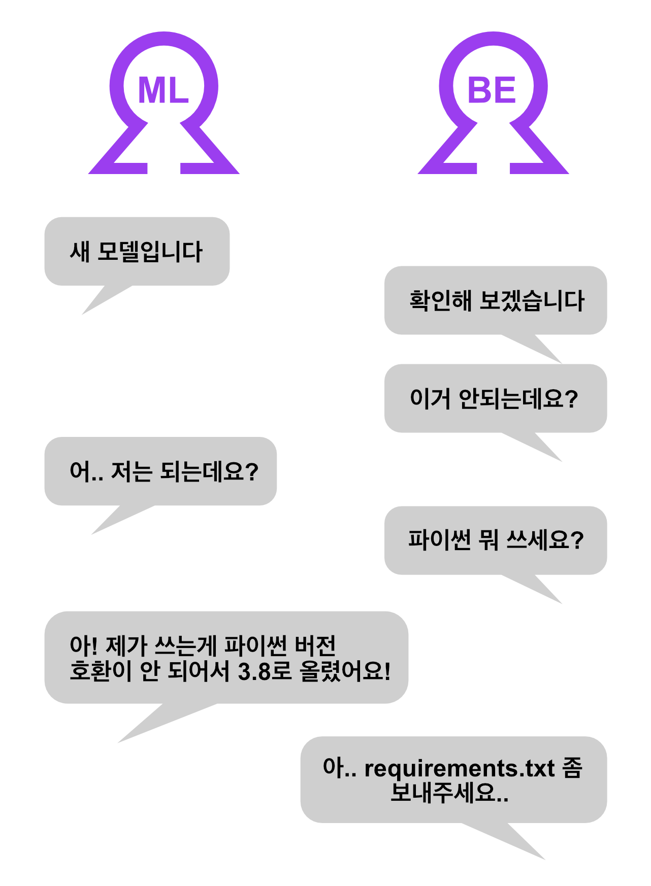

이번 페이지에서는 구글에서 발표한 MLOps의 단계를 보며 MLOps의 핵심 기능은 무엇인지 알아 보겠습니다.

## Hidden Technical Debt in ML System

구글은 무려 2015년부터 MLOps의 필요성을 말했습니다. Hidden Technical Debt in Machine Learning Systems 은 그런 구글의 생각을 담은 논문입니다.

이 논문의 핵심은 바로 머신러닝을 이용한 제품을 만드는데 있어서 머신러닝 코드는 전체 시스템을 구성하는데 있어서 아주 일부일 뿐이라는 것입니다.

구글은 이 논문을 더 발전시켜서 MLOps라는 용어를 만들어 확장시켰습니다. 더 자세한 내용은 [구글 클라우드 홈페이지](https://cloud.google.com/architecture/mlops-continuous-delivery-and-automation-pipelines-in-machine-learning)에서 더 자세한 내용을 확인할 수 있습니다. 이번 포스트에서는 구글에서 말하는 MLOps란 어떤 것인지에 대해서 설명해보고자 합니다.

구글에서는 MLOps의 발전 단계를 총 3(0~2)단계로 나누었습니다. 각 단계들에 대해 설명하기 앞서 이전 포스트에서 설명했던 개념 중 필요한 부분을 다시 한번 보겠습니다.

머신러닝 모델을 운영하기 위해서는 모델을 개발하는 머신러닝 팀과 배포 및 운영을 담당하는 운영팀이 있습니다. 이 두 팀의 원할한 협업을 위해서 MLOps가 필요하게 되었습니다. 이전에는 간단히 Continuous Integration(CI)/Continuous Deployment(CD)를 통해서 할 수 있다고 하였는데, 어떻게 CI/CD를 하는지에 대해서 알아 보겠습니다.

## 0단계: 수동 프로세스

0단계에서 두 팀은 “모델”을 통해 소통합니다. 머신 러닝팀은 쌓여있는 데이터로 모델을 학습시키고 학습된 모델을 운영팀에게 전달 합니다. 운영팀은 이렇게 전달받은 모델을 배포합니다.

초기의 머신 러닝 모델들은 이 “모델” 중심의 소통을 통해 배포합니다. 그런데 이런 배포 방식은 여러 문제가 있습니다.  
예를 들어서 어떤 기능에서는 파이썬 3.7을 쓰고 어떤 기능에서는 파이썬 3.8을 쓴다면 다음과 같은 상황을 자주 목격할 수 있습니다.

이러한 상황이 일어나는 이유는 머신러닝 모델의 특성에 있습니다. 학습된 머신러닝 모델이 동작하기 위해서는 3가지가 필요합니다.

1. 파이썬 코드
2. 학습된 가중치
3. 환경 (패키지, 버전 등)

만약 이 3가지 중 한 가지라도 전달이 잘못 된다면 모델이 동작하지 않거나 예상하지 못한 예측을 할수 있습니다. 그런데 많은 경우 환경이 일치하지 않아서 동작하지 않는 경우가 많습니다. 머신러닝은 다양한 오픈소스를 사용하는데 오픈소스는 특성상 어떤 버전을 쓰는지에 따라서 같은 함수라도 결과가 다를 수 있습니다.

이러한 문제는 서비스 초기에는 관리할 모델이 많지 않기 때문에 금방 해결할 수 있습니다. 하지만 관리하는 기능들이 많아지고 서로 소통에 어려움을 겪게 된다면 성능이 더 좋은 모델을 빠르게 배포할 수 없게 됩니다.

## 1단계: ML 파이프라인 자동화

### Pipeline

그래서 MLOps에서는 “파이프라인(Pipeline)”을 이용해 이러한 문제를 방지하고자 했습니다. MLOps의 파이프라인은 도커와 같은 컨테이너를 이용해 머신러닝 엔지니어가 모델 개발에 사용한 것과 동일한 환경으로 동작되는 것을 보장합니다. 이를 통해서 환경이 달라서 모델이 동작하지 않는 상황을 방지합니다.

그런데 파이프라인은 범용적인 용어로 여러 다양한 태스크에서 사용됩니다. 머신러닝 엔지니어가 작성하는 파이프라인의 역할은 무엇일까요?  
머신러닝 엔지니어가 작성하는 파이프라인은 학습된 모델을 생산합니다. 그래서 파이프라인 대신 학습 파이프라인(Training Pipeline)이 더 정확하다고 볼 수 있습니다.

### Continuous Training

그리고 Continuous Training(CT) 개념이 추가됩니다. 그렇다면 CT는 왜 필요할까요?

#### Auto Retrain

Real World에서 데이터는 Data Shift라는 데이터의 분포가 계속해서 변하는 특징이 있습니다. 그래서 과거에 학습한 모델이 시간이 지남에 따라 모델의 성능이 저하되는 문제가 있습니다. 이 문제를 해결하는 가장 간단하고 효과적인 해결책은 바로 최근 데이터를 이용해 모델을 재학습하는 것입니다. 변화된 데이터 분포에 맞춰서 모델을 재학습하면 다시 준수한 성능을 낼 수 있습니다.

#### Auto Deploy

하지만 제조업과 같이 한 공장에서 여러 레시피를 처리하는 경우 무조건 재학습을 하는 것이 좋지 않을 수 도 있습니다. Blind Spot이 대표적인 예입니다.

예를 들어서 자동차 생산 라인에서 모델 A에 대해서 모델을 만들고 이를 이용해 예측을 진행하고 있었습니다. 만약 전혀 다른 모델 B가 들어오면 이전에 보지 못한 데이터 패턴이기 때문에 모델 B에 대해서 새로운 모델을 학습합니다.

이제 모델 B에 대해서 모델을 만들었기 때문에 모델은 예측을 진행할 것 입니다. 그런데 만약 데이터가 다시 모델 A로 바뀐다면 어떻게 할까요?  
만약 Retraining 규칙만 있다면 다시 모델 A에 대해서 새로운 모델을 학습하게 됩니다. 그런데 머신러닝 모델이 충분한 성능을 보이기 위해서는 충분한 양의 데이터가 모여야 합니다. Blind Spot이란 이렇게 데이터를 모으기 위해서 모델이 동작하지 않는 구간을 말합니다.

이러한 Blind Spot을 해결하는 방법은 간단할 수 있습니다. 바로 모델 A에 대한 모델이 과거에 있었는지 확인하고 만약 있었다면 새로운 모델을 바로 학습하기 보다는 이 전 모델을 이용해 다시 예측을 하면 이런 Blind Spot을 해결할 수 있습니다. 이렇게 모델와 같은 메타 데이터를 이용해 모델을 자동으로 변환해주는 것을 Auto Deploy라고 합니다.

정리하자면 CT를 위해서는 Auto Retraining과 Auto Deploy 두 가지 기능이 필요합니다. 둘은 서로의 단점을 보완해 계속해서 모델의 성능을 유지할 수 있게 합니다.

## 2단계: CI/CD 파이프라인의 자동화

2단계의 제목은 CI와 CD의 자동화 입니다. DevOps에서의 CI/CD의 대상은 소스 코드입니다. 그렇다면 MLOps는 어떤 것이 CI/CD의 대상일까요?

MLOps의 CI/CD 대상 또한 소스 코드인 것은 맞지만 조금 더 엄밀히 정의하자면 학습 파이프라인이라고 볼 수 있습니다.

그래서 모델을 학습하는데 있어서 영향이 있는 변화에 대해서 실제로 모델이 정상적으로 학습이 되는지 (CI), 학습된 모델이 정상적으로 동작하는지 (CD)를 확인해야 합니다. 그래서 학습을 하는 코드에 직접적인 수정이 있는 경우에는 CI/CD를 진행해야 합니다.

코드 외에도 사용하는 패키지의 버전, 파이썬의 버전 변경도 CI/CD의 대상입니다. 많은 경우 머신 러닝은 오픈 소스를 이용합니다. 하지만 오픈 소스는 그 특성상 버전이 바뀌었을 때 함수의 내부 로직이 변하는 경우도 있습니다. 물론 어느 정도 버전이 올라 갈 때 이와 관련된 알림을 주지만 한 번에 버전이 크게 바뀐다면 이러한 변화를 모를 수도 있습니다.  
그래서 사용하는 패키지의 버전이 변하는 경우에도 CI/CD를 통해 정상적으로 모델이 학습, 동작하는지 확인을 해야 합니다.
