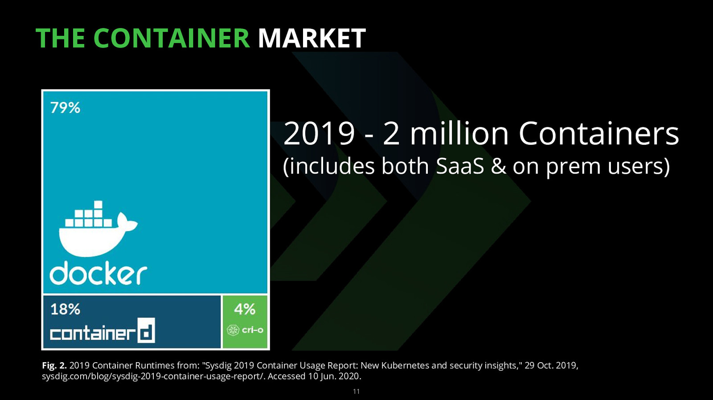
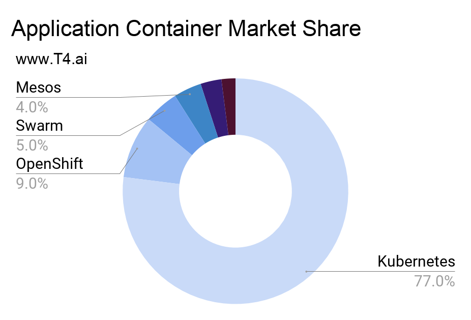

## Why Kubernetes ?

머신러닝 모델을 서비스화하기 위해서는 모델 개발 외에도 많은 **부가적인** 기능들이 필요합니다.

1. 학습 단계
    - 모델 학습 명령의 스케줄 관리
    - 학습된 모델의 Reproducibility 보장
2. 배포 단계
    - 트래픽 분산
    - 서비스 장애 모니터링
    - 장애 시 트러블슈팅

다행히도 이런 기능들에 대한 needs는 소프트웨어 개발 쪽에서 이미 많은 고민을 거쳐 발전되어 왔습니다.  
따라서 머신러닝 모델을 배포할 때도 이런 고민의 결과물들을 활용하면 큰 도움을 받을 수 있습니다.
MLOps에서 대표적으로 활용하는 소프트웨어 제품이 바로 도커와 쿠버네티스입니다.

## 도커와 쿠버네티스

### 기술 이름이 아니라 제품 이름

도커와 쿠버네티스는 각각 컨테이너라이제이션(Containerization) 기능과 컨테이너 오케스트레이션(Container Orchestration) 기능을 제공하는 대표 소프트웨어(제품)입니다.

#### 도커

도커는 과거에 대세였지만 유료화 관련 정책들을 하나씩 추가하면서 점점 사용 빈도가 하락세입니다.
하지만 2022년 3월 기준으로 아직까지도 가장 일반적으로 사용되는 컨테이너 가상화 소프트웨어입니다.

 [from sysdig 2019] 

 [from sysdig 2021]  

#### 쿠버네티스

쿠버네티스는 지금까지는 비교 대상조차 거의 없는 제품입니다.

 [from cncf survey] 

 [from t4.ai]  

### **재미있는 오픈소스 역사 이야기**

#### 초기 도커 & 쿠버네티스

초기 도커 개발시에는 Docker Engine이라는 **하나의 패키지**에 API, CLI, 네트워크, 스토리지 등 여러 기능들을 모두 포함했으나, **MSA** 의 철학을 담아 **하나씩 분리**하기 시작했습니다.  
하지만 초기의 쿠버네티스는 컨테이너 가상화를 위해 Docker Engine을 내장하고 있었습니다.  
따라서 도커 버전이 업데이트될 때마다 Docker Engine 의 인터페이스가 변경되어 쿠버네티스에서 크게 영향을 받는 일이 계속해서 발생하였습니다.

#### Open Container Initiative

그래서 **이런 불편함을 해소**하고자, 도커를 중심으로 구글 등 컨테이너 기술에 관심있는 **여러 집단**들이 한데 모여 **Open Container Initiative,** 이하 **OCI**라는 프로젝트를 시작하여 컨테이너에 관한 **표준**을 정하는 일들을 시작하였습니다.  
도커에서도 인터페이스를 **한 번 더 분리**해서, OCI 표준을 준수하는 **containerd**라는 Container Runtime 를 개발하고, **dockerd** 가 containerd 의 API 를 호출하도록 추상화 레이어를 추가하였습니다.

이러한 흐름에 맞추어서 쿠버네티스에서도 이제부터는 도커만을 지원하지 않고, **OCI 표준을** 준수하고, 정해진 스펙을 지키는 컨테이너 런타임은 무엇이든 쿠버네티스에서 사용할 수 있도록, Container Runtime Interface, 이하 **CRI 스펙**을 버전 1.5부터 제공하기 시작했습니다.

#### CRI-O

Red Hat, Intel, SUSE, IBM에서 **OCI 표준+CRI 스펙을** 따라 Kubernetes 전용 Container Runtime 을 목적으로 개발한 컨테이너 런타임입니다.

#### 지금의 도커 & 쿠버네티스

쿠버네티스는 Docker Engine 을 디폴트 컨테이너 런타임으로 사용해왔지만, 도커의 API 가 **CRI** 스펙에 맞지 않아(*OCI 는 따름*) 도커의 API를 **CRI**와 호환되게 바꿔주는 **dockershim**을 쿠버네티스 자체적으로 개발 및 지원해왔었는데,(*도커 측이 아니라 쿠버네티스 측에서 지원했다는 점이 굉장히 큰 짐이었습니다.*) 이걸 쿠버네티스 **v1.20 부터는 Deprecated하고,** **v1.23 부터는 지원을 포기**하기로 결정하였습니다.

- v1.23 은 2021 년 12월 릴리즈

그래서 쿠버네티스 v1.23 부터는 도커를 native 하게 쓸 수 없습니다다.  
그렇지만 **사용자들은 이런 변화에 크게 관련이 있진 않습니다.**
왜냐하면 Docker Engine을 통해 만들어진 도커 이미지는 OCI 표준을 준수하기 때문에, 쿠버네티스가 어떤 컨테이너 런타임으로 이루어져있든 사용 가능하기 때문입니다.

### References

- [*https://www.linkedin.com/pulse/containerd는-무엇이고-왜-중요할까-sean-lee/?originalSubdomain=kr*](https://www.linkedin.com/pulse/containerd%EB%8A%94-%EB%AC%B4%EC%97%87%EC%9D%B4%EA%B3%A0-%EC%99%9C-%EC%A4%91%EC%9A%94%ED%95%A0%EA%B9%8C-sean-lee/?originalSubdomain=kr)
- [https://kubernetes.io/blog/2021/12/07/kubernetes-1-23-release-announcement/](https://kubernetes.io/blog/2021/12/07/kubernetes-1-23-release-announcement/)
- [https://kubernetes.io/blog/2020/12/02/dockershim-faq/](https://kubernetes.io/blog/2020/12/02/dockershim-faq/)
- [https://kubernetes.io/blog/2020/12/02/dont-panic-kubernetes-and-docker/](https://kubernetes.io/blog/2020/12/02/dont-panic-kubernetes-and-docker/)
- [https://kubernetes.io/ko/blog/2020/12/02/dont-panic-kubernetes-and-docker/](https://kubernetes.io/ko/blog/2020/12/02/dont-panic-kubernetes-and-docker/)
