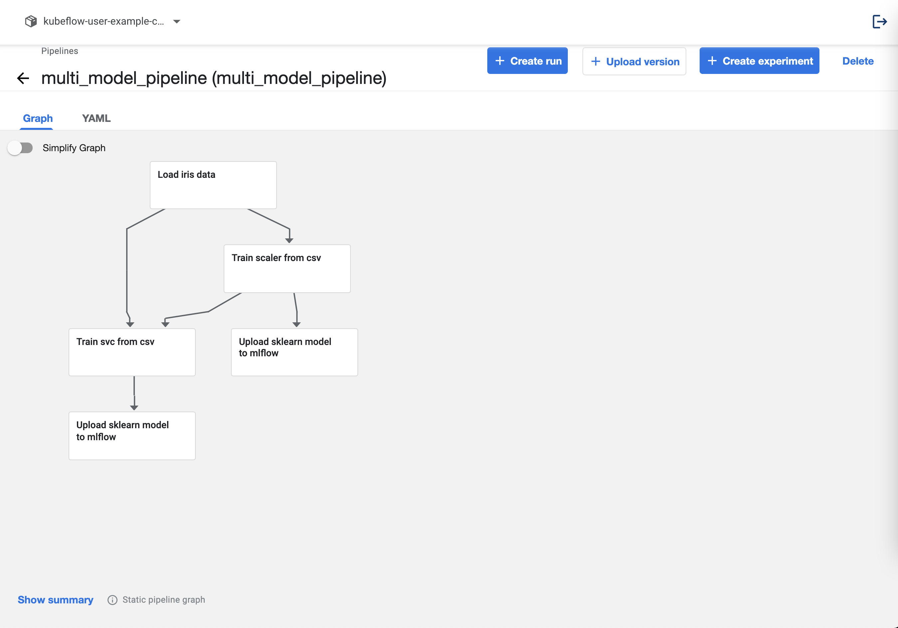
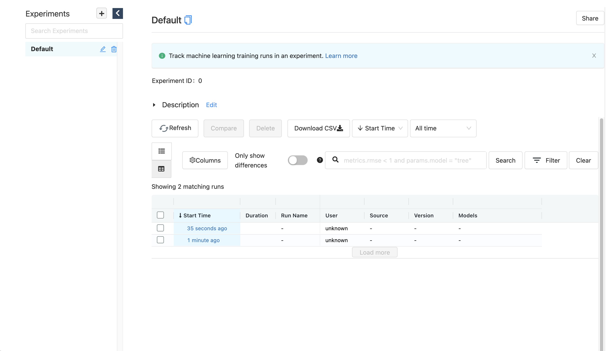

## Multi Models

앞서 설명했던 방법들은 모두 단일 모델을 대상으로 했습니다.  
이번 페이지에서는 여러 개의 모델을 연결하는 방법에 대해서 알아봅니다.

## Pipeline

우선 모델을 2개를 생성하는 파이프라인을 작성하겠습니다.

모델은 앞서 사용한 SVC 모델에 StandardScaler를 추가하고 저장하도록 하겠습니다.

```python
from functools import partial

import kfp
from kfp.components import InputPath, OutputPath, create_component_from_func


@partial(
    create_component_from_func,
    packages_to_install=["pandas", "scikit-learn"],
)
def load_iris_data(
    data_path: OutputPath("csv"),
    target_path: OutputPath("csv"),
):
    import pandas as pd
    from sklearn.datasets import load_iris

    iris = load_iris()

    data = pd.DataFrame(iris["data"], columns=iris["feature_names"])
    target = pd.DataFrame(iris["target"], columns=["target"])

    data.to_csv(data_path, index=False)
    target.to_csv(target_path, index=False)

@partial(
    create_component_from_func,
    packages_to_install=["dill", "pandas", "scikit-learn", "mlflow"],
)
def train_scaler_from_csv(
    data_path: InputPath("csv"),
    scaled_data_path: OutputPath("csv"),
    model_path: OutputPath("dill"),
    input_example_path: OutputPath("dill"),
    signature_path: OutputPath("dill"),
    conda_env_path: OutputPath("dill"),
):
    import dill
    import pandas as pd
    from sklearn.preprocessing import StandardScaler

    from mlflow.models.signature import infer_signature
    from mlflow.utils.environment import _mlflow_conda_env

    data = pd.read_csv(data_path)

    scaler = StandardScaler()
    scaled_data = scaler.fit_transform(data)
    scaled_data = pd.DataFrame(scaled_data, columns=data.columns, index=data.index)

    scaled_data.to_csv(scaled_data_path, index=False)

    with open(model_path, mode="wb") as file_writer:
        dill.dump(scaler, file_writer)

    input_example = data.sample(1)
    with open(input_example_path, "wb") as file_writer:
        dill.dump(input_example, file_writer)

    signature = infer_signature(data, scaler.transform(data))
    with open(signature_path, "wb") as file_writer:
        dill.dump(signature, file_writer)

    conda_env = _mlflow_conda_env(
        additional_pip_deps=["scikit-learn"],
        install_mlflow=False
    )
    with open(conda_env_path, "wb") as file_writer:
        dill.dump(conda_env, file_writer)


@partial(
    create_component_from_func,
    packages_to_install=["dill", "pandas", "scikit-learn", "mlflow"],
)
def train_svc_from_csv(
    train_data_path: InputPath("csv"),
    train_target_path: InputPath("csv"),
    model_path: OutputPath("dill"),
    input_example_path: OutputPath("dill"),
    signature_path: OutputPath("dill"),
    conda_env_path: OutputPath("dill"),
    kernel: str,
):
    import dill
    import pandas as pd
    from sklearn.svm import SVC

    from mlflow.models.signature import infer_signature
    from mlflow.utils.environment import _mlflow_conda_env

    train_data = pd.read_csv(train_data_path)
    train_target = pd.read_csv(train_target_path)

    clf = SVC(kernel=kernel)
    clf.fit(train_data, train_target)

    with open(model_path, mode="wb") as file_writer:
        dill.dump(clf, file_writer)

    input_example = train_data.sample(1)
    with open(input_example_path, "wb") as file_writer:
        dill.dump(input_example, file_writer)

    signature = infer_signature(train_data, clf.predict(train_data))
    with open(signature_path, "wb") as file_writer:
        dill.dump(signature, file_writer)

    conda_env = _mlflow_conda_env(
        additional_pip_deps=["scikit-learn"],
        install_mlflow=False
    )
    with open(conda_env_path, "wb") as file_writer:
        dill.dump(conda_env, file_writer)


@partial(
    create_component_from_func,
    packages_to_install=["dill", "pandas", "scikit-learn", "mlflow", "boto3"],
)
def upload_sklearn_model_to_mlflow(
    model_name: str,
    model_path: InputPath("dill"),
    input_example_path: InputPath("dill"),
    signature_path: InputPath("dill"),
    conda_env_path: InputPath("dill"),
):
    import os
    import dill
    from mlflow.sklearn import save_model
    
    from mlflow.tracking.client import MlflowClient

    os.environ["MLFLOW_S3_ENDPOINT_URL"] = "http://minio-service.kubeflow.svc:9000"
    os.environ["AWS_ACCESS_KEY_ID"] = "minio"
    os.environ["AWS_SECRET_ACCESS_KEY"] = "minio123"

    client = MlflowClient("http://mlflow-server-service.mlflow-system.svc:5000")

    with open(model_path, mode="rb") as file_reader:
        clf = dill.load(file_reader)

    with open(input_example_path, "rb") as file_reader:
        input_example = dill.load(file_reader)

    with open(signature_path, "rb") as file_reader:
        signature = dill.load(file_reader)

    with open(conda_env_path, "rb") as file_reader:
        conda_env = dill.load(file_reader)
    save_model(
        sk_model=clf,
        path=model_name,
        serialization_format="cloudpickle",
        conda_env=conda_env,
        signature=signature,
        input_example=input_example,
    )
    run = client.create_run(experiment_id="0")
    client.log_artifact(run.info.run_id, model_name)


from kfp.dsl import pipeline


@pipeline(name="multi_model_pipeline")
def multi_model_pipeline(kernel: str = "rbf"):
    iris_data = load_iris_data()
    scaled_data = train_scaler_from_csv(data=iris_data.outputs["data"])
    _ = upload_sklearn_model_to_mlflow(
        model_name="scaler",
        model=scaled_data.outputs["model"],
        input_example=scaled_data.outputs["input_example"],
        signature=scaled_data.outputs["signature"],
        conda_env=scaled_data.outputs["conda_env"],
    )
    model = train_svc_from_csv(
        train_data=scaled_data.outputs["scaled_data"],
        train_target=iris_data.outputs["target"],
        kernel=kernel,
    )
    _ = upload_sklearn_model_to_mlflow(
        model_name="svc",
        model=model.outputs["model"],
        input_example=model.outputs["input_example"],
        signature=model.outputs["signature"],
        conda_env=model.outputs["conda_env"],
    )


if __name__ == "__main__":
    kfp.compiler.Compiler().compile(multi_model_pipeline, "multi_model_pipeline.yaml")

```

파이프라인을 업로드하면 다음과 같이 나옵니다.



MLflow 대시보드를 확인하면 다음과 같이 두 개의 모델이 생성됩니다.



각각의 run_id를 확인 후 다음과 같이 SeldonDeployment 스펙을 정의합니다.

```text
apiVersion: machinelearning.seldon.io/v1
kind: SeldonDeployment
metadata:
  name: multi-model-example
  namespace: kubeflow-user-example-com
spec:
  name: model
  predictors:
  - name: model

    componentSpecs:
    - spec:
        volumes:
        - name: model-provision-location
          emptyDir: {}

        initContainers:
        - name: scaler-initializer
          image: gcr.io/kfserving/storage-initializer:v0.4.0
          args:
            - "s3://mlflow/mlflow/artifacts/0/7f445015a0e94519b003d316478766ef/artifacts/scaler"
            - "/mnt/models"
          volumeMounts:
          - mountPath: /mnt/models
            name: model-provision-location
          envFrom:
          - secretRef:
              name: seldon-init-container-secret
        - name: svc-initializer
          image: gcr.io/kfserving/storage-initializer:v0.4.0
          args:
            - "s3://mlflow/mlflow/artifacts/0/87eb168e76264b39a24b0e5ca0fe922b/artifacts/svc"
            - "/mnt/models"
          volumeMounts:
          - mountPath: /mnt/models
            name: model-provision-location
          envFrom:
          - secretRef:
              name: seldon-init-container-secret

        containers:
        - name: scaler
          image: seldonio/mlflowserver:1.8.0-dev
          volumeMounts:
          - mountPath: /mnt/models
            name: model-provision-location
            readOnly: true
          securityContext:
            privileged: true
            runAsUser: 0
            runAsGroup: 0
        - name: svc
          image: seldonio/mlflowserver:1.8.0-dev
          volumeMounts:
          - mountPath: /mnt/models
            name: model-provision-location
            readOnly: true
          securityContext:
            privileged: true
            runAsUser: 0
            runAsGroup: 0

    graph:
      name: scaler
      type: MODEL
      parameters:
      - name: model_uri
        type: STRING
        value: "/mnt/models"
      - name: predict_method
        type: STRING
        value: "transform"
      children:
      - name: svc
        type: MODEL
        parameters:
        - name: model_uri
          type: STRING
          value: "/mnt/models"
```

모델이 두 개가 되었으므로 각 모델의 initContainer와 container를 정의해주어야 합니다.
이 필드는 입력값을 array로 받으며 순서는 관계없습니다.

모델이 실행하는 순서는 graph에서 정의됩니다.

```text
graph:
  name: scaler
  type: MODEL
  parameters:
  - name: model_uri
    type: STRING
    value: "/mnt/models"
  - name: predict_method
    type: STRING
    value: "transform"
  children:
  - name: svc
    type: MODEL
    parameters:
    - name: model_uri
      type: STRING
      value: "/mnt/models"
```

graph의 동작 방식은 처음 받은 값을 정해진 predict_method로 변환한 뒤 children으로 정의된 모델에 전달하는 방식입니다.
이 경우 scaler -> svc 로 데이터가 전달됩니다.

이제 위의 스펙을 yaml파일로 생성해 보겠습니다.

```text
cat <<EOF > multi-model.yaml
apiVersion: machinelearning.seldon.io/v1
kind: SeldonDeployment
metadata:
  name: multi-model-example
  namespace: kubeflow-user-example-com
spec:
  name: model
  predictors:
  - name: model

    componentSpecs:
    - spec:
        volumes:
        - name: model-provision-location
          emptyDir: {}

        initContainers:
        - name: scaler-initializer
          image: gcr.io/kfserving/storage-initializer:v0.4.0
          args:
            - "s3://mlflow/mlflow/artifacts/0/7f445015a0e94519b003d316478766ef/artifacts/scaler"
            - "/mnt/models"
          volumeMounts:
          - mountPath: /mnt/models
            name: model-provision-location
          envFrom:
          - secretRef:
              name: seldon-init-container-secret
        - name: svc-initializer
          image: gcr.io/kfserving/storage-initializer:v0.4.0
          args:
            - "s3://mlflow/mlflow/artifacts/0/87eb168e76264b39a24b0e5ca0fe922b/artifacts/svc"
            - "/mnt/models"
          volumeMounts:
          - mountPath: /mnt/models
            name: model-provision-location
          envFrom:
          - secretRef:
              name: seldon-init-container-secret

        containers:
        - name: scaler
          image: ghcr.io/mlops-for-all/mlflowserver
          volumeMounts:
          - mountPath: /mnt/models
            name: model-provision-location
            readOnly: true
          securityContext:
            privileged: true
            runAsUser: 0
            runAsGroup: 0
        - name: svc
          image: ghcr.io/mlops-for-all/mlflowserver
          volumeMounts:
          - mountPath: /mnt/models
            name: model-provision-location
            readOnly: true
          securityContext:
            privileged: true
            runAsUser: 0
            runAsGroup: 0

    graph:
      name: scaler
      type: MODEL
      parameters:
      - name: model_uri
        type: STRING
        value: "/mnt/models"
      - name: predict_method
        type: STRING
        value: "transform"
      children:
      - name: svc
        type: MODEL
        parameters:
        - name: model_uri
          type: STRING
          value: "/mnt/models"
EOF
```

다음 명령어를 통해 API를 생성합니다.

```text
kubectl apply -f multi-model.yaml
```

정상적으로 수행되면 다음과 같이 출력됩니다.

```text
seldondeployment.machinelearning.seldon.io/multi-model-example created
```

정상적으로 생성됐는지 확인합니다.

```text
kubectl get po -n kubeflow-user-example-com | grep multi-model-example
```

정상적으로 생성되면 다음과 비슷한 pod이 생성됩니다.

```text
multi-model-example-model-0-scaler-svc-9955fb795-n9ffw   4/4     Running     0          2m30s
```
