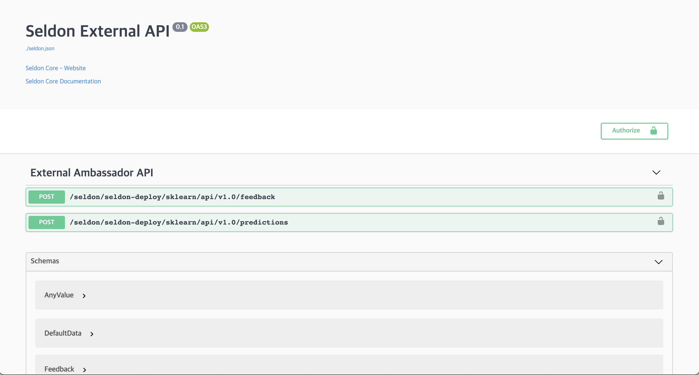
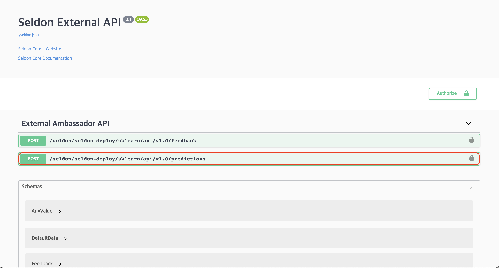
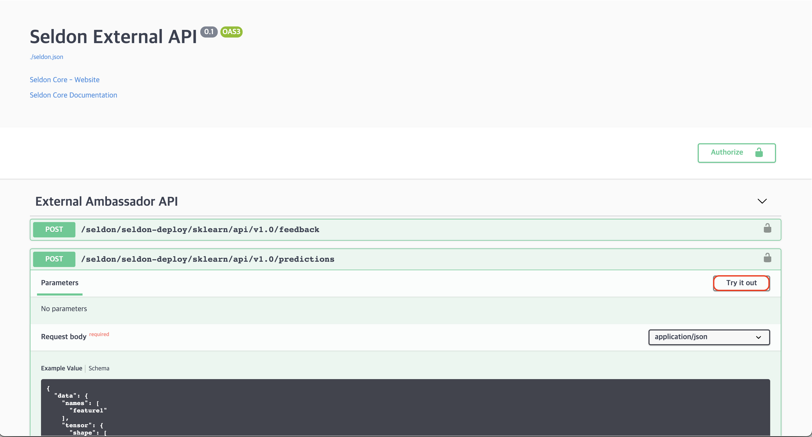
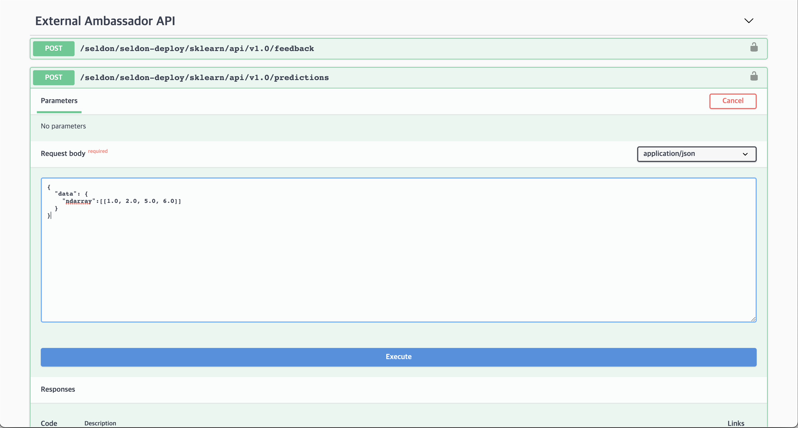
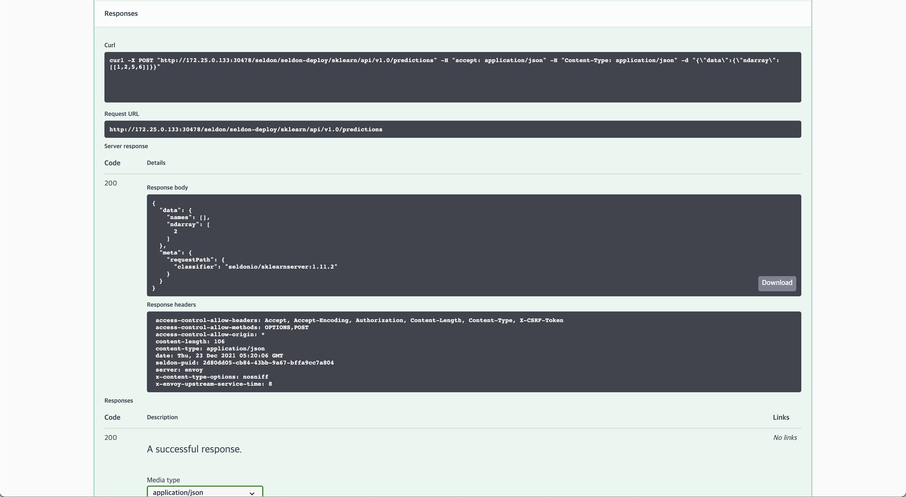

## Deploy with SeldonDeployment

Let's deploy our trained model as an API using SeldonDeployment. SeldonDeployment is a custom resource definition (CRD) defined to deploy models as REST/gRPC servers on Kubernetes.

#### 1. Prerequisites

We will conduct the SeldonDeployment related practice in a new namespace called seldon-deploy. After creating the namespace, set seldon-deploy as the current namespace.

```text
kubectl create namespace seldon-deploy
kubectl config set-context --current --namespace=seldon-deploy
```

### 2. Define Spec

Generate a yaml file to deploy SeldonDeployment. 
In this page, we will use a publicly available iris model.
Because this iris model is trained through the sklearn framework, we use SKLEARN_SERVER.

```text
cat <<EOF > iris-sdep.yaml
apiVersion: machinelearning.seldon.io/v1alpha2
kind: SeldonDeployment
metadata:
  name: sklearn
  namespace: seldon-deploy
spec:
  name: iris
  predictors:
  - graph:
      children: []
      implementation: SKLEARN_SERVER
      modelUri: gs://seldon-models/v1.12.0-dev/sklearn/iris
      name: classifier
    name: default
    replicas: 1
EOF
```

Deploy yaml file.

```text
kubectl apply -f iris-sdep.yaml
```

Check if the deployment was successful through the following command.

```text
kubectl get pods --selector seldon-app=sklearn-default -n seldon-deploy
```

If everyone runs, similar results will be printed.

```text
NAME                                            READY   STATUS    RESTARTS   AGE
sklearn-default-0-classifier-5fdfd7bb77-ls9tr   2/2     Running   0          5m
```

## Ingress URL

Now, send a inference request to the deployed model to get the inference result. The API created by the SeldonDeployment follows the following rule:
`http://{NODE_IP}:{NODE_PORT}/seldon/{namespace}/{seldon-deployment-name}/api/v1.0/{method-name}/`

### NODE_IP / NODE_PORT

[Since Seldon Core was installed with Ambassador as the Ingress Controller](../setup-components/install-components-seldon.md), all APIs created by SeldonDeployment can be requested through the Ambassador Ingress gateway.

Therefore, first set the url of the Ambassador Ingress Gateway as an environment variable.

```text
export NODE_IP=$(kubectl get nodes -o jsonpath='{ $.items[*].status.addresses[?(@.type=="InternalIP")].address }')
export NODE_PORT=$(kubectl get service ambassador -n seldon-system -o jsonpath="{.spec.ports[0].nodePort}")
```

Check the set url.

```text
echo "NODE_IP"=$NODE_IP
echo "NODE_PORT"=$NODE_PORT
```

It should be outputted similarly as follows, and if set through the cloud, you can check that internal IP address is set.
```text
NODE_IP=192.168.0.19
NODE_PORT=30486
```

### namespace / seldon-deployment-name

This refers to the `namespace` and `seldon-deployment-name` where the SeldonDeployment is deployed and used to define the values defined in the metadata when defining the spec.
```text
metadata:
  name: sklearn
  namespace: seldon-deploy
```

In the example above, `namespace` is seldon-deploy, `seldon-deployment-name` is sklearn.
### method-name

In SeldonDeployment, the commonly used `method-name` has two options:

1. doc
2. predictions

The detailed usage of each method is explained below.

## Using Swagger

First, let's explore how to use the doc method, which allows access to the Swagger generated by Seldon.

### 1. Accessing Swagger

According to the provided ingress URL rules, you can access the Swagger documentation using the following URL:
`http://192.168.0.19:30486/seldon/seldon-deploy/sklearn/api/v1.0/doc/`



### 2. Selecting Swagger Predictions

In the Swagger UI, select the `/seldon/seldon-deploy/sklearn/api/v1.0/predictions` endpoint.



### 3. Choosing *Try it out*



### 4. Inputting data in the Request body



Enter the following data into the Request body.

```text
{
  "data": {
    "ndarray":[[1.0, 2.0, 5.0, 6.0]]
  }
}
```

### 5. Check the inference results

You can click the `Execute` button to obtain the inference result.



If everything is executed successfully, you will obtain the following inference result.

```text
{
  "data": {
    "names": [
      "t:0",
      "t:1",
      "t:2"
    ],
    "ndarray": [
      [
        9.912315378486697e-7,
        0.0007015931307746079,
        0.9992974156376876
      ]
    ]
  },
  "meta": {
    "requestPath": {
      "classifier": "seldonio/sklearnserver:1.11.2"
    }
  }
}
```

## Using CLI

Also, you can use http client CLI tools such as curl to make API requests.
For example, requesting `/predictions` as follows

```text
curl -X POST http://$NODE_IP:$NODE_PORT/seldon/seldon-deploy/sklearn/api/v1.0/predictions \
-H 'Content-Type: application/json' \
-d '{ "data": { "ndarray": [[1,2,3,4]] } }'
```

You can confirm that the following response is outputted normally.
```text
{"data":{"names":["t:0","t:1","t:2"],"ndarray":[[0.0006985194531162835,0.00366803903943666,0.995633441507447]]},"meta":{"requestPath":{"classifier":"seldonio/sklearnserver:1.11.2"}}}
```
