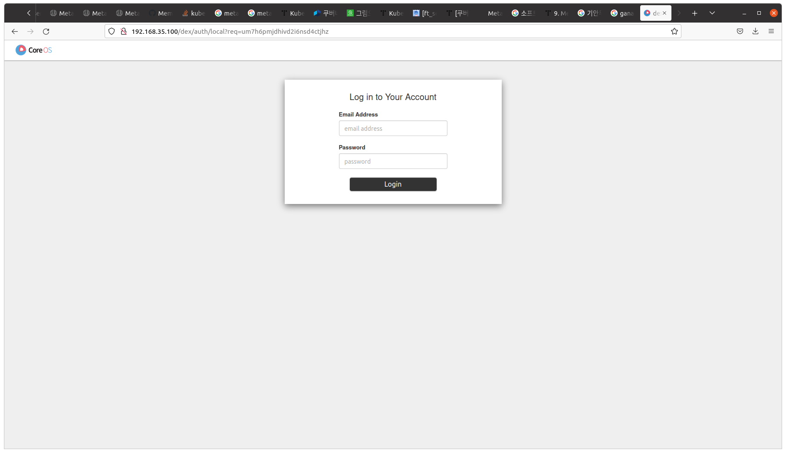
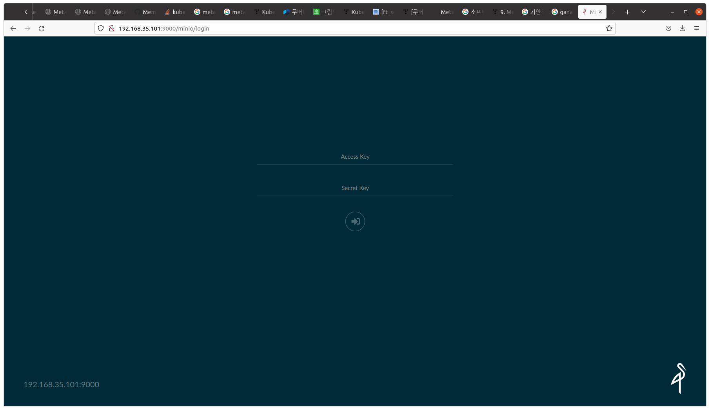
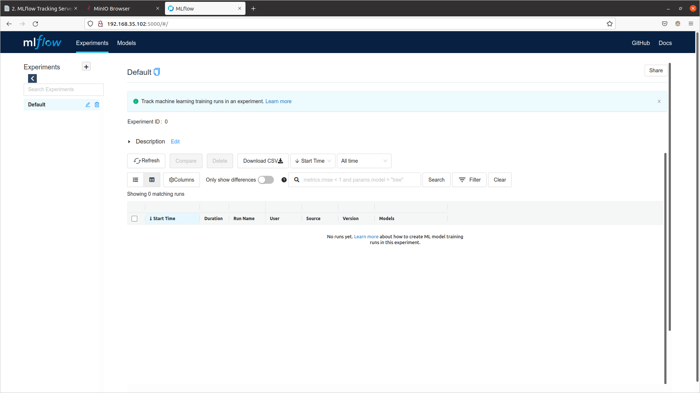
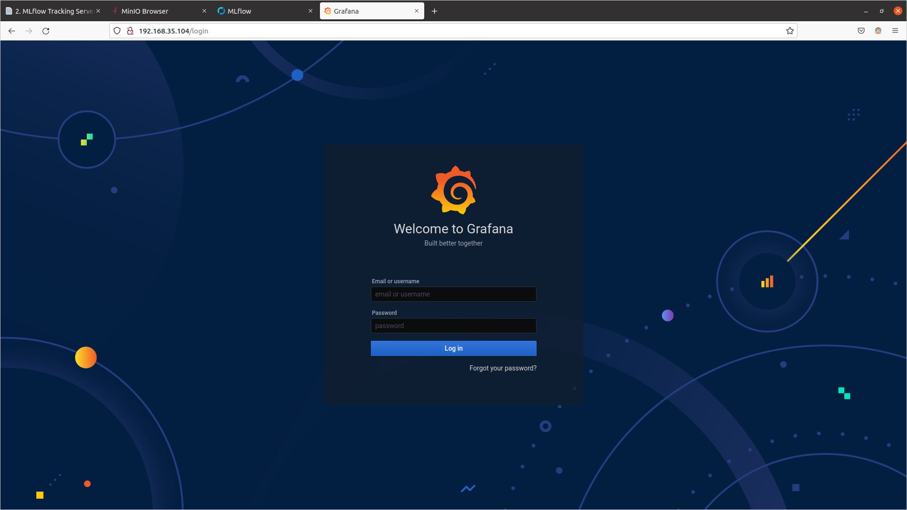

## What is MetalLB?

## Installing MetalLB

When using Kubernetes on cloud platforms such as AWS, GCP, and Azure, they provide their own load balancers. However, for on-premises clusters, an additional module needs to be installed to enable load balancing. [MetalLB](https://metallb.universe.tf/) is an open-source project that provides a load balancer for bare metal environments.

## Requirements

| Requirement                                                 | Version and Details                                          |
| ----------------------------------------------------------- | ------------------------------------------------------------ |
| Kubernetes                                                  | Version >= v1.13.0 without built-in load balancing            |
| [Compatible Network CNI](https://metallb.universe.tf/installation/network-addons/) | Calico, Canal, Cilium, Flannel, Kube-ovn, Kube-router, Weave Net |
| IPv4 addresses                                              | Used for MetalLB deployment                                  |
| BGP mode                                                    | One or more routers that support BGP functionality           |
| TCP/UDP port 7946 open between nodes                         | Memberlist requirement                                      |

### MetalLB Installation

#### Preparation

If you are using kube-proxy in IPVS mode, starting from Kubernetes v1.14.2, you need to enable strict ARP mode.  
By default, Kube-router enables strict ARP, so this feature is not required if you are using Kube-router as a service proxy.  
Before applying strict ARP mode, check the current mode.

```text
# see what changes would be made, returns nonzero returncode if different
kubectl get configmap kube-proxy -n kube-system -o yaml | \
grep strictARP
```

```text
strictARP: false
```

If strictARP: false is outputted, run the following to change it to strictARP: true.
(If strictARP: true is already outputted, you do not need to execute the following command).

```text
# actually apply the changes, returns nonzero returncode on errors only
kubectl get configmap kube-proxy -n kube-system -o yaml | \
sed -e "s/strictARP: false/strictARP: true/" | \
kubectl apply -f - -n kube-system
```

If performed normally, it will be output as follows.

```text
Warning: resource configmaps/kube-proxy is missing the kubectl.kubernetes.io/last-applied-configuration annotation which is required by kubectl apply. kubectl apply should only be used on resources created declaratively by either kubectl create --save-config or kubectl apply. The missing annotation will be patched automatically.
configmap/kube-proxy configured
```

### Installation - Manifest

#### 1. Install MetalLB.

```text
kubectl apply -f https://raw.githubusercontent.com/metallb/metallb/v0.11.0/manifests/namespace.yaml
kubectl apply -f https://raw.githubusercontent.com/metallb/metallb/v0.11.0/manifests/metallb.yaml
```

#### 2. Check installation.

Wait until both pods in the metallb-system namespace are Running.

```text
kubectl get pod -n metallb-system
```

When everthing is Running, similar results will be output.

```text
NAME                          READY   STATUS    RESTARTS   AGE
controller-7dcc8764f4-8n92q   1/1     Running   1          1m
speaker-fnf8l                 1/1     Running   1          1m
```

The components of the manifest are as follows:

- metallb-system/controller
  - Deployed as a deployment, responsible for assigning external IP addresses for load balancing.
- metallb-system/speaker
  - Deployed as a daemonset, responsible for configuring network communication to connect external traffic and services.

The service includes RBAC permissions which are necessary for the controller and speaker components to operate.

## Configuration

Setting up the load balancing policy of MetalLB can be done by deploying a configmap containing the related configuration information.

There are two modes that can be configured in MetalLB:

1. [Layer 2 Mode](https://metallb.universe.tf/concepts/layer2/) 
2. [BGP Mode](https://metallb.universe.tf/concepts/bgp/) 

Here we will proceed with Layer 2 mode.

### Layer 2 Configuration

In the Layer 2 mode, it is enough to set only the range of IP addresses to be used simply.  
When using Layer 2 mode, it is not necessary to bind IP to the network interface of the worker node, because it operates in a way that it responds directly to the ARP request of the local network and provides the computer's MAC address to the client.

The following `metallb_config.yaml` file is the configuration for MetalLB to provide control over the IP range of 192.168.35.100 ~ 192.168.35.110, and to configure Layer 2 mode.

In case the cluster node and the client node are separated, the range of 192.168.35.100 ~ 192.168.35.110 must be accessible by both the client node and the cluster node.

#### metallb_config.yaml

```text
apiVersion: v1
kind: ConfigMap
metadata:
  namespace: metallb-system
  name: config
data:
  config: |
    address-pools:
    - name: default
      protocol: layer2
      addresses:
      - 192.168.35.100-192.168.35.110  # IP 대역폭
```

Apply the above settings.

```test
kubectl apply -f metallb_config.yaml 
```

If deployed normally, it will output as follows.

```test
configmap/config created
```

## Using MetalLB

### Kubeflow Dashboard

First, before getting the load-balancing feature from MetalLB, check the current status by changing the type of the istio-ingressgateway service in the istio-system namespace to `LoadBalancer` to provide the Kubeflow Dashboard.

```text
kubectl get svc/istio-ingressgateway -n istio-system
```

The type of this service is ClusterIP and you can see that the External-IP value is `none`.

```text
NAME                   TYPE        CLUSTER-IP    EXTERNAL-IP   PORT(S)                                        AGE
istio-ingressgateway   ClusterIP   10.103.72.5   <none>        15021/TCP,80/TCP,443/TCP,31400/TCP,15443/TCP   4h21m
```

Change the type to LoadBalancer and if you want to input a desired IP address, add the loadBalancerIP item.  
If you do not add it, IP addresses will be assigned sequentially from the IP address pool set above.

```text
kubectl edit svc/istio-ingressgateway -n istio-system
```

```text
spec:
  clusterIP: 10.103.72.5
  clusterIPs:
  - 10.103.72.5
  ipFamilies:
  - IPv4
  ipFamilyPolicy: SingleStack
  ports:
  - name: status-port
    port: 15021
    protocol: TCP
    targetPort: 15021
  - name: http2
    port: 80
    protocol: TCP
    targetPort: 8080
  - name: https
    port: 443
    protocol: TCP
    targetPort: 8443
  - name: tcp
    port: 31400
    protocol: TCP
    targetPort: 31400
  - name: tls
    port: 15443
    protocol: TCP
    targetPort: 15443
  selector:
    app: istio-ingressgateway
    istio: ingressgateway
  sessionAffinity: None
  type: LoadBalancer # Change ClusterIP to LoadBalancer
  loadBalancerIP: 192.168.35.100   # Add IP
status:
  loadBalancer: {}
```

If you check again, you will see that the External-IP value is `192.168.35.100`.

```text
kubectl get svc/istio-ingressgateway -n istio-system
```

```text
NAME                   TYPE           CLUSTER-IP    EXTERNAL-IP      PORT(S)                                                                      AGE
istio-ingressgateway   LoadBalancer   10.103.72.5   192.168.35.100   15021:31054/TCP,80:30853/TCP,443:30443/TCP,31400:30012/TCP,15443:31650/TCP   5h1m
```

Open a web browser and connect to [http://192.168.35.100](http://192.168.35.100) to verify the following screen is output.



### minio Dashboard

First, we check the current status before changing the type of minio-service, which provides the Dashboard of minio, in the kubeflow namespace to LoadBalancer to receive the load balancing function from MetalLB.

```text
kubectl get svc/minio-service -n kubeflow
```

The type of this service is ClusterIP and you can confirm that the External-IP value is `none`.

```text
NAME            TYPE        CLUSTER-IP      EXTERNAL-IP   PORT(S)    AGE
minio-service   ClusterIP   10.109.209.87   <none>        9000/TCP   5h14m
```

Change the type to LoadBalancer and if you want to enter an IP address, add the loadBalancerIP item. If you do not add, the IP address will be assigned sequentially from the IP address pool set above.

```text
kubectl edit svc/minio-service -n kubeflow
```

```text
apiVersion: v1
kind: Service
metadata:
  annotations:
    kubectl.kubernetes.io/last-applied-configuration: |
      {"apiVersion":"v1","kind":"Service","metadata":{"annotations":{},"labels":{"application-crd-id":"kubeflow-pipelines"},"name":"minio-ser>
  creationTimestamp: "2022-01-05T08:44:23Z"
  labels:
    application-crd-id: kubeflow-pipelines
  name: minio-service
  namespace: kubeflow
  resourceVersion: "21120"
  uid: 0053ee28-4f87-47bb-ad6b-7ad68aa29a48
spec:
  clusterIP: 10.109.209.87
  clusterIPs:
  - 10.109.209.87
  ipFamilies:
  - IPv4
  ipFamilyPolicy: SingleStack
  ports:
  - name: http
    port: 9000
    protocol: TCP
    targetPort: 9000
  selector:
    app: minio
    application-crd-id: kubeflow-pipelines
  sessionAffinity: None
  type: LoadBalancer # Change ClusterIP to LoadBalancer
  loadBalancerIP: 192.168.35.101 # Add IP
status:
  loadBalancer: {}
```

If we check again, we can see that the External-IP value is `192.168.35.101`.

```text
kubectl get svc/minio-service -n kubeflow
```

```text
NAME            TYPE           CLUSTER-IP      EXTERNAL-IP      PORT(S)          AGE
minio-service   LoadBalancer   10.109.209.87   192.168.35.101   9000:31371/TCP   5h21m
```

Open a web browser and connect to [http://192.168.35.101:9000](http://192.168.35.101:9000) to confirm the following screen is printed. 



### mlflow Dashboard

First, we check the current status before changing the type of mlflow-server-service service in the mlflow-system namespace that provides the mlflow Dashboard to LoadBalancer to receive load balancing function from MetalLB.

```text
kubectl get svc/mlflow-server-service -n mlflow-system
```

The type of this service is ClusterIP and you can confirm that the External-IP value is `none`.

```text
NAME                    TYPE        CLUSTER-IP       EXTERNAL-IP   PORT(S)    AGE
mlflow-server-service   ClusterIP   10.111.173.209   <none>        5000/TCP   4m50s
```

Change the type to LoadBalancer and if you want to input the desired IP address, add the loadBalancerIP item.  
If you do not add it, the IP address will be assigned sequentially from the IP address pool set above.

```text
kubectl edit svc/mlflow-server-service -n mlflow-system
```

```text
apiVersion: v1
kind: Service
metadata:
  annotations:
    meta.helm.sh/release-name: mlflow-server
    meta.helm.sh/release-namespace: mlflow-system
  creationTimestamp: "2022-01-07T04:00:19Z"
  labels:
    app.kubernetes.io/managed-by: Helm
  name: mlflow-server-service
  namespace: mlflow-system
  resourceVersion: "276246"
  uid: e5d39fb7-ad98-47e7-b512-f9c673055356
spec:
  clusterIP: 10.111.173.209
  clusterIPs:
  - 10.111.173.209
  ipFamilies:
  - IPv4
  ipFamilyPolicy: SingleStack
  ports:
  - port: 5000
    protocol: TCP
    targetPort: 5000
  selector:
    app.kubernetes.io/name: mlflow-server
  sessionAffinity: None
  type: LoadBalancer # Change ClusterIP to LoadBalancer
  loadBalancerIP: 192.168.35.102 # Add IP
status:
  loadBalancer: {}
```

If we check again, we can see that the External-IP value is `192.168.35.102`.

```text
kubectl get svc/mlflow-server-service -n mlflow-system
```

```text
NAME                    TYPE           CLUSTER-IP       EXTERNAL-IP      PORT(S)          AGE
mlflow-server-service   LoadBalancer   10.111.173.209   192.168.35.102   5000:32287/TCP   6m11s
```

Open the web browser and connect to [http://192.168.35.102:5000](http://192.168.35.102:5000) to confirm the following screen is displayed.



### Grafana Dashboard

First, check the current status before changing the type of seldon-core-analytics-grafana service in the seldon-system namespace which provides Grafana's Dashboard to receive Load Balancing function from MetalLB.

```text
kubectl get svc/seldon-core-analytics-grafana -n seldon-system
```

The type of the corresponding service is ClusterIP, and you can see that the External-IP value is `none`.

```text
NAME                            TYPE        CLUSTER-IP      EXTERNAL-IP   PORT(S)   AGE
seldon-core-analytics-grafana   ClusterIP   10.109.20.161   <none>        80/TCP    94s
```

Change the type to LoadBalancer and if you want to enter an IP address, add the loadBalancerIP item.  
If not, an IP address will be assigned sequentially from the IP address pool set above.

```text
kubectl edit svc/seldon-core-analytics-grafana -n seldon-system
```

```text
apiVersion: v1
kind: Service
metadata:
  annotations:
    meta.helm.sh/release-name: seldon-core-analytics
    meta.helm.sh/release-namespace: seldon-system
  creationTimestamp: "2022-01-07T04:16:47Z"
  labels:
    app.kubernetes.io/instance: seldon-core-analytics
    app.kubernetes.io/managed-by: Helm
    app.kubernetes.io/name: grafana
    app.kubernetes.io/version: 7.0.3
    helm.sh/chart: grafana-5.1.4
  name: seldon-core-analytics-grafana
  namespace: seldon-system
  resourceVersion: "280605"
  uid: 75073b78-92ec-472c-b0d5-240038ea8fa5
spec:
  clusterIP: 10.109.20.161
  clusterIPs:
  - 10.109.20.161
  ipFamilies:
  - IPv4
  ipFamilyPolicy: SingleStack
  ports:
  - name: service
    port: 80
    protocol: TCP
    targetPort: 3000
  selector:
    app.kubernetes.io/instance: seldon-core-analytics
    app.kubernetes.io/name: grafana
  sessionAffinity: None
  type: LoadBalancer # Change ClusterIP to LoadBalancer
  loadBalancerIP: 192.168.35.103 # Add IP
status:
  loadBalancer: {}
```

If you check again, you can see that the External-IP value is `192.168.35.103`.

```text
kubectl get svc/seldon-core-analytics-grafana -n seldon-system
```

```text
NAME                            TYPE           CLUSTER-IP      EXTERNAL-IP      PORT(S)        AGE
seldon-core-analytics-grafana   LoadBalancer   10.109.20.161   192.168.35.103   80:31191/TCP   5m14s
```

Open the Web Browser and connect to http://192.168.35.103:80 to confirm that the following screen is displayed.


