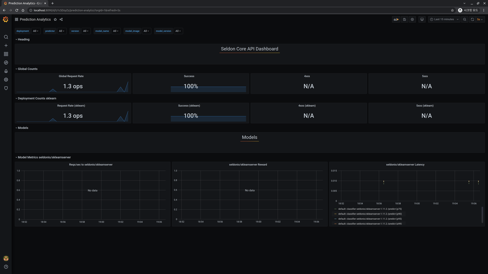

## Grafana & Prometheus

이제, [지난 페이지](../api-deployment/seldon-iris.md)에서 생성했던 SeldonDeployment 로 API Request 를 반복적으로 수행해보고, 대시보드에 변화가 일어나는지 확인해봅니다.

### 대시보드

[앞서 생성한 대시보드](../setup-components/install-components-pg.md)를 포트 포워딩합니다.

```text
kubectl port-forward svc/seldon-core-analytics-grafana -n seldon-system 8090:80
```

### API 요청

[앞서 생성한 Seldon Deployment](../api-deployment/seldon-iris.md#using-cli)에 요청을 **반복해서** 보냅니다.

```text
curl -X POST http://$NODE_IP:$NODE_PORT/seldon/seldon-deploy/sklearn/api/v1.0/predictions \
-H 'Content-Type: application/json' \
-d '{ "data": { "ndarray": [[1,2,3,4]] } }'
```

그리고 그라파나 대시보드를 확인하면 다음과 같이 Global Request Rate 이 `0 ops` 에서 순간적으로 상승하는 것을 확인할 수 있습니다.



이렇게 프로메테우스와 그라파나가 정상적으로 설치된 것을 확인할 수 있습니다.
