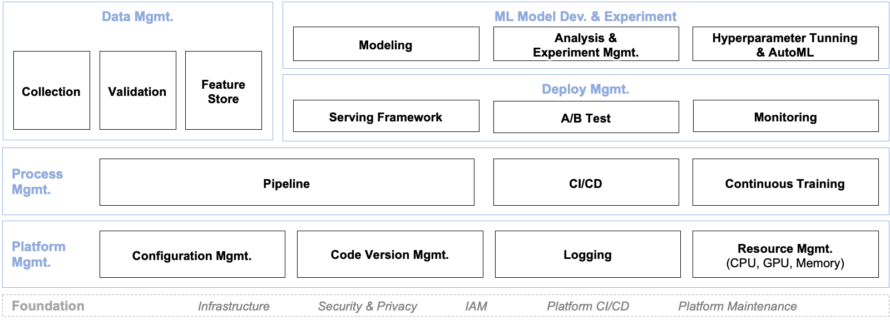
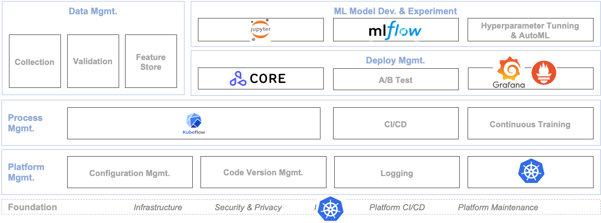
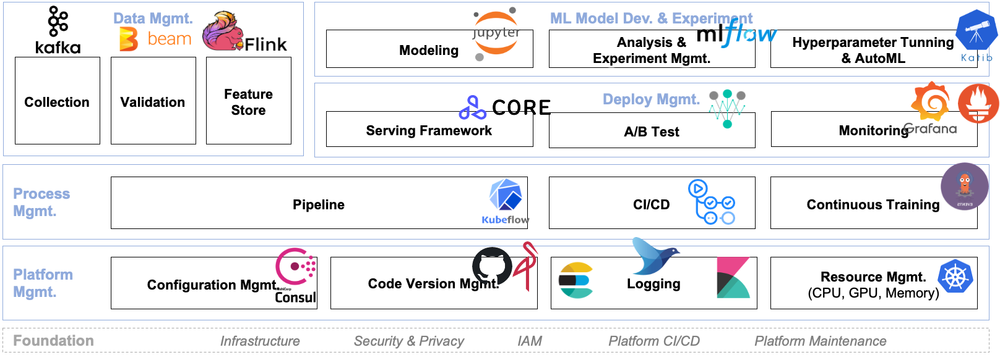

## MLOps Component

[MLOps Concepts](../introduction/component.md)에서 다루었던 컴포넌트를 도식화하면 다음과 같습니다.

이 중 *모두의 MLOps* 에서 다룬 기술 스택들은 다음과 같습니다.

보시는 것처럼 아직 우리가 다루지 못한 많은 MLOps 컴포넌트들이 있습니다.  

시간 관계상 이번에 모두 다루지는 못했지만, 만약 필요하다면 다음과 같은 오픈소스들을 먼저 참고해보면 좋을 것 같습니다.

세부 내용은 다음과 같습니다.

| Mgmt.                      | Component                   | Open Soruce                           |
| -------------------------- | --------------------------- | ------------------------------------- |
| Data Mgmt.                 | Collection                  | [Kafka](https://kafka.apache.org/)                                 |
|                            | Validation                  | [Beam](https://beam.apache.org/)                                  |
|                            | Feature Store               | [Flink](https://flink.apache.org/)                                 |
| ML Model Dev. & Experiment | Modeling                    | [Jupyter](https://jupyter.org/)                               |
|                            | Analysis & Experiment Mgmt. | [MLflow](https://mlflow.org/)                                |
|                            | HPO Tuning & AutoML         | [Katib](https://github.com/kubeflow/katib)                                 |
| Deploy Mgmt.               | Serving Framework           | [Seldon Core](https://docs.seldon.io/projects/seldon-core/en/latest/index.html)                           |
|                            | A/B Test                    | [Iter8](https://iter8.tools/)                                 |
|                            | Monitoring                  | [Grafana](https://grafana.com/oss/grafana/), [Prometheus](https://prometheus.io/)                   |
| Process Mgmt.              | pipeline                    | [Kubeflow](https://www.kubeflow.org/)                              |
|                            | CI/CD                       | [Github Action](https://docs.github.com/en/actions)                         |
|                            | Continuous Training         | [Argo Events](https://argoproj.github.io/events/)                           |
| Platform Mgmt.             | Configuration Mgmt.         | [Consul](https://www.consul.io/)                                |
|                            | Code Version Mgmt.          | [Github](https://github.com/), [Minio](https://min.io/)                         |
|                            | Logging                     | (EFK) [Elastic Search](https://www.elastic.co/kr/elasticsearch/), [Fluentd](https://www.fluentd.org/), [Kibana](https://www.elastic.co/kr/kibana/) |
|                            | Resource Mgmt.              | [Kubernetes](https://kubernetes.io/)                            |
