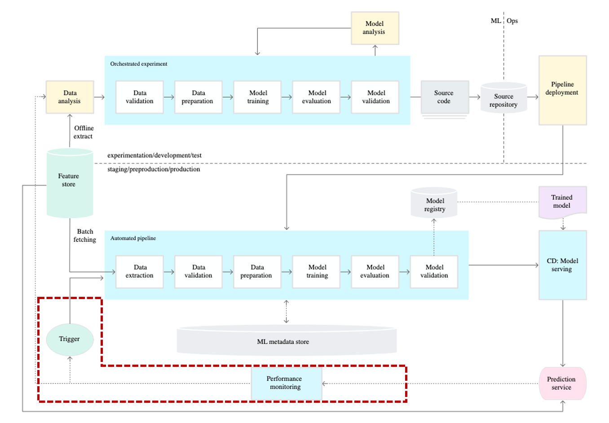

This page will look at the steps of MLOps outlined by Google and explore what the core features of MLOps are.

## Hidden Technical Debt in ML System

Google has been talking about the need for MLOps since as far back as 2015.  The paper Hidden Technical Debt in Machine Learning Systems encapsulates this idea from Google.  

The key takeaway from this paper is that the machine learning code is only a small part of the entire system when it comes to building products with machine learning.

Google developed MLOps by evolving this paper and expanding the term. More details can be found on the [Google Cloud homepage](https://cloud.google.com/architecture/mlops-continuous-delivery-and-automation-pipelines-in-machine-learning). In this post, we will try to explain what Google means by MLOps.

Google divided the evolution of MLOps into three (0-2) stages. Before explaining each stage, let's review some of the concepts described in the previous post.

In order to operate a machine learning model, there is a machine learning team responsible for developing the model and an operations team responsible for deployment and operations. MLOps is needed for the successful collaboration of these two teams. We have previously said that it can be done simply through Continuous Integration (CI) / Continuous Deployment (CD), so let us see how to do CI / CD.

## Level 0: Manual Process

At the 0th stage, two teams communicate through a "model". The machine learning team trains the model with accumulated data and delivers the trained model to the operation team. The operation team then deploys the model delivered in this way.

Initial machine learning models are deployed through this "model" centered communication. However, there are several problems with this distribution method. For example, if some functions use Python 3.7 and some use Python 3.8, we often see the following situation.

The reason for this situation lies in the characteristics of the machine learning model. Three things are needed for the trained machine learning model to work:

1. Python code
2. Trained weights
3. Environment (Packages, versions)

If any of these three aspects is communicated incorrectly, the model may fail to function or make unexpected predictions. However, in many cases, models fail to work due to environmental mismatches. Machine learning relies on various open-source libraries, and due to the nature of open-source, even the same function can produce different results depending on the version used.

In the early stages of a service, when there are not many models to manage, these issues can be resolved quickly. However, as the number of managed features increases and communication becomes more challenging, it becomes difficult to deploy models with better performance quickly.

## Level 1: Automated ML Pipeline
### Pipeline

So, in MLOps, "pipeline" is used to prevent such problems. The MLOps pipeline ensures that the model operates in the same environment as the one used by the machine learning engineer during model development, using containers like Docker. This helps prevent situations where the model doesn't work due to differences in the environment.

However, the term "pipeline" is used in a broader context and in various tasks. What is the role of the pipeline that machine learning engineers create? The pipeline created by machine learning engineers produces trained models. Therefore, it would be more accurate to refer to it as a training pipeline rather than just a pipeline.

### Continuous Training

And the concept of Continuous Training (CT) is added. So why is CT necessary?

#### Auto Retrain

In the real world, data exhibits a characteristic called "Data Shift," where the data distribution keeps changing over time. As a result, models trained in the past may experience performance degradation over time. The simplest and most effective solution to this problem is to retrain the model using recent data. By retraining the model according to the changed data distribution, it can regain its performance.

#### Auto Deploy

However, in industries such as manufacturing, where multiple recipes are processed in a single factory, it may not always be desirable to retrain the model unconditionally. One common example is the blind spot.

For example, in an automotive production line, a model A was created and used for predictions. If an entirely different model B is introduced, it represents unseen data patterns, and a new model is trained for model B.

Now, the model will make predictions for model B. However, if the data switches back to model A, what should be done? 
If there are only retraining rules, a new model for model A will be trained again. However, machine learning models require a sufficient amount of data to demonstrate satisfactory performance. The term "blind spot" refers to a period in which the model does not work while gathering enough data.

There is a simple solution to address this blind spot. It involves checking whether there was a previous model for model A and, if so, using the previous model for prediction instead of immediately training a new model. This way, using meta-data associated with the model to automatically switch models is known as Auto Deploy.

To summarize, for Continuous Training (CT), both Auto Retrain and Auto Deploy are necessary. They complement each other's weaknesses and enable the model's performance to be maintained continuously.

### Model Serving

Machine learning pipelines in production continuously deploy the latest models based on new data to your prediction service. This process involves automatically deploying trained and validated models to online prediction services.

## Level 2: Automating the CI/CD Pipeline

The title of Step 2 is the automation of CI and CD. In DevOps, the focus of CI/CD is on source code. So what is the focus of CI/CD in MLOps?

In MLOps, the focus of CI/CD is also on source code, but more specifically, it can be seen as the training pipeline.

Therefore, when it comes to training models, it is important to verify whether the model is trained correctly (CI) and whether the trained model functions properly (CD) in response to relevant changes that can impact the training process. Hence, CI/CD should be performed when there are direct modifications to the code used for training.

In addition to code, the versions of the packages used and changes in the Python version are also part of CI/CD. In many cases, machine learning utilizes open-source packages. However, open-source packages can have changes in the internal logic of functions when their versions are updated. Although notifications may be provided when there are certain version updates, significant changes in versions can go unnoticed. Therefore, when the versions of the packages used change, it is important to perform CI/CD to ensure that the model is trained and functions correctly.

In summary, in MLOps, CI/CD focuses on the source code, particularly the training pipeline, to verify that the model is trained correctly and functions properly. This includes checking for direct code modifications and changes in package versions or Python versions to ensure the integrity of the training and functioning processes of the model.
