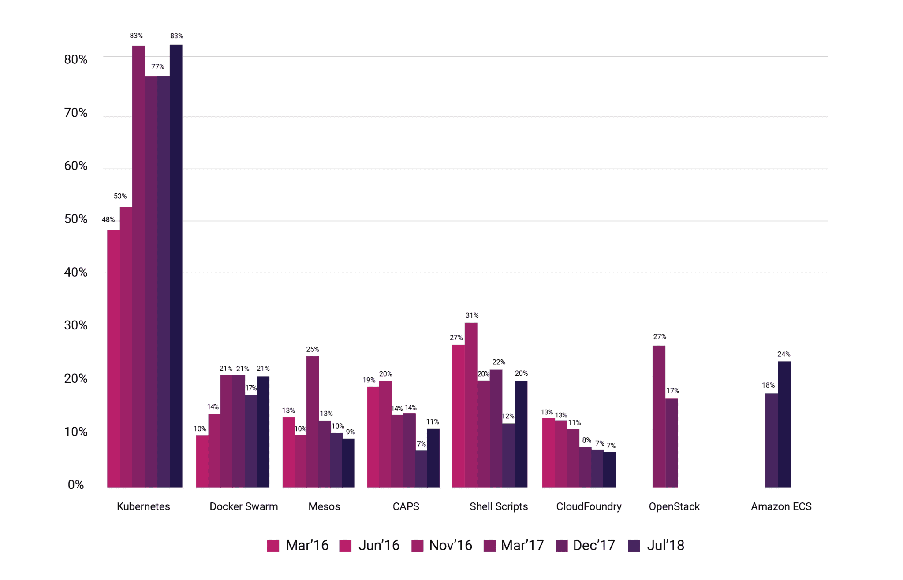

## MLOps & Kubernetes

When talking about MLOps, why is the word Kubernetes always heard together?

To build a successful MLOps system, various components are needed as described in [Components of MLOps](../introduction/component.md), but to operate them organically at the infrastructure level, there are many issues to be solved. For example, simply running a large number of machine learning model requests in order, ensuring the same execution environment in other workspaces, and responding quickly when a deployed service has a failure.

The need for containers and container orchestration systems appears here. With the introduction of container orchestration systems such as Kubernetes, efficient isolation and management of execution environments can be achieved. By introducing a container orchestration system, it is possible to prevent situations such as *'Is anyone using cluster 1?', 'Who killed my process that was using GPU?', 'Who updated the x package on the cluster?* when developing and deploying machine learning models while a few developers share a small number of clusters.

## Container

Microsoft defines a container as follows: What is a container then? In Microsoft, a container is defined as [follows](https://azure.microsoft.com/en-us/overview/what-is-a-container/).

> Container: Standardized, portable packaging of an application's code, libraries, and configuration files

But why is a container needed for machine learning? Machine learning models can behave differently depending on the operating system, Python execution environment, package version, etc. To prevent this, the technology used to share and execute the entire dependent execution environment with the source code used in machine learning is called containerization technology. This packaged form is called a container image, and by sharing the container image, users can ensure the same execution results on any system. In other words, by sharing not just the Jupyter Notebook file or the source code and requirements.txt file of the model, but the entire container image with the execution environment, you can avoid situations such as *"It works on my notebook, why not yours?"*.

One translation of the Korean sentence to English is: "One of the common misunderstandings that people who are new to containers often make is to assume that "container == Docker". Docker is not a concept that has the same meaning as containers; rather, it is a tool that provides features to make it easier and more flexible to use containers, such as launching containers and creating and sharing container images. In summary, container is a virtualization technology, and Docker is an implementation of virtualization technology.

However, Docker has become the mainstream quickly due to its easy usability and high efficiency among various container virtualization tools, so when people think of containers, they often think of Docker automatically. There are various reasons why the container and Docker ecosystem have become the mainstream, but for technical reasons, I won't go into that detail since it is outside the scope of Everybody's MLOps.

## Container Orchestration System

Then what is a container orchestration system? As inferred from the word "orchestration," it can be compared to a system that coordinates the operation of numerous containers to work together harmoniously.

In container-based systems, services are provided to users in the form of containers. If the number of containers to be managed is small, a single operator can sufficiently handle all situations. However, if there are hundreds of containers running in dozens of clusters and they need to function continuously without causing any failures, it becomes nearly impossible for a single operator to monitor the proper functioning of all services and respond to issues.

For example, continuous monitoring is required to ensure that all services are functioning properly. If a specific service experiences a failure, the operator needs to investigate the problem by examining the logs of multiple containers. Additionally, they need to handle various tasks such as scheduling and load balancing to prevent work overload on specific clusters or containers, as well as scaling operations.

A container orchestration system is software that provides functionality to manage and operate the states of numerous containers continuously and automatically, making the process of managing and operating a large number of containers somewhat easier.

How can it be used in machine learning? For example, a container that packages deep learning training code that requires a GPU can be executed on a cluster with available GPUs. A container that packages data preprocessing code requiring a large amount of memory can be executed on a cluster with ample memory. If there is an issue with the cluster during training, the system can automatically move the same container to a different cluster and continue the training, eliminating the need for manual intervention. Developing such a system that automates management without requiring manual intervention is the goal.

As of the writing of this text in 2022, Kubernetes is considered the de facto standard for container orchestration systems.

According to the [survey](https://www.cncf.io/blog/2018/08/29/cncf-survey-use-of-cloud-native-technologies-in-production-has-grown-over-200-percent/) released by CNCF in 2018, Kubernetes was already showing its prominence. The [survey](https://www.cncf.io/wp-content/uploads/2020/08/CNCF_Survey_Report.pdf) published in 2019 indicates that 78% of respondents were using Kubernetes at a production level.

The growth of the Kubernetes ecosystem can be attributed to various reasons. However, similar to Docker, Kubernetes is not exclusively limited to machine learning-based services. Since delving into detailed technical content would require a substantial amount of discussion, this edition of "MLOps for ALL" will omit the detailed explanation of Kubernetes.
