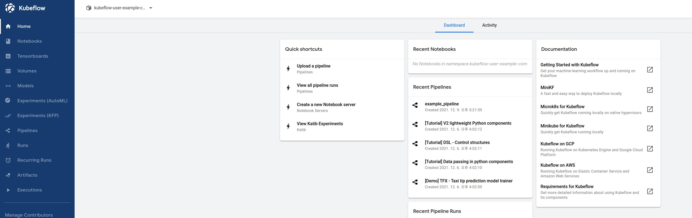

[Kubeflow 설치](../setup-components/install-components-kf.md)를 완료하면, 다음 커맨드를 통해 대시보드에 접속할 수 있습니다.

```text
kubectl port-forward --address 0.0.0.0 svc/istio-ingressgateway -n istio-system 8080:80
```



Central Dashboard는 Kubeflow에서 제공하는 모든 기능을 통합하여 제공하는 UI입니다. Central Dashboard에서 제공하는 기능은 크게 왼쪽의 탭을 기준으로 구분할 수 있습니다.


- Home
- Notebooks
- Tensorboards
- Volumes
- Models
- Experiments(AutoML)
- Experiments(KFP)
- Pipelines
- Runs
- Recurring Runs
- Artifacts
- Executions

그럼 이제 기능별 간단한 사용법을 알아보겠습니다.
