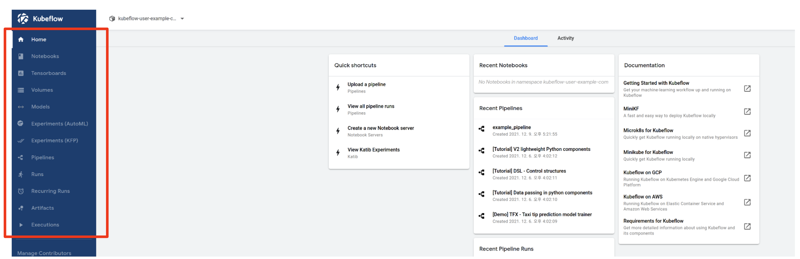
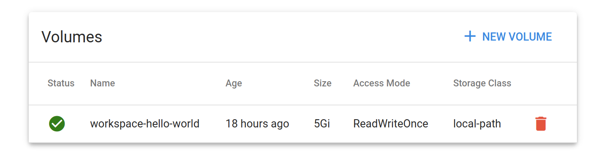
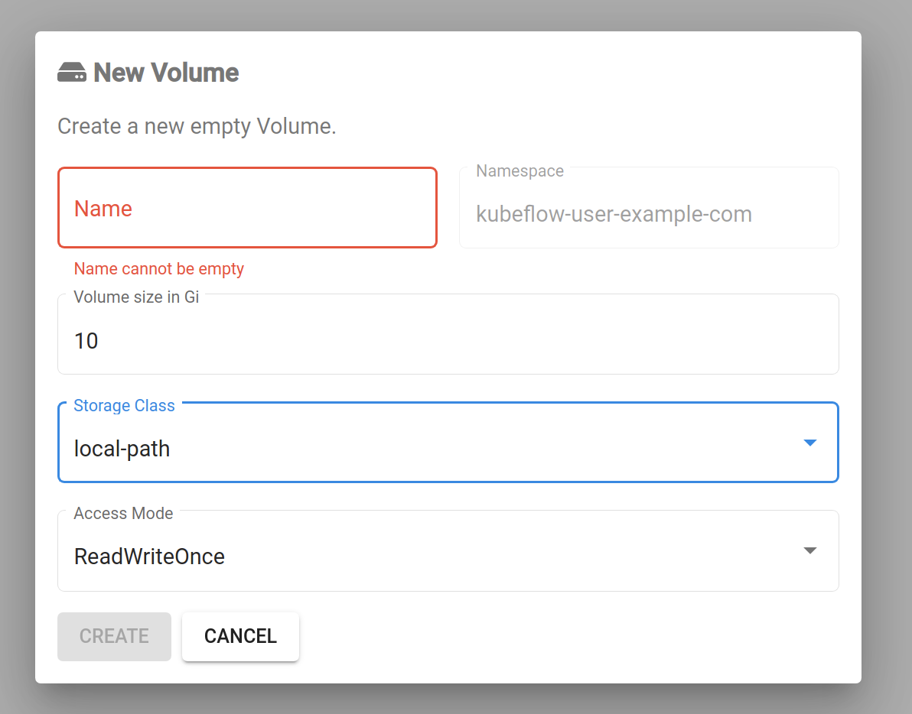
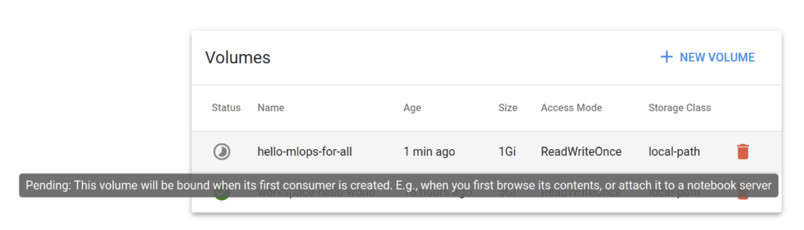

## Volumes

Next, let's click on the Volumes tab in the left of the Central Dashboard.

You will see the following screen.

Volumes tab provides the functionality to manage the Persistent Volume Claims (PVC) belonging to the current user's namespace in Kubernetes' Volume (Volume).

By looking at the screenshot, you can see the information of the Volume created on the [1. Notebooks](../kubeflow-dashboard-guide/notebooks) page. It can be seen that the Storage Class of the Volume is set to local-path, which is the Default Storage Class installed at the time of Kubernetes cluster installation.

In addition, the Volumes page can be used if you want to create, view, or delete a new Volume in the user namespace.

---

## Creating a Volume

By clicking the `+ NEW VOLUME` button at the top right, you can see the following screen.

You can create a volume by specifying its name, size, storage class, and access mode.

When you specify the desired resource specs to create a volume, its Status will be shown as Pending on this page. When you hover over the Status icon, you will see a message that this *(This volume will be bound when its first consumer is created.)*  
This is according to the volume creation policy of the [StorageClass](https://kubernetes.io/ko/docs/concepts/storage/storage-classes/) used in the lab, which is local-path. **This is not a problem situation.**  
When the Status is shown as Pending on this page, you can still specify the name of the volume in the notebook server or pod that you want to use the volume and the volume creation will be triggered at that time.

