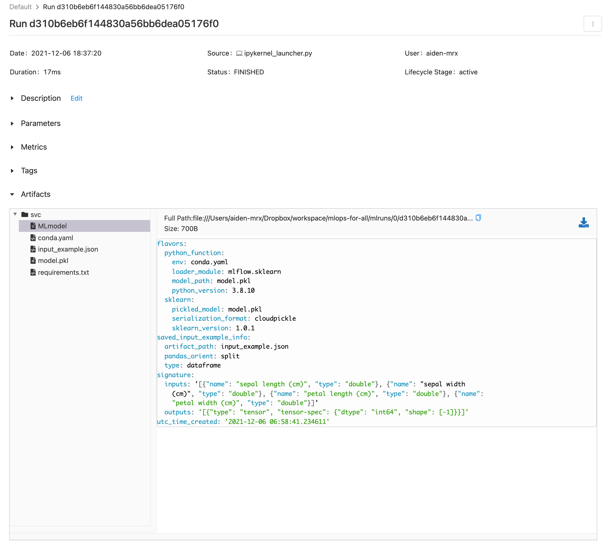
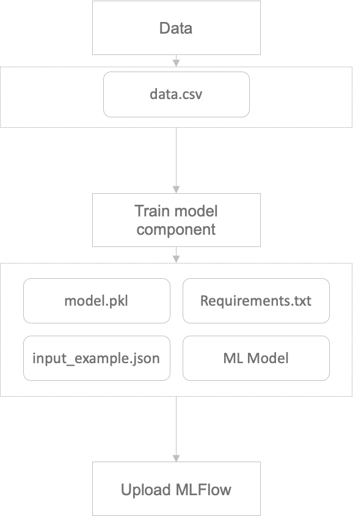
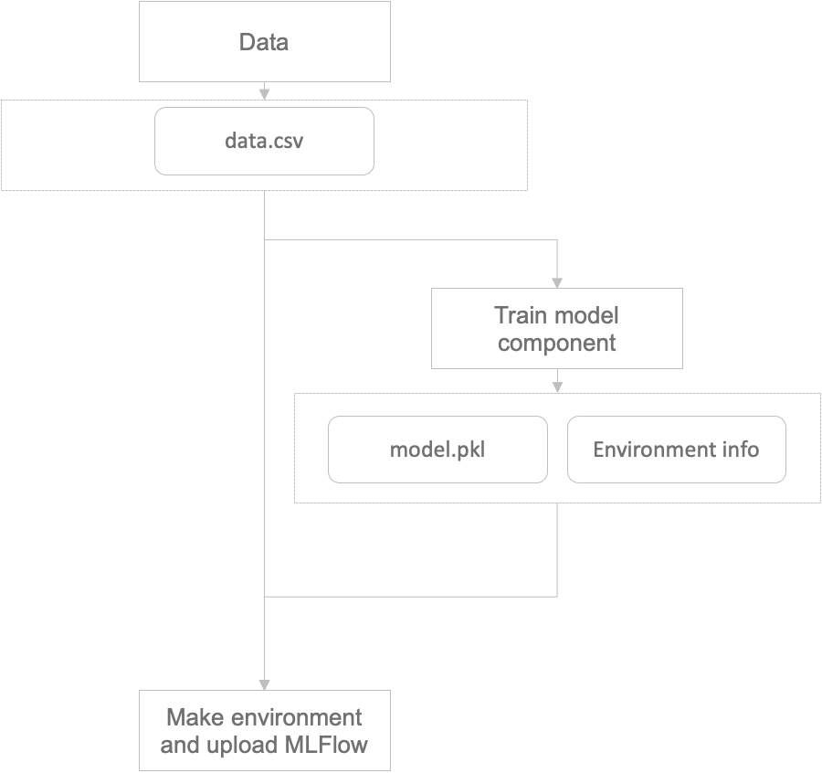
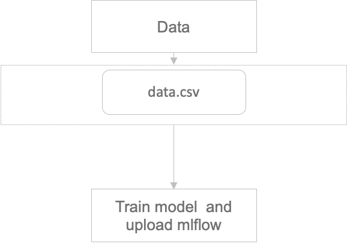
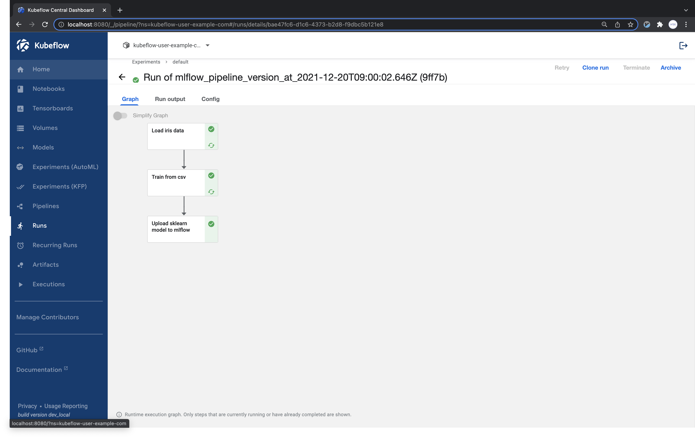
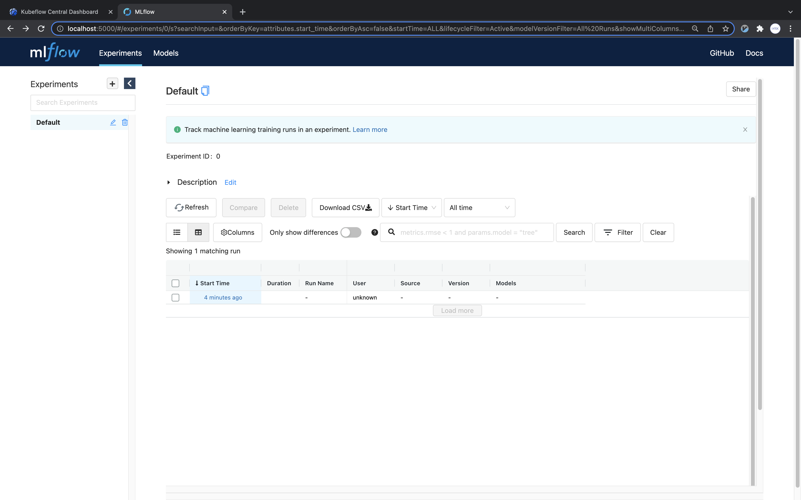
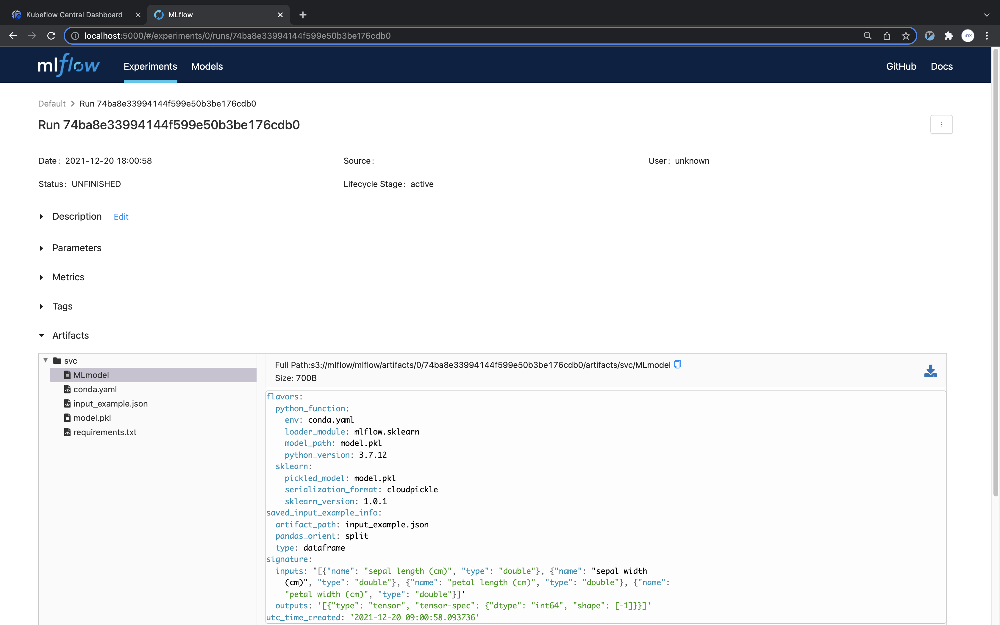

## MLFlow Component

In this page, we will explain the process of writing a component to store the model in MLFlow so that the model trained in [Advanced Usage Component](../kubeflow/advanced-component.md) can be linked to API deployment.

## MLFlow in Local

In order to store the model in MLFlow and use it in serving, the following items are needed.

- model
- signature
- input_example
- conda_env

We will look into the process of saving a model to MLFlow through Python code.

### 1. Train model

The following steps involve training an SVC model using the iris dataset.

```python
import pandas as pd
from sklearn.datasets import load_iris
from sklearn.svm import SVC

iris = load_iris()

data = pd.DataFrame(iris["data"], columns=iris["feature_names"])
target = pd.DataFrame(iris["target"], columns=["target"])

clf = SVC(kernel="rbf")
clf.fit(data, target)

```

### 2. MLFLow Infos

This process creates the necessary information for MLFlow.

```python
from mlflow.models.signature import infer_signature
from mlflow.utils.environment import _mlflow_conda_env

input_example = data.sample(1)
signature = infer_signature(data, clf.predict(data))
conda_env = _mlflow_conda_env(additional_pip_deps=["dill", "pandas", "scikit-learn"])
```

Each variable's content is as follows.

- `input_example`

    | sepal length (cm) | sepal width (cm) | petal length (cm) | petal width (cm) |
    | --- | --- | --- | --- |
    | 6.5 | 6.7 | 3.1 | 4.4 |

- `signature`

    ```python
    inputs:
      ['sepal length (cm)': double, 'sepal width (cm)': double, 'petal length (cm)': double, 'petal width (cm)': double]
    outputs:
      [Tensor('int64', (-1,))]
    ```

- `conda_env`

    ```python
    {'name': 'mlflow-env',
     'channels': ['conda-forge'],
     'dependencies': ['python=3.8.10',
      'pip',
      {'pip': ['mlflow', 'dill', 'pandas', 'scikit-learn']}]}
    ```

### 3. Save MLFLow Infos

Next, we save the learned information and the model. Since the trained model uses the sklearn package, we can easily save the model using `mlflow.sklearn`.

```python
from mlflow.sklearn import save_model

save_model(
    sk_model=clf,
    path="svc",
    serialization_format="cloudpickle",
    conda_env=conda_env,
    signature=signature,
    input_example=input_example,
)
```

If you work locally, a svc folder will be created and the following files will be generated.

```text
ls svc
```

If you execute the command above, you can check the following output value.

```text
MLmodel            conda.yaml         input_example.json model.pkl          requirements.txt
```

Each file will be as follows if checked.

- MLmodel

    ```text
    flavors:
      python_function:
        env: conda.yaml
        loader_module: mlflow.sklearn
        model_path: model.pkl
        python_version: 3.8.10
      sklearn:
        pickled_model: model.pkl
        serialization_format: cloudpickle
        sklearn_version: 1.0.1
    saved_input_example_info:
      artifact_path: input_example.json
      pandas_orient: split
      type: dataframe
    signature:
      inputs: '[{"name": "sepal length (cm)", "type": "double"}, {"name": "sepal width
        (cm)", "type": "double"}, {"name": "petal length (cm)", "type": "double"}, {"name":
        "petal width (cm)", "type": "double"}]'
      outputs: '[{"type": "tensor", "tensor-spec": {"dtype": "int64", "shape": [-1]}}]'
    utc_time_created: '2021-12-06 06:52:30.612810'
    ```

- conda.yaml

    ```text
    channels:
    - conda-forge
    dependencies:
    - python=3.8.10
    - pip
    - pip:
      - mlflow
      - dill
      - pandas
      - scikit-learn
    name: mlflow-env
    ```

- input_example.json

    ```text
    {
        "columns": 
        [
            "sepal length (cm)",
            "sepal width (cm)",
            "petal length (cm)",
            "petal width (cm)"
        ],
        "data": 
        [
            [6.7, 3.1, 4.4, 1.4]
        ]
    }
    ```

- requirements.txt

    ```text
    mlflow
    dill
    pandas
    scikit-learn
    ```

- model.pkl

## MLFlow on Server

Now, let's proceed with the task of uploading the saved model to the MLflow server.

```python
import mlflow

with mlflow.start_run():
    mlflow.log_artifact("svc/")
```

Save and open the `mlruns` directory generated path with `mlflow ui` command to launch mlflow server and dashboard.
Access the mlflow dashboard, click the generated run to view it as below.


(This screen may vary depending on the version of mlflow.)

## MLFlow Component

Now, let's write a reusable component in Kubeflow.

The ways of writing components that can be reused are broadly divided into three categories.

1. After saving the necessary environment in the component responsible for model training, the MLflow component is only responsible for the upload.

    

2. Pass the trained model and data to the MLflow component, which is responsible for saving and uploading.

    

3. The component responsible for model training handles both saving and uploading.

    

We are trying to manage the model through the first approach.
The reason is that we don't need to write the code to upload the MLFlow model every time like three times for each component written.

Reusing components is possible by the methods 1 and 2.
However, in the case of 2, it is necessary to deliver the trained image and packages to the component, so ultimately additional information about the component must be delivered.

In order to proceed with the method 1, the learning component must also be changed.
Code that stores the environment needed to save the model must be added.

```python
from functools import partial
from kfp.components import InputPath, OutputPath, create_component_from_func

@partial(
    create_component_from_func,
    packages_to_install=["dill", "pandas", "scikit-learn", "mlflow"],
)
def train_from_csv(
    train_data_path: InputPath("csv"),
    train_target_path: InputPath("csv"),
    model_path: OutputPath("dill"),
    input_example_path: OutputPath("dill"),
    signature_path: OutputPath("dill"),
    conda_env_path: OutputPath("dill"),
    kernel: str,
):
    import dill
    import pandas as pd
    from sklearn.svm import SVC

    from mlflow.models.signature import infer_signature
    from mlflow.utils.environment import _mlflow_conda_env

    train_data = pd.read_csv(train_data_path)
    train_target = pd.read_csv(train_target_path)

    clf = SVC(kernel=kernel)
    clf.fit(train_data, train_target)

    with open(model_path, mode="wb") as file_writer:
        dill.dump(clf, file_writer)

    input_example = train_data.sample(1)
    with open(input_example_path, "wb") as file_writer:
        dill.dump(input_example, file_writer)

    signature = infer_signature(train_data, clf.predict(train_data))
    with open(signature_path, "wb") as file_writer:
        dill.dump(signature, file_writer)

    conda_env = _mlflow_conda_env(
        additional_pip_deps=["dill", "pandas", "scikit-learn"]
    )
    with open(conda_env_path, "wb") as file_writer:
        dill.dump(conda_env, file_writer)

```

Write a component to upload to MLFlow.
At this time, configure the uploaded MLFlow endpoint to be connected to the [mlflow service](../setup-components/install-components-mlflow.md) that we installed.  
In this case, use the Kubernetes Service DNS Name of the Minio installed at the time of MLFlow Server installation. As this service is created in the Kubeflow namespace with the name minio-service, set it to `http://minio-service.kubeflow.svc:9000`.  
Similarly, for the tracking_uri address, use the Kubernetes Service DNS Name of the MLFlow server and set it to `http://mlflow-server-service.mlflow-system.svc:5000`.

```python
from functools import partial
from kfp.components import InputPath, create_component_from_func

@partial(
    create_component_from_func,
    packages_to_install=["dill", "pandas", "scikit-learn", "mlflow", "boto3"],
)
def upload_sklearn_model_to_mlflow(
    model_name: str,
    model_path: InputPath("dill"),
    input_example_path: InputPath("dill"),
    signature_path: InputPath("dill"),
    conda_env_path: InputPath("dill"),
):
    import os
    import dill
    from mlflow.sklearn import save_model
    
    from mlflow.tracking.client import MlflowClient

    os.environ["MLFLOW_S3_ENDPOINT_URL"] = "http://minio-service.kubeflow.svc:9000"
    os.environ["AWS_ACCESS_KEY_ID"] = "minio"
    os.environ["AWS_SECRET_ACCESS_KEY"] = "minio123"

    client = MlflowClient("http://mlflow-server-service.mlflow-system.svc:5000")

    with open(model_path, mode="rb") as file_reader:
        clf = dill.load(file_reader)

    with open(input_example_path, "rb") as file_reader:
        input_example = dill.load(file_reader)

    with open(signature_path, "rb") as file_reader:
        signature = dill.load(file_reader)

    with open(conda_env_path, "rb") as file_reader:
        conda_env = dill.load(file_reader)

    save_model(
        sk_model=clf,
        path=model_name,
        serialization_format="cloudpickle",
        conda_env=conda_env,
        signature=signature,
        input_example=input_example,
    )
    run = client.create_run(experiment_id="0")
    client.log_artifact(run.info.run_id, model_name)
```

## MLFlow Pipeline

Now let's connect the components we have written and create a pipeline. 

### Data Component

The data we will use to train the model is sklearn's iris.
We will write a component to generate the data.

```python
from functools import partial

from kfp.components import InputPath, OutputPath, create_component_from_func


@partial(
    create_component_from_func,
    packages_to_install=["pandas", "scikit-learn"],
)
def load_iris_data(
    data_path: OutputPath("csv"),
    target_path: OutputPath("csv"),
):
    import pandas as pd
    from sklearn.datasets import load_iris

    iris = load_iris()

    data = pd.DataFrame(iris["data"], columns=iris["feature_names"])
    target = pd.DataFrame(iris["target"], columns=["target"])

    data.to_csv(data_path, index=False)
    target.to_csv(target_path, index=False)

```

### Pipeline

The pipeline code can be written as follows.

```python
from kfp.dsl import pipeline


@pipeline(name="mlflow_pipeline")
def mlflow_pipeline(kernel: str, model_name: str):
    iris_data = load_iris_data()
    model = train_from_csv(
        train_data=iris_data.outputs["data"],
        train_target=iris_data.outputs["target"],
        kernel=kernel,
    )
    _ = upload_sklearn_model_to_mlflow(
        model_name=model_name,
        model=model.outputs["model"],
        input_example=model.outputs["input_example"],
        signature=model.outputs["signature"],
        conda_env=model.outputs["conda_env"],
    )
```

### Run

If you organize the components and pipelines written above into a single Python file, it would look like this.

```python
from functools import partial

import kfp
from kfp.components import InputPath, OutputPath, create_component_from_func
from kfp.dsl import pipeline


@partial(
    create_component_from_func,
    packages_to_install=["pandas", "scikit-learn"],
)
def load_iris_data(
    data_path: OutputPath("csv"),
    target_path: OutputPath("csv"),
):
    import pandas as pd
    from sklearn.datasets import load_iris

    iris = load_iris()

    data = pd.DataFrame(iris["data"], columns=iris["feature_names"])
    target = pd.DataFrame(iris["target"], columns=["target"])

    data.to_csv(data_path, index=False)
    target.to_csv(target_path, index=False)


@partial(
    create_component_from_func,
    packages_to_install=["dill", "pandas", "scikit-learn", "mlflow"],
)
def train_from_csv(
    train_data_path: InputPath("csv"),
    train_target_path: InputPath("csv"),
    model_path: OutputPath("dill"),
    input_example_path: OutputPath("dill"),
    signature_path: OutputPath("dill"),
    conda_env_path: OutputPath("dill"),
    kernel: str,
):
    import dill
    import pandas as pd
    from sklearn.svm import SVC

    from mlflow.models.signature import infer_signature
    from mlflow.utils.environment import _mlflow_conda_env

    train_data = pd.read_csv(train_data_path)
    train_target = pd.read_csv(train_target_path)

    clf = SVC(kernel=kernel)
    clf.fit(train_data, train_target)

    with open(model_path, mode="wb") as file_writer:
        dill.dump(clf, file_writer)

    input_example = train_data.sample(1)
    with open(input_example_path, "wb") as file_writer:
        dill.dump(input_example, file_writer)

    signature = infer_signature(train_data, clf.predict(train_data))
    with open(signature_path, "wb") as file_writer:
        dill.dump(signature, file_writer)

    conda_env = _mlflow_conda_env(
        additional_pip_deps=["dill", "pandas", "scikit-learn"]
    )
    with open(conda_env_path, "wb") as file_writer:
        dill.dump(conda_env, file_writer)


@partial(
    create_component_from_func,
    packages_to_install=["dill", "pandas", "scikit-learn", "mlflow", "boto3"],
)
def upload_sklearn_model_to_mlflow(
    model_name: str,
    model_path: InputPath("dill"),
    input_example_path: InputPath("dill"),
    signature_path: InputPath("dill"),
    conda_env_path: InputPath("dill"),
):
    import os
    import dill
    from mlflow.sklearn import save_model
    
    from mlflow.tracking.client import MlflowClient

    os.environ["MLFLOW_S3_ENDPOINT_URL"] = "http://minio-service.kubeflow.svc:9000"
    os.environ["AWS_ACCESS_KEY_ID"] = "minio"
    os.environ["AWS_SECRET_ACCESS_KEY"] = "minio123"

    client = MlflowClient("http://mlflow-server-service.mlflow-system.svc:5000")

    with open(model_path, mode="rb") as file_reader:
        clf = dill.load(file_reader)

    with open(input_example_path, "rb") as file_reader:
        input_example = dill.load(file_reader)

    with open(signature_path, "rb") as file_reader:
        signature = dill.load(file_reader)

    with open(conda_env_path, "rb") as file_reader:
        conda_env = dill.load(file_reader)

    save_model(
        sk_model=clf,
        path=model_name,
        serialization_format="cloudpickle",
        conda_env=conda_env,
        signature=signature,
        input_example=input_example,
    )
    run = client.create_run(experiment_id="0")
    client.log_artifact(run.info.run_id, model_name)


@pipeline(name="mlflow_pipeline")
def mlflow_pipeline(kernel: str, model_name: str):
    iris_data = load_iris_data()
    model = train_from_csv(
        train_data=iris_data.outputs["data"],
        train_target=iris_data.outputs["target"],
        kernel=kernel,
    )
    _ = upload_sklearn_model_to_mlflow(
        model_name=model_name,
        model=model.outputs["model"],
        input_example=model.outputs["input_example"],
        signature=model.outputs["signature"],
        conda_env=model.outputs["conda_env"],
    )


if __name__ == "__main__":
    kfp.compiler.Compiler().compile(mlflow_pipeline, "mlflow_pipeline.yaml")
```

<p>
  <details>
    <summary>mlflow_pipeline.yaml</summary>

```text
apiVersion: argoproj.io/v1alpha1
kind: Workflow
metadata:
  generateName: mlflow-pipeline-
  annotations: {pipelines.kubeflow.org/kfp_sdk_version: 1.8.10, pipelines.kubeflow.org/pipeline_compilation_time: '2022-01-19T14:14:11.999807',
    pipelines.kubeflow.org/pipeline_spec: '{"inputs": [{"name": "kernel", "type":
      "String"}, {"name": "model_name", "type": "String"}], "name": "mlflow_pipeline"}'}
  labels: {pipelines.kubeflow.org/kfp_sdk_version: 1.8.10}
spec:
  entrypoint: mlflow-pipeline
  templates:
  - name: load-iris-data
    container:
      args: [--data, /tmp/outputs/data/data, --target, /tmp/outputs/target/data]
      command:
      - sh
      - -c
      - (PIP_DISABLE_PIP_VERSION_CHECK=1 python3 -m pip install --quiet --no-warn-script-location
        'pandas' 'scikit-learn' || PIP_DISABLE_PIP_VERSION_CHECK=1 python3 -m pip
        install --quiet --no-warn-script-location 'pandas' 'scikit-learn' --user)
        && "$0" "$@"
      - sh
      - -ec
      - |
        program_path=$(mktemp)
        printf "%s" "$0" > "$program_path"
        python3 -u "$program_path" "$@"
      - |
        def _make_parent_dirs_and_return_path(file_path: str):
            import os
            os.makedirs(os.path.dirname(file_path), exist_ok=True)
            return file_path

        def load_iris_data(
            data_path,
            target_path,
        ):
            import pandas as pd
            from sklearn.datasets import load_iris

            iris = load_iris()

            data = pd.DataFrame(iris["data"], columns=iris["feature_names"])
            target = pd.DataFrame(iris["target"], columns=["target"])

            data.to_csv(data_path, index=False)
            target.to_csv(target_path, index=False)

        import argparse
        _parser = argparse.ArgumentParser(prog='Load iris data', description='')
        _parser.add_argument("--data", dest="data_path", type=_make_parent_dirs_and_return_path, required=True, default=argparse.SUPPRESS)
        _parser.add_argument("--target", dest="target_path", type=_make_parent_dirs_and_return_path, required=True, default=argparse.SUPPRESS)
        _parsed_args = vars(_parser.parse_args())

        _outputs = load_iris_data(**_parsed_args)
      image: python:3.7
    outputs:
      artifacts:
      - {name: load-iris-data-data, path: /tmp/outputs/data/data}
      - {name: load-iris-data-target, path: /tmp/outputs/target/data}
    metadata:
      labels:
        pipelines.kubeflow.org/kfp_sdk_version: 1.8.10
        pipelines.kubeflow.org/pipeline-sdk-type: kfp
        pipelines.kubeflow.org/enable_caching: "true"
      annotations: {pipelines.kubeflow.org/component_spec: '{"implementation": {"container":
          {"args": ["--data", {"outputPath": "data"}, "--target", {"outputPath": "target"}],
          "command": ["sh", "-c", "(PIP_DISABLE_PIP_VERSION_CHECK=1 python3 -m pip
          install --quiet --no-warn-script-location ''pandas'' ''scikit-learn'' ||
          PIP_DISABLE_PIP_VERSION_CHECK=1 python3 -m pip install --quiet --no-warn-script-location
          ''pandas'' ''scikit-learn'' --user) && \"$0\" \"$@\"", "sh", "-ec", "program_path=$(mktemp)\nprintf
          \"%s\" \"$0\" > \"$program_path\"\npython3 -u \"$program_path\" \"$@\"\n",
          "def _make_parent_dirs_and_return_path(file_path: str):\n    import os\n    os.makedirs(os.path.dirname(file_path),
          exist_ok=True)\n    return file_path\n\ndef load_iris_data(\n    data_path,\n    target_path,\n):\n    import
          pandas as pd\n    from sklearn.datasets import load_iris\n\n    iris = load_iris()\n\n    data
          = pd.DataFrame(iris[\"data\"], columns=iris[\"feature_names\"])\n    target
          = pd.DataFrame(iris[\"target\"], columns=[\"target\"])\n\n    data.to_csv(data_path,
          index=False)\n    target.to_csv(target_path, index=False)\n\nimport argparse\n_parser
          = argparse.ArgumentParser(prog=''Load iris data'', description='''')\n_parser.add_argument(\"--data\",
          dest=\"data_path\", type=_make_parent_dirs_and_return_path, required=True,
          default=argparse.SUPPRESS)\n_parser.add_argument(\"--target\", dest=\"target_path\",
          type=_make_parent_dirs_and_return_path, required=True, default=argparse.SUPPRESS)\n_parsed_args
          = vars(_parser.parse_args())\n\n_outputs = load_iris_data(**_parsed_args)\n"],
          "image": "python:3.7"}}, "name": "Load iris data", "outputs": [{"name":
          "data", "type": "csv"}, {"name": "target", "type": "csv"}]}', pipelines.kubeflow.org/component_ref: '{}'}
  - name: mlflow-pipeline
    inputs:
      parameters:
      - {name: kernel}
      - {name: model_name}
    dag:
      tasks:
      - {name: load-iris-data, template: load-iris-data}
      - name: train-from-csv
        template: train-from-csv
        dependencies: [load-iris-data]
        arguments:
          parameters:
          - {name: kernel, value: '{{inputs.parameters.kernel}}'}
          artifacts:
          - {name: load-iris-data-data, from: '{{tasks.load-iris-data.outputs.artifacts.load-iris-data-data}}'}
          - {name: load-iris-data-target, from: '{{tasks.load-iris-data.outputs.artifacts.load-iris-data-target}}'}
      - name: upload-sklearn-model-to-mlflow
        template: upload-sklearn-model-to-mlflow
        dependencies: [train-from-csv]
        arguments:
          parameters:
          - {name: model_name, value: '{{inputs.parameters.model_name}}'}
          artifacts:
          - {name: train-from-csv-conda_env, from: '{{tasks.train-from-csv.outputs.artifacts.train-from-csv-conda_env}}'}
          - {name: train-from-csv-input_example, from: '{{tasks.train-from-csv.outputs.artifacts.train-from-csv-input_example}}'}
          - {name: train-from-csv-model, from: '{{tasks.train-from-csv.outputs.artifacts.train-from-csv-model}}'}
          - {name: train-from-csv-signature, from: '{{tasks.train-from-csv.outputs.artifacts.train-from-csv-signature}}'}
  - name: train-from-csv
    container:
      args: [--train-data, /tmp/inputs/train_data/data, --train-target, /tmp/inputs/train_target/data,
        --kernel, '{{inputs.parameters.kernel}}', --model, /tmp/outputs/model/data,
        --input-example, /tmp/outputs/input_example/data, --signature, /tmp/outputs/signature/data,
        --conda-env, /tmp/outputs/conda_env/data]
      command:
      - sh
      - -c
      - (PIP_DISABLE_PIP_VERSION_CHECK=1 python3 -m pip install --quiet --no-warn-script-location
        'dill' 'pandas' 'scikit-learn' 'mlflow' || PIP_DISABLE_PIP_VERSION_CHECK=1
        python3 -m pip install --quiet --no-warn-script-location 'dill' 'pandas' 'scikit-learn'
        'mlflow' --user) && "$0" "$@"
      - sh
      - -ec
      - |
        program_path=$(mktemp)
        printf "%s" "$0" > "$program_path"
        python3 -u "$program_path" "$@"
      - |
        def _make_parent_dirs_and_return_path(file_path: str):
            import os
            os.makedirs(os.path.dirname(file_path), exist_ok=True)
            return file_path

        def train_from_csv(
            train_data_path,
            train_target_path,
            model_path,
            input_example_path,
            signature_path,
            conda_env_path,
            kernel,
        ):
            import dill
            import pandas as pd
            from sklearn.svm import SVC

            from mlflow.models.signature import infer_signature
            from mlflow.utils.environment import _mlflow_conda_env

            train_data = pd.read_csv(train_data_path)
            train_target = pd.read_csv(train_target_path)

            clf = SVC(kernel=kernel)
            clf.fit(train_data, train_target)

            with open(model_path, mode="wb") as file_writer:
                dill.dump(clf, file_writer)

            input_example = train_data.sample(1)
            with open(input_example_path, "wb") as file_writer:
                dill.dump(input_example, file_writer)

            signature = infer_signature(train_data, clf.predict(train_data))
            with open(signature_path, "wb") as file_writer:
                dill.dump(signature, file_writer)

            conda_env = _mlflow_conda_env(
                additional_pip_deps=["dill", "pandas", "scikit-learn"]
            )
            with open(conda_env_path, "wb") as file_writer:
                dill.dump(conda_env, file_writer)

        import argparse
        _parser = argparse.ArgumentParser(prog='Train from csv', description='')
        _parser.add_argument("--train-data", dest="train_data_path", type=str, required=True, default=argparse.SUPPRESS)
        _parser.add_argument("--train-target", dest="train_target_path", type=str, required=True, default=argparse.SUPPRESS)
        _parser.add_argument("--kernel", dest="kernel", type=str, required=True, default=argparse.SUPPRESS)
        _parser.add_argument("--model", dest="model_path", type=_make_parent_dirs_and_return_path, required=True, default=argparse.SUPPRESS)
        _parser.add_argument("--input-example", dest="input_example_path", type=_make_parent_dirs_and_return_path, required=True, default=argparse.SUPPRESS)
        _parser.add_argument("--signature", dest="signature_path", type=_make_parent_dirs_and_return_path, required=True, default=argparse.SUPPRESS)
        _parser.add_argument("--conda-env", dest="conda_env_path", type=_make_parent_dirs_and_return_path, required=True, default=argparse.SUPPRESS)
        _parsed_args = vars(_parser.parse_args())

        _outputs = train_from_csv(**_parsed_args)
      image: python:3.7
    inputs:
      parameters:
      - {name: kernel}
      artifacts:
      - {name: load-iris-data-data, path: /tmp/inputs/train_data/data}
      - {name: load-iris-data-target, path: /tmp/inputs/train_target/data}
    outputs:
      artifacts:
      - {name: train-from-csv-conda_env, path: /tmp/outputs/conda_env/data}
      - {name: train-from-csv-input_example, path: /tmp/outputs/input_example/data}
      - {name: train-from-csv-model, path: /tmp/outputs/model/data}
      - {name: train-from-csv-signature, path: /tmp/outputs/signature/data}
    metadata:
      labels:
        pipelines.kubeflow.org/kfp_sdk_version: 1.8.10
        pipelines.kubeflow.org/pipeline-sdk-type: kfp
        pipelines.kubeflow.org/enable_caching: "true"
      annotations: {pipelines.kubeflow.org/component_spec: '{"implementation": {"container":
          {"args": ["--train-data", {"inputPath": "train_data"}, "--train-target",
          {"inputPath": "train_target"}, "--kernel", {"inputValue": "kernel"}, "--model",
          {"outputPath": "model"}, "--input-example", {"outputPath": "input_example"},
          "--signature", {"outputPath": "signature"}, "--conda-env", {"outputPath":
          "conda_env"}], "command": ["sh", "-c", "(PIP_DISABLE_PIP_VERSION_CHECK=1
          python3 -m pip install --quiet --no-warn-script-location ''dill'' ''pandas''
          ''scikit-learn'' ''mlflow'' || PIP_DISABLE_PIP_VERSION_CHECK=1 python3 -m
          pip install --quiet --no-warn-script-location ''dill'' ''pandas'' ''scikit-learn''
          ''mlflow'' --user) && \"$0\" \"$@\"", "sh", "-ec", "program_path=$(mktemp)\nprintf
          \"%s\" \"$0\" > \"$program_path\"\npython3 -u \"$program_path\" \"$@\"\n",
          "def _make_parent_dirs_and_return_path(file_path: str):\n    import os\n    os.makedirs(os.path.dirname(file_path),
          exist_ok=True)\n    return file_path\n\ndef train_from_csv(\n    train_data_path,\n    train_target_path,\n    model_path,\n    input_example_path,\n    signature_path,\n    conda_env_path,\n    kernel,\n):\n    import
          dill\n    import pandas as pd\n    from sklearn.svm import SVC\n\n    from
          mlflow.models.signature import infer_signature\n    from mlflow.utils.environment
          import _mlflow_conda_env\n\n    train_data = pd.read_csv(train_data_path)\n    train_target
          = pd.read_csv(train_target_path)\n\n    clf = SVC(kernel=kernel)\n    clf.fit(train_data,
          train_target)\n\n    with open(model_path, mode=\"wb\") as file_writer:\n        dill.dump(clf,
          file_writer)\n\n    input_example = train_data.sample(1)\n    with open(input_example_path,
          \"wb\") as file_writer:\n        dill.dump(input_example, file_writer)\n\n    signature
          = infer_signature(train_data, clf.predict(train_data))\n    with open(signature_path,
          \"wb\") as file_writer:\n        dill.dump(signature, file_writer)\n\n    conda_env
          = _mlflow_conda_env(\n        additional_pip_deps=[\"dill\", \"pandas\",
          \"scikit-learn\"]\n    )\n    with open(conda_env_path, \"wb\") as file_writer:\n        dill.dump(conda_env,
          file_writer)\n\nimport argparse\n_parser = argparse.ArgumentParser(prog=''Train
          from csv'', description='''')\n_parser.add_argument(\"--train-data\", dest=\"train_data_path\",
          type=str, required=True, default=argparse.SUPPRESS)\n_parser.add_argument(\"--train-target\",
          dest=\"train_target_path\", type=str, required=True, default=argparse.SUPPRESS)\n_parser.add_argument(\"--kernel\",
          dest=\"kernel\", type=str, required=True, default=argparse.SUPPRESS)\n_parser.add_argument(\"--model\",
          dest=\"model_path\", type=_make_parent_dirs_and_return_path, required=True,
          default=argparse.SUPPRESS)\n_parser.add_argument(\"--input-example\", dest=\"input_example_path\",
          type=_make_parent_dirs_and_return_path, required=True, default=argparse.SUPPRESS)\n_parser.add_argument(\"--signature\",
          dest=\"signature_path\", type=_make_parent_dirs_and_return_path, required=True,
          default=argparse.SUPPRESS)\n_parser.add_argument(\"--conda-env\", dest=\"conda_env_path\",
          type=_make_parent_dirs_and_return_path, required=True, default=argparse.SUPPRESS)\n_parsed_args
          = vars(_parser.parse_args())\n\n_outputs = train_from_csv(**_parsed_args)\n"],
          "image": "python:3.7"}}, "inputs": [{"name": "train_data", "type": "csv"},
          {"name": "train_target", "type": "csv"}, {"name": "kernel", "type": "String"}],
          "name": "Train from csv", "outputs": [{"name": "model", "type": "dill"},
          {"name": "input_example", "type": "dill"}, {"name": "signature", "type":
          "dill"}, {"name": "conda_env", "type": "dill"}]}', pipelines.kubeflow.org/component_ref: '{}',
        pipelines.kubeflow.org/arguments.parameters: '{"kernel": "{{inputs.parameters.kernel}}"}'}
  - name: upload-sklearn-model-to-mlflow
    container:
      args: [--model-name, '{{inputs.parameters.model_name}}', --model, /tmp/inputs/model/data,
        --input-example, /tmp/inputs/input_example/data, --signature, /tmp/inputs/signature/data,
        --conda-env, /tmp/inputs/conda_env/data]
      command:
      - sh
      - -c
      - (PIP_DISABLE_PIP_VERSION_CHECK=1 python3 -m pip install --quiet --no-warn-script-location
        'dill' 'pandas' 'scikit-learn' 'mlflow' 'boto3' || PIP_DISABLE_PIP_VERSION_CHECK=1
        python3 -m pip install --quiet --no-warn-script-location 'dill' 'pandas' 'scikit-learn'
        'mlflow' 'boto3' --user) && "$0" "$@"
      - sh
      - -ec
      - |
        program_path=$(mktemp)
        printf "%s" "$0" > "$program_path"
        python3 -u "$program_path" "$@"
      - |
        def upload_sklearn_model_to_mlflow(
            model_name,
            model_path,
            input_example_path,
            signature_path,
            conda_env_path,
        ):
            import os
            import dill
            from mlflow.sklearn import save_model

            from mlflow.tracking.client import MlflowClient

            os.environ["MLFLOW_S3_ENDPOINT_URL"] = "http://minio-service.kubeflow.svc:9000"
            os.environ["AWS_ACCESS_KEY_ID"] = "minio"
            os.environ["AWS_SECRET_ACCESS_KEY"] = "minio123"

            client = MlflowClient("http://mlflow-server-service.mlflow-system.svc:5000")

            with open(model_path, mode="rb") as file_reader:
                clf = dill.load(file_reader)

            with open(input_example_path, "rb") as file_reader:
                input_example = dill.load(file_reader)

            with open(signature_path, "rb") as file_reader:
                signature = dill.load(file_reader)

            with open(conda_env_path, "rb") as file_reader:
                conda_env = dill.load(file_reader)

            save_model(
                sk_model=clf,
                path=model_name,
                serialization_format="cloudpickle",
                conda_env=conda_env,
                signature=signature,
                input_example=input_example,
            )
            run = client.create_run(experiment_id="0")
            client.log_artifact(run.info.run_id, model_name)

        import argparse
        _parser = argparse.ArgumentParser(prog='Upload sklearn model to mlflow', description='')
        _parser.add_argument("--model-name", dest="model_name", type=str, required=True, default=argparse.SUPPRESS)
        _parser.add_argument("--model", dest="model_path", type=str, required=True, default=argparse.SUPPRESS)
        _parser.add_argument("--input-example", dest="input_example_path", type=str, required=True, default=argparse.SUPPRESS)
        _parser.add_argument("--signature", dest="signature_path", type=str, required=True, default=argparse.SUPPRESS)
        _parser.add_argument("--conda-env", dest="conda_env_path", type=str, required=True, default=argparse.SUPPRESS)
        _parsed_args = vars(_parser.parse_args())

        _outputs = upload_sklearn_model_to_mlflow(**_parsed_args)
      image: python:3.7
    inputs:
      parameters:
      - {name: model_name}
      artifacts:
      - {name: train-from-csv-conda_env, path: /tmp/inputs/conda_env/data}
      - {name: train-from-csv-input_example, path: /tmp/inputs/input_example/data}
      - {name: train-from-csv-model, path: /tmp/inputs/model/data}
      - {name: train-from-csv-signature, path: /tmp/inputs/signature/data}
    metadata:
      labels:
        pipelines.kubeflow.org/kfp_sdk_version: 1.8.10
        pipelines.kubeflow.org/pipeline-sdk-type: kfp
        pipelines.kubeflow.org/enable_caching: "true"
      annotations: {pipelines.kubeflow.org/component_spec: '{"implementation": {"container":
          {"args": ["--model-name", {"inputValue": "model_name"}, "--model", {"inputPath":
          "model"}, "--input-example", {"inputPath": "input_example"}, "--signature",
          {"inputPath": "signature"}, "--conda-env", {"inputPath": "conda_env"}],
          "command": ["sh", "-c", "(PIP_DISABLE_PIP_VERSION_CHECK=1 python3 -m pip
          install --quiet --no-warn-script-location ''dill'' ''pandas'' ''scikit-learn''
          ''mlflow'' ''boto3'' || PIP_DISABLE_PIP_VERSION_CHECK=1 python3 -m pip install
          --quiet --no-warn-script-location ''dill'' ''pandas'' ''scikit-learn'' ''mlflow''
          ''boto3'' --user) && \"$0\" \"$@\"", "sh", "-ec", "program_path=$(mktemp)\nprintf
          \"%s\" \"$0\" > \"$program_path\"\npython3 -u \"$program_path\" \"$@\"\n",
          "def upload_sklearn_model_to_mlflow(\n    model_name,\n    model_path,\n    input_example_path,\n    signature_path,\n    conda_env_path,\n):\n    import
          os\n    import dill\n    from mlflow.sklearn import save_model\n\n    from
          mlflow.tracking.client import MlflowClient\n\n    os.environ[\"MLFLOW_S3_ENDPOINT_URL\"]
          = \"http://minio-service.kubeflow.svc:9000\"\n    os.environ[\"AWS_ACCESS_KEY_ID\"]
          = \"minio\"\n    os.environ[\"AWS_SECRET_ACCESS_KEY\"] = \"minio123\"\n\n    client
          = MlflowClient(\"http://mlflow-server-service.mlflow-system.svc:5000\")\n\n    with
          open(model_path, mode=\"rb\") as file_reader:\n        clf = dill.load(file_reader)\n\n    with
          open(input_example_path, \"rb\") as file_reader:\n        input_example
          = dill.load(file_reader)\n\n    with open(signature_path, \"rb\") as file_reader:\n        signature
          = dill.load(file_reader)\n\n    with open(conda_env_path, \"rb\") as file_reader:\n        conda_env
          = dill.load(file_reader)\n\n    save_model(\n        sk_model=clf,\n        path=model_name,\n        serialization_format=\"cloudpickle\",\n        conda_env=conda_env,\n        signature=signature,\n        input_example=input_example,\n    )\n    run
          = client.create_run(experiment_id=\"0\")\n    client.log_artifact(run.info.run_id,
          model_name)\n\nimport argparse\n_parser = argparse.ArgumentParser(prog=''Upload
          sklearn model to mlflow'', description='''')\n_parser.add_argument(\"--model-name\",
          dest=\"model_name\", type=str, required=True, default=argparse.SUPPRESS)\n_parser.add_argument(\"--model\",
          dest=\"model_path\", type=str, required=True, default=argparse.SUPPRESS)\n_parser.add_argument(\"--input-example\",
          dest=\"input_example_path\", type=str, required=True, default=argparse.SUPPRESS)\n_parser.add_argument(\"--signature\",
          dest=\"signature_path\", type=str, required=True, default=argparse.SUPPRESS)\n_parser.add_argument(\"--conda-env\",
          dest=\"conda_env_path\", type=str, required=True, default=argparse.SUPPRESS)\n_parsed_args
          = vars(_parser.parse_args())\n\n_outputs = upload_sklearn_model_to_mlflow(**_parsed_args)\n"],
          "image": "python:3.7"}}, "inputs": [{"name": "model_name", "type": "String"},
          {"name": "model", "type": "dill"}, {"name": "input_example", "type": "dill"},
          {"name": "signature", "type": "dill"}, {"name": "conda_env", "type": "dill"}],
          "name": "Upload sklearn model to mlflow"}', pipelines.kubeflow.org/component_ref: '{}',
        pipelines.kubeflow.org/arguments.parameters: '{"model_name": "{{inputs.parameters.model_name}}"}'}
  arguments:
    parameters:
    - {name: kernel}
    - {name: model_name}
  serviceAccountName: pipeline-runner
```

  </details>
</p>

After generating the mlflow_pipeline.yaml file after execution, upload the pipeline and execute it to check the results of the run.



Port-forward the mlflow service to access the MLflow UI.

```text
kubectl port-forward svc/mlflow-server-service -n mlflow-system 5000:5000
```

Open the web browser and connect to localhost:5000. You will then be able to see that the run has been created as follows.



Click on run to verify that the trained model file is present.


