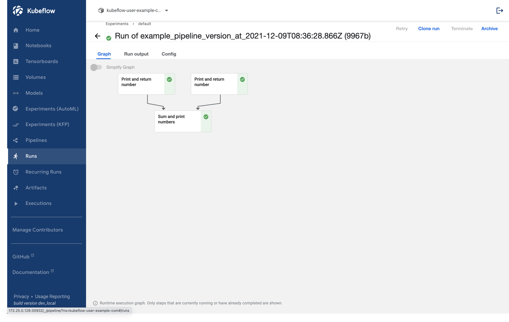

## Pipeline Setting

이번 페이지에서는 파이프라인에서 설정할 수 있는 값들에 대해 알아보겠습니다.

## Display Name

생성된 파이프라인 내에서 컴포넌트는 두 개의 이름을 갖습니다.

- task_name: 컴포넌트를 작성할 때 작성한 함수 이름
- display_name: kubeflow UI상에 보이는 이름

예를 들어서 다음과 같은 경우 두 컴포넌트 모두 Print and return number로 설정되어 있어서 어떤 컴포넌트가 1번인지 2번인지 확인하기 어렵습니다.



### set_display_name

이를 위한 것이 바로 display_name 입니다.  
설정하는 방법은 파이프라인에서 컴포넌트에 다음과 같이 `set_display_name` [attribute](https://kubeflow-pipelines.readthedocs.io/en/latest/source/kfp.dsl.html#kfp.dsl.ContainerOp.set_display_name)를 이용하면 됩니다.

```python
import kfp
from kfp.components import create_component_from_func
from kfp.dsl import pipeline


@create_component_from_func
def print_and_return_number(number: int) -> int:
    print(number)
    return number


@create_component_from_func
def sum_and_print_numbers(number_1: int, number_2: int):
    print(number_1 + number_2)


@pipeline(name="example_pipeline")
def example_pipeline(number_1: int, number_2: int):
    number_1_result = print_and_return_number(number_1).set_display_name("This is number 1")
    number_2_result = print_and_return_number(number_2).set_display_name("This is number 2")
    sum_result = sum_and_print_numbers(
        number_1=number_1_result.output, number_2=number_2_result.output
    ).set_display_name("This is sum of number 1 and number 2")


if __name__ == "__main__":
    kfp.compiler.Compiler().compile(example_pipeline, "example_pipeline.yaml")
```

이 스크립트를 실행해서 나온 `example_pipeline.yaml`을 확인하면 다음과 같습니다.

<p>
  <details>
    <summary>example_pipeline.yaml</summary>

```text
apiVersion: argoproj.io/v1alpha1
kind: Workflow
metadata:
  generateName: example-pipeline-
  annotations: {pipelines.kubeflow.org/kfp_sdk_version: 1.8.9, pipelines.kubeflow.org/pipeline_compilation_time: '2021-12-09T18:11:43.193190',
    pipelines.kubeflow.org/pipeline_spec: '{"inputs": [{"name": "number_1", "type":
      "Integer"}, {"name": "number_2", "type": "Integer"}], "name": "example_pipeline"}'}
  labels: {pipelines.kubeflow.org/kfp_sdk_version: 1.8.9}
spec:
  entrypoint: example-pipeline
  templates:
  - name: example-pipeline
    inputs:
      parameters:
      - {name: number_1}
      - {name: number_2}
    dag:
      tasks:
      - name: print-and-return-number
        template: print-and-return-number
        arguments:
          parameters:
          - {name: number_1, value: '{{inputs.parameters.number_1}}'}
      - name: print-and-return-number-2
        template: print-and-return-number-2
        arguments:
          parameters:
          - {name: number_2, value: '{{inputs.parameters.number_2}}'}
      - name: sum-and-print-numbers
        template: sum-and-print-numbers
        dependencies: [print-and-return-number, print-and-return-number-2]
        arguments:
          parameters:
          - {name: print-and-return-number-2-Output, value: '{{tasks.print-and-return-number-2.outputs.parameters.print-and-return-number-2-Output}}'}
          - {name: print-and-return-number-Output, value: '{{tasks.print-and-return-number.outputs.parameters.print-and-return-number-Output}}'}
  - name: print-and-return-number
    container:
      args: [--number, '{{inputs.parameters.number_1}}', '----output-paths', /tmp/outputs/Output/data]
      command:
      - sh
      - -ec
      - |
        program_path=$(mktemp)
        printf "%s" "$0" > "$program_path"
        python3 -u "$program_path" "$@"
      - |
        def print_and_return_number(number):
            print(number)
            return number

        def _serialize_int(int_value: int) -> str:
            if isinstance(int_value, str):
                return int_value
            if not isinstance(int_value, int):
                raise TypeError('Value "{}" has type "{}" instead of int.'.format(
                    str(int_value), str(type(int_value))))
            return str(int_value)

        import argparse
        _parser = argparse.ArgumentParser(prog='Print and return number', description='')
        _parser.add_argument("--number", dest="number", type=int, required=True, default=argparse.SUPPRESS)
        _parser.add_argument("----output-paths", dest="_output_paths", type=str, nargs=1)
        _parsed_args = vars(_parser.parse_args())
        _output_files = _parsed_args.pop("_output_paths", [])

        _outputs = print_and_return_number(**_parsed_args)

        _outputs = [_outputs]

        _output_serializers = [
            _serialize_int,

        ]

        import os
        for idx, output_file in enumerate(_output_files):
            try:
                os.makedirs(os.path.dirname(output_file))
            except OSError:
                pass
            with open(output_file, 'w') as f:
                f.write(_output_serializers[idx](_outputs[idx]))
      image: python:3.7
    inputs:
      parameters:
      - {name: number_1}
    outputs:
      parameters:
      - name: print-and-return-number-Output
        valueFrom: {path: /tmp/outputs/Output/data}
      artifacts:
      - {name: print-and-return-number-Output, path: /tmp/outputs/Output/data}
    metadata:
      annotations: {pipelines.kubeflow.org/task_display_name: This is number 1, pipelines.kubeflow.org/component_spec: '{"implementation":
          {"container": {"args": ["--number", {"inputValue": "number"}, "----output-paths",
          {"outputPath": "Output"}], "command": ["sh", "-ec", "program_path=$(mktemp)\nprintf
          \"%s\" \"$0\" > \"$program_path\"\npython3 -u \"$program_path\" \"$@\"\n",
          "def print_and_return_number(number):\n    print(number)\n    return number\n\ndef
          _serialize_int(int_value: int) -> str:\n    if isinstance(int_value, str):\n        return
          int_value\n    if not isinstance(int_value, int):\n        raise TypeError(''Value
          \"{}\" has type \"{}\" instead of int.''.format(\n            str(int_value),
          str(type(int_value))))\n    return str(int_value)\n\nimport argparse\n_parser
          = argparse.ArgumentParser(prog=''Print and return number'', description='''')\n_parser.add_argument(\"--number\",
          dest=\"number\", type=int, required=True, default=argparse.SUPPRESS)\n_parser.add_argument(\"----output-paths\",
          dest=\"_output_paths\", type=str, nargs=1)\n_parsed_args = vars(_parser.parse_args())\n_output_files
          = _parsed_args.pop(\"_output_paths\", [])\n\n_outputs = print_and_return_number(**_parsed_args)\n\n_outputs
          = [_outputs]\n\n_output_serializers = [\n    _serialize_int,\n\n]\n\nimport
          os\nfor idx, output_file in enumerate(_output_files):\n    try:\n        os.makedirs(os.path.dirname(output_file))\n    except
          OSError:\n        pass\n    with open(output_file, ''w'') as f:\n        f.write(_output_serializers[idx](_outputs[idx]))\n"],
          "image": "python:3.7"}}, "inputs": [{"name": "number", "type": "Integer"}],
          "name": "Print and return number", "outputs": [{"name": "Output", "type":
          "Integer"}]}', pipelines.kubeflow.org/component_ref: '{}', pipelines.kubeflow.org/arguments.parameters: '{"number":
          "{{inputs.parameters.number_1}}"}'}
      labels:
        pipelines.kubeflow.org/kfp_sdk_version: 1.8.9
        pipelines.kubeflow.org/pipeline-sdk-type: kfp
        pipelines.kubeflow.org/enable_caching: "true"
  - name: print-and-return-number-2
    container:
      args: [--number, '{{inputs.parameters.number_2}}', '----output-paths', /tmp/outputs/Output/data]
      command:
      - sh
      - -ec
      - |
        program_path=$(mktemp)
        printf "%s" "$0" > "$program_path"
        python3 -u "$program_path" "$@"
      - |
        def print_and_return_number(number):
            print(number)
            return number

        def _serialize_int(int_value: int) -> str:
            if isinstance(int_value, str):
                return int_value
            if not isinstance(int_value, int):
                raise TypeError('Value "{}" has type "{}" instead of int.'.format(
                    str(int_value), str(type(int_value))))
            return str(int_value)

        import argparse
        _parser = argparse.ArgumentParser(prog='Print and return number', description='')
        _parser.add_argument("--number", dest="number", type=int, required=True, default=argparse.SUPPRESS)
        _parser.add_argument("----output-paths", dest="_output_paths", type=str, nargs=1)
        _parsed_args = vars(_parser.parse_args())
        _output_files = _parsed_args.pop("_output_paths", [])

        _outputs = print_and_return_number(**_parsed_args)

        _outputs = [_outputs]

        _output_serializers = [
            _serialize_int,

        ]

        import os
        for idx, output_file in enumerate(_output_files):
            try:
                os.makedirs(os.path.dirname(output_file))
            except OSError:
                pass
            with open(output_file, 'w') as f:
                f.write(_output_serializers[idx](_outputs[idx]))
      image: python:3.7
    inputs:
      parameters:
      - {name: number_2}
    outputs:
      parameters:
      - name: print-and-return-number-2-Output
        valueFrom: {path: /tmp/outputs/Output/data}
      artifacts:
      - {name: print-and-return-number-2-Output, path: /tmp/outputs/Output/data}
    metadata:
      annotations: {pipelines.kubeflow.org/task_display_name: This is number 2, pipelines.kubeflow.org/component_spec: '{"implementation":
          {"container": {"args": ["--number", {"inputValue": "number"}, "----output-paths",
          {"outputPath": "Output"}], "command": ["sh", "-ec", "program_path=$(mktemp)\nprintf
          \"%s\" \"$0\" > \"$program_path\"\npython3 -u \"$program_path\" \"$@\"\n",
          "def print_and_return_number(number):\n    print(number)\n    return number\n\ndef
          _serialize_int(int_value: int) -> str:\n    if isinstance(int_value, str):\n        return
          int_value\n    if not isinstance(int_value, int):\n        raise TypeError(''Value
          \"{}\" has type \"{}\" instead of int.''.format(\n            str(int_value),
          str(type(int_value))))\n    return str(int_value)\n\nimport argparse\n_parser
          = argparse.ArgumentParser(prog=''Print and return number'', description='''')\n_parser.add_argument(\"--number\",
          dest=\"number\", type=int, required=True, default=argparse.SUPPRESS)\n_parser.add_argument(\"----output-paths\",
          dest=\"_output_paths\", type=str, nargs=1)\n_parsed_args = vars(_parser.parse_args())\n_output_files
          = _parsed_args.pop(\"_output_paths\", [])\n\n_outputs = print_and_return_number(**_parsed_args)\n\n_outputs
          = [_outputs]\n\n_output_serializers = [\n    _serialize_int,\n\n]\n\nimport
          os\nfor idx, output_file in enumerate(_output_files):\n    try:\n        os.makedirs(os.path.dirname(output_file))\n    except
          OSError:\n        pass\n    with open(output_file, ''w'') as f:\n        f.write(_output_serializers[idx](_outputs[idx]))\n"],
          "image": "python:3.7"}}, "inputs": [{"name": "number", "type": "Integer"}],
          "name": "Print and return number", "outputs": [{"name": "Output", "type":
          "Integer"}]}', pipelines.kubeflow.org/component_ref: '{}', pipelines.kubeflow.org/arguments.parameters: '{"number":
          "{{inputs.parameters.number_2}}"}'}
      labels:
        pipelines.kubeflow.org/kfp_sdk_version: 1.8.9
        pipelines.kubeflow.org/pipeline-sdk-type: kfp
        pipelines.kubeflow.org/enable_caching: "true"
  - name: sum-and-print-numbers
    container:
      args: [--number-1, '{{inputs.parameters.print-and-return-number-Output}}', --number-2,
        '{{inputs.parameters.print-and-return-number-2-Output}}']
      command:
      - sh
      - -ec
      - |
        program_path=$(mktemp)
        printf "%s" "$0" > "$program_path"
        python3 -u "$program_path" "$@"
      - |
        def sum_and_print_numbers(number_1, number_2):
            print(number_1 + number_2)

        import argparse
        _parser = argparse.ArgumentParser(prog='Sum and print numbers', description='')
        _parser.add_argument("--number-1", dest="number_1", type=int, required=True, default=argparse.SUPPRESS)
        _parser.add_argument("--number-2", dest="number_2", type=int, required=True, default=argparse.SUPPRESS)
        _parsed_args = vars(_parser.parse_args())

        _outputs = sum_and_print_numbers(**_parsed_args)
      image: python:3.7
    inputs:
      parameters:
      - {name: print-and-return-number-2-Output}
      - {name: print-and-return-number-Output}
    metadata:
      annotations: {pipelines.kubeflow.org/task_display_name: This is sum of number
          1 and number 2, pipelines.kubeflow.org/component_spec: '{"implementation":
          {"container": {"args": ["--number-1", {"inputValue": "number_1"}, "--number-2",
          {"inputValue": "number_2"}], "command": ["sh", "-ec", "program_path=$(mktemp)\nprintf
          \"%s\" \"$0\" > \"$program_path\"\npython3 -u \"$program_path\" \"$@\"\n",
          "def sum_and_print_numbers(number_1, number_2):\n    print(number_1 + number_2)\n\nimport
          argparse\n_parser = argparse.ArgumentParser(prog=''Sum and print numbers'',
          description='''')\n_parser.add_argument(\"--number-1\", dest=\"number_1\",
          type=int, required=True, default=argparse.SUPPRESS)\n_parser.add_argument(\"--number-2\",
          dest=\"number_2\", type=int, required=True, default=argparse.SUPPRESS)\n_parsed_args
          = vars(_parser.parse_args())\n\n_outputs = sum_and_print_numbers(**_parsed_args)\n"],
          "image": "python:3.7"}}, "inputs": [{"name": "number_1", "type": "Integer"},
          {"name": "number_2", "type": "Integer"}], "name": "Sum and print numbers"}',
        pipelines.kubeflow.org/component_ref: '{}', pipelines.kubeflow.org/arguments.parameters: '{"number_1":
          "{{inputs.parameters.print-and-return-number-Output}}", "number_2": "{{inputs.parameters.print-and-return-number-2-Output}}"}'}
      labels:
        pipelines.kubeflow.org/kfp_sdk_version: 1.8.9
        pipelines.kubeflow.org/pipeline-sdk-type: kfp
        pipelines.kubeflow.org/enable_caching: "true"
  arguments:
    parameters:
    - {name: number_1}
    - {name: number_2}
  serviceAccountName: pipeline-runner
```

  </details>
</p>

이 전의 파일과 비교하면 `pipelines.kubeflow.org/task_display_name` key가 새로 생성되었습니다.

### UI in Kubeflow

위에서 만든 파일을 이용해 이전에 생성한 [파이프라인](../kubeflow/basic-pipeline-upload.md#upload-pipeline-version)의 버전을 올리겠습니다.


그러면 위와 같이 설정한 이름이 노출되는 것을 확인할 수 있습니다.

## Resources

### GPU

특별한 설정이 없다면 파이프라인은 컴포넌트를 쿠버네티스 파드(pod)로 실행할 때, 기본 리소스 스펙으로 실행하게 됩니다.  
만약 GPU를 사용해 모델을 학습해야 할 때 쿠버네티스상에서 GPU를 할당받지 못해 제대로 학습이 이루어지지 않습니다.  
이를 위해 `set_gpu_limit()` [attribute](https://kubeflow-pipelines.readthedocs.io/en/latest/source/kfp.dsl.html?highlight=set_gpu_limit#kfp.dsl.UserContainer.set_gpu_limit)을 이용해 설정할 수 있습니다.

```python
import kfp
from kfp.components import create_component_from_func
from kfp.dsl import pipeline


@create_component_from_func
def print_and_return_number(number: int) -> int:
    print(number)
    return number


@create_component_from_func
def sum_and_print_numbers(number_1: int, number_2: int):
    print(number_1 + number_2)


@pipeline(name="example_pipeline")
def example_pipeline(number_1: int, number_2: int):
    number_1_result = print_and_return_number(number_1).set_display_name("This is number 1")
    number_2_result = print_and_return_number(number_2).set_display_name("This is number 2")
    sum_result = sum_and_print_numbers(
        number_1=number_1_result.output, number_2=number_2_result.output
    ).set_display_name("This is sum of number 1 and number 2").set_gpu_limit(1)


if __name__ == "__main__":
    kfp.compiler.Compiler().compile(example_pipeline, "example_pipeline.yaml")
```

위의 스크립트를 실행하면 생성된 파일에서 `sum-and-print-numbers`를 자세히 보면 resources에 `{nvidia.com/gpu: 1}` 도 추가된 것을 볼 수 있습니다.
이를 통해 GPU를 할당받을 수 있습니다.

```text
  - name: sum-and-print-numbers
    container:
      args: [--number-1, '{{inputs.parameters.print-and-return-number-Output}}', --number-2,
        '{{inputs.parameters.print-and-return-number-2-Output}}']
      command:
      - sh
      - -ec
      - |
        program_path=$(mktemp)
        printf "%s" "$0" > "$program_path"
        python3 -u "$program_path" "$@"
      - |
        def sum_and_print_numbers(number_1, number_2):
            print(number_1 + number_2)

        import argparse
        _parser = argparse.ArgumentParser(prog='Sum and print numbers', description='')
        _parser.add_argument("--number-1", dest="number_1", type=int, required=True, default=argparse.SUPPRESS)
        _parser.add_argument("--number-2", dest="number_2", type=int, required=True, default=argparse.SUPPRESS)
        _parsed_args = vars(_parser.parse_args())

        _outputs = sum_and_print_numbers(**_parsed_args)
      image: python:3.7
      resources:
        limits: {nvidia.com/gpu: 1}
```

### CPU

cpu의 개수를 정하기 위해서 이용하는 함수는 `.set_cpu_limit()` [attribute](https://kubeflow-pipelines.readthedocs.io/en/latest/source/kfp.dsl.html?highlight=set_gpu_limit#kfp.dsl.Sidecar.set_cpu_limit)을 이용해 설정할 수 있습니다.  
gpu와는 다른 점은 int가 아닌 string으로 입력해야 한다는 점입니다.

```python
import kfp
from kfp.components import create_component_from_func
from kfp.dsl import pipeline


@create_component_from_func
def print_and_return_number(number: int) -> int:
    print(number)
    return number


@create_component_from_func
def sum_and_print_numbers(number_1: int, number_2: int):
    print(number_1 + number_2)


@pipeline(name="example_pipeline")
def example_pipeline(number_1: int, number_2: int):
    number_1_result = print_and_return_number(number_1).set_display_name("This is number 1")
    number_2_result = print_and_return_number(number_2).set_display_name("This is number 2")
    sum_result = sum_and_print_numbers(
        number_1=number_1_result.output, number_2=number_2_result.output
    ).set_display_name("This is sum of number 1 and number 2").set_gpu_limit(1).set_cpu_limit("16")


if __name__ == "__main__":
    kfp.compiler.Compiler().compile(example_pipeline, "example_pipeline.yaml")
```

바뀐 부분만 확인하면 다음과 같습니다.

```text
      resources:
        limits: {nvidia.com/gpu: 1, cpu: '16'}
```

### Memory

메모리는 `.set_memory_limit()` [attribute](https://kubeflow-pipelines.readthedocs.io/en/latest/source/kfp.dsl.html?highlight=set_gpu_limit#kfp.dsl.Sidecar.set_memory_limit)을 이용해 설정할 수 있습니다.

```python
import kfp
from kfp.components import create_component_from_func
from kfp.dsl import pipeline


@create_component_from_func
def print_and_return_number(number: int) -> int:
    print(number)
    return number


@create_component_from_func
def sum_and_print_numbers(number_1: int, number_2: int):
    print(number_1 + number_2)


@pipeline(name="example_pipeline")
def example_pipeline(number_1: int, number_2: int):
    number_1_result = print_and_return_number(number_1).set_display_name("This is number 1")
    number_2_result = print_and_return_number(number_2).set_display_name("This is number 2")
    sum_result = sum_and_print_numbers(
        number_1=number_1_result.output, number_2=number_2_result.output
    ).set_display_name("This is sum of number 1 and number 2").set_gpu_limit(1).set_memory_limit("1G")


if __name__ == "__main__":
    kfp.compiler.Compiler().compile(example_pipeline, "example_pipeline.yaml")

```

바뀐 부분만 확인하면 다음과 같습니다.

```text
      resources:
        limits: {nvidia.com/gpu: 1, memory: 1G}
```
