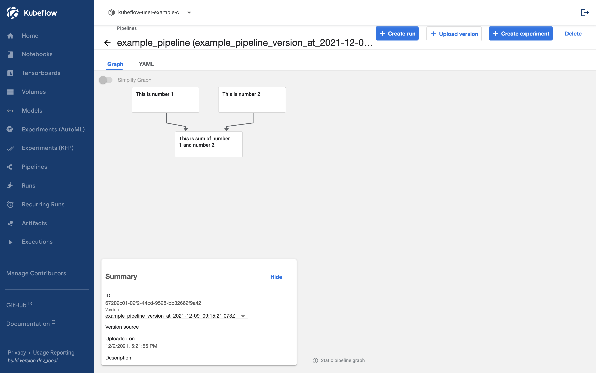

## Pipeline Setting

In this page, we will look at values that can be set in the pipeline.

## Display Name

Created within the pipeline, components have two names:

- task_name: the function name when writing the component
- display_name: the name that appears in the kubeflow UI

For example, in the case where both components are set to Print and return number, it is difficult to tell which component is 1 or 2.


### set_display_name

The solution for this is the display_name.  
We can set the display_name in the pipeline by using the set_display_name [attribute](https://kubeflow-pipelines.readthedocs.io/en/latest/source/kfp.dsl.html#kfp.dsl.ContainerOp.set_display_name) of the component.

```python
import kfp
from kfp.components import create_component_from_func
from kfp.dsl import pipeline


@create_component_from_func
def print_and_return_number(number: int) -> int:
    print(number)
    return number


@create_component_from_func
def sum_and_print_numbers(number_1: int, number_2: int):
    print(number_1 + number_2)


@pipeline(name="example_pipeline")
def example_pipeline(number_1: int, number_2: int):
    number_1_result = print_and_return_number(number_1).set_display_name("This is number 1")
    number_2_result = print_and_return_number(number_2).set_display_name("This is number 2")
    sum_result = sum_and_print_numbers(
        number_1=number_1_result.output, number_2=number_2_result.output
    ).set_display_name("This is sum of number 1 and number 2")


if __name__ == "__main__":
    kfp.compiler.Compiler().compile(example_pipeline, "example_pipeline.yaml")
```

If you run this script and check the resulting `example_pipeline.yaml`, it would be like this.

<p>
  <details>
    <summary>example_pipeline.yaml</summary>

```bash
apiVersion: argoproj.io/v1alpha1
kind: Workflow
metadata:
  generateName: example-pipeline-
  annotations: {pipelines.kubeflow.org/kfp_sdk_version: 1.8.9, pipelines.kubeflow.org/pipeline_compilation_time: '2021-12-09T18:11:43.193190',
    pipelines.kubeflow.org/pipeline_spec: '{"inputs": [{"name": "number_1", "type":
      "Integer"}, {"name": "number_2", "type": "Integer"}], "name": "example_pipeline"}'}
  labels: {pipelines.kubeflow.org/kfp_sdk_version: 1.8.9}
spec:
  entrypoint: example-pipeline
  templates:
  - name: example-pipeline
    inputs:
      parameters:
      - {name: number_1}
      - {name: number_2}
    dag:
      tasks:
      - name: print-and-return-number
        template: print-and-return-number
        arguments:
          parameters:
          - {name: number_1, value: '{{inputs.parameters.number_1}}'}
      - name: print-and-return-number-2
        template: print-and-return-number-2
        arguments:
          parameters:
          - {name: number_2, value: '{{inputs.parameters.number_2}}'}
      - name: sum-and-print-numbers
        template: sum-and-print-numbers
        dependencies: [print-and-return-number, print-and-return-number-2]
        arguments:
          parameters:
          - {name: print-and-return-number-2-Output, value: '{{tasks.print-and-return-number-2.outputs.parameters.print-and-return-number-2-Output}}'}
          - {name: print-and-return-number-Output, value: '{{tasks.print-and-return-number.outputs.parameters.print-and-return-number-Output}}'}
  - name: print-and-return-number
    container:
      args: [--number, '{{inputs.parameters.number_1}}', '----output-paths', /tmp/outputs/Output/data]
      command:
      - sh
      - -ec
      - |
        program_path=$(mktemp)
        printf "%s" "$0" > "$program_path"
        python3 -u "$program_path" "$@"
      - |
        def print_and_return_number(number):
            print(number)
            return number

        def _serialize_int(int_value: int) -> str:
            if isinstance(int_value, str):
                return int_value
            if not isinstance(int_value, int):
                raise TypeError('Value "{}" has type "{}" instead of int.'.format(
                    str(int_value), str(type(int_value))))
            return str(int_value)

        import argparse
        _parser = argparse.ArgumentParser(prog='Print and return number', description='')
        _parser.add_argument("--number", dest="number", type=int, required=True, default=argparse.SUPPRESS)
        _parser.add_argument("----output-paths", dest="_output_paths", type=str, nargs=1)
        _parsed_args = vars(_parser.parse_args())
        _output_files = _parsed_args.pop("_output_paths", [])

        _outputs = print_and_return_number(**_parsed_args)

        _outputs = [_outputs]

        _output_serializers = [
            _serialize_int,

        ]

        import os
        for idx, output_file in enumerate(_output_files):
            try:
                os.makedirs(os.path.dirname(output_file))
            except OSError:
                pass
            with open(output_file, 'w') as f:
                f.write(_output_serializers[idx](_outputs[idx]))
      image: python:3.7
    inputs:
      parameters:
      - {name: number_1}
    outputs:
      parameters:
      - name: print-and-return-number-Output
        valueFrom: {path: /tmp/outputs/Output/data}
      artifacts:
      - {name: print-and-return-number-Output, path: /tmp/outputs/Output/data}
    metadata:
      annotations: {pipelines.kubeflow.org/task_display_name: This is number 1, pipelines.kubeflow.org/component_spec: '{"implementation":
          {"container": {"args": ["--number", {"inputValue": "number"}, "----output-paths",
          {"outputPath": "Output"}], "command": ["sh", "-ec", "program_path=$(mktemp)\nprintf
          \"%s\" \"$0\" > \"$program_path\"\npython3 -u \"$program_path\" \"$@\"\n",
          "def print_and_return_number(number):\n    print(number)\n    return number\n\ndef
          _serialize_int(int_value: int) -> str:\n    if isinstance(int_value, str):\n        return
          int_value\n    if not isinstance(int_value, int):\n        raise TypeError(''Value
          \"{}\" has type \"{}\" instead of int.''.format(\n            str(int_value),
          str(type(int_value))))\n    return str(int_value)\n\nimport argparse\n_parser
          = argparse.ArgumentParser(prog=''Print and return number'', description='''')\n_parser.add_argument(\"--number\",
          dest=\"number\", type=int, required=True, default=argparse.SUPPRESS)\n_parser.add_argument(\"----output-paths\",
          dest=\"_output_paths\", type=str, nargs=1)\n_parsed_args = vars(_parser.parse_args())\n_output_files
          = _parsed_args.pop(\"_output_paths\", [])\n\n_outputs = print_and_return_number(**_parsed_args)\n\n_outputs
          = [_outputs]\n\n_output_serializers = [\n    _serialize_int,\n\n]\n\nimport
          os\nfor idx, output_file in enumerate(_output_files):\n    try:\n        os.makedirs(os.path.dirname(output_file))\n    except
          OSError:\n        pass\n    with open(output_file, ''w'') as f:\n        f.write(_output_serializers[idx](_outputs[idx]))\n"],
          "image": "python:3.7"}}, "inputs": [{"name": "number", "type": "Integer"}],
          "name": "Print and return number", "outputs": [{"name": "Output", "type":
          "Integer"}]}', pipelines.kubeflow.org/component_ref: '{}', pipelines.kubeflow.org/arguments.parameters: '{"number":
          "{{inputs.parameters.number_1}}"}'}
      labels:
        pipelines.kubeflow.org/kfp_sdk_version: 1.8.9
        pipelines.kubeflow.org/pipeline-sdk-type: kfp
        pipelines.kubeflow.org/enable_caching: "true"
  - name: print-and-return-number-2
    container:
      args: [--number, '{{inputs.parameters.number_2}}', '----output-paths', /tmp/outputs/Output/data]
      command:
      - sh
      - -ec
      - |
        program_path=$(mktemp)
        printf "%s" "$0" > "$program_path"
        python3 -u "$program_path" "$@"
      - |
        def print_and_return_number(number):
            print(number)
            return number

        def _serialize_int(int_value: int) -> str:
            if isinstance(int_value, str):
                return int_value
            if not isinstance(int_value, int):
                raise TypeError('Value "{}" has type "{}" instead of int.'.format(
                    str(int_value), str(type(int_value))))
            return str(int_value)

        import argparse
        _parser = argparse.ArgumentParser(prog='Print and return number', description='')
        _parser.add_argument("--number", dest="number", type=int, required=True, default=argparse.SUPPRESS)
        _parser.add_argument("----output-paths", dest="_output_paths", type=str, nargs=1)
        _parsed_args = vars(_parser.parse_args())
        _output_files = _parsed_args.pop("_output_paths", [])

        _outputs = print_and_return_number(**_parsed_args)

        _outputs = [_outputs]

        _output_serializers = [
            _serialize_int,

        ]

        import os
        for idx, output_file in enumerate(_output_files):
            try:
                os.makedirs(os.path.dirname(output_file))
            except OSError:
                pass
            with open(output_file, 'w') as f:
                f.write(_output_serializers[idx](_outputs[idx]))
      image: python:3.7
    inputs:
      parameters:
      - {name: number_2}
    outputs:
      parameters:
      - name: print-and-return-number-2-Output
        valueFrom: {path: /tmp/outputs/Output/data}
      artifacts:
      - {name: print-and-return-number-2-Output, path: /tmp/outputs/Output/data}
    metadata:
      annotations: {pipelines.kubeflow.org/task_display_name: This is number 2, pipelines.kubeflow.org/component_spec: '{"implementation":
          {"container": {"args": ["--number", {"inputValue": "number"}, "----output-paths",
          {"outputPath": "Output"}], "command": ["sh", "-ec", "program_path=$(mktemp)\nprintf
          \"%s\" \"$0\" > \"$program_path\"\npython3 -u \"$program_path\" \"$@\"\n",
          "def print_and_return_number(number):\n    print(number)\n    return number\n\ndef
          _serialize_int(int_value: int) -> str:\n    if isinstance(int_value, str):\n        return
          int_value\n    if not isinstance(int_value, int):\n        raise TypeError(''Value
          \"{}\" has type \"{}\" instead of int.''.format(\n            str(int_value),
          str(type(int_value))))\n    return str(int_value)\n\nimport argparse\n_parser
          = argparse.ArgumentParser(prog=''Print and return number'', description='''')\n_parser.add_argument(\"--number\",
          dest=\"number\", type=int, required=True, default=argparse.SUPPRESS)\n_parser.add_argument(\"----output-paths\",
          dest=\"_output_paths\", type=str, nargs=1)\n_parsed_args = vars(_parser.parse_args())\n_output_files
          = _parsed_args.pop(\"_output_paths\", [])\n\n_outputs = print_and_return_number(**_parsed_args)\n\n_outputs
          = [_outputs]\n\n_output_serializers = [\n    _serialize_int,\n\n]\n\nimport
          os\nfor idx, output_file in enumerate(_output_files):\n    try:\n        os.makedirs(os.path.dirname(output_file))\n    except
          OSError:\n        pass\n    with open(output_file, ''w'') as f:\n        f.write(_output_serializers[idx](_outputs[idx]))\n"],
          "image": "python:3.7"}}, "inputs": [{"name": "number", "type": "Integer"}],
          "name": "Print and return number", "outputs": [{"name": "Output", "type":
          "Integer"}]}', pipelines.kubeflow.org/component_ref: '{}', pipelines.kubeflow.org/arguments.parameters: '{"number":
          "{{inputs.parameters.number_2}}"}'}
      labels:
        pipelines.kubeflow.org/kfp_sdk_version: 1.8.9
        pipelines.kubeflow.org/pipeline-sdk-type: kfp
        pipelines.kubeflow.org/enable_caching: "true"
  - name: sum-and-print-numbers
    container:
      args: [--number-1, '{{inputs.parameters.print-and-return-number-Output}}', --number-2,
        '{{inputs.parameters.print-and-return-number-2-Output}}']
      command:
      - sh
      - -ec
      - |
        program_path=$(mktemp)
        printf "%s" "$0" > "$program_path"
        python3 -u "$program_path" "$@"
      - |
        def sum_and_print_numbers(number_1, number_2):
            print(number_1 + number_2)

        import argparse
        _parser = argparse.ArgumentParser(prog='Sum and print numbers', description='')
        _parser.add_argument("--number-1", dest="number_1", type=int, required=True, default=argparse.SUPPRESS)
        _parser.add_argument("--number-2", dest="number_2", type=int, required=True, default=argparse.SUPPRESS)
        _parsed_args = vars(_parser.parse_args())

        _outputs = sum_and_print_numbers(**_parsed_args)
      image: python:3.7
    inputs:
      parameters:
      - {name: print-and-return-number-2-Output}
      - {name: print-and-return-number-Output}
    metadata:
      annotations: {pipelines.kubeflow.org/task_display_name: This is sum of number
          1 and number 2, pipelines.kubeflow.org/component_spec: '{"implementation":
          {"container": {"args": ["--number-1", {"inputValue": "number_1"}, "--number-2",
          {"inputValue": "number_2"}], "command": ["sh", "-ec", "program_path=$(mktemp)\nprintf
          \"%s\" \"$0\" > \"$program_path\"\npython3 -u \"$program_path\" \"$@\"\n",
          "def sum_and_print_numbers(number_1, number_2):\n    print(number_1 + number_2)\n\nimport
          argparse\n_parser = argparse.ArgumentParser(prog=''Sum and print numbers'',
          description='''')\n_parser.add_argument(\"--number-1\", dest=\"number_1\",
          type=int, required=True, default=argparse.SUPPRESS)\n_parser.add_argument(\"--number-2\",
          dest=\"number_2\", type=int, required=True, default=argparse.SUPPRESS)\n_parsed_args
          = vars(_parser.parse_args())\n\n_outputs = sum_and_print_numbers(**_parsed_args)\n"],
          "image": "python:3.7"}}, "inputs": [{"name": "number_1", "type": "Integer"},
          {"name": "number_2", "type": "Integer"}], "name": "Sum and print numbers"}',
        pipelines.kubeflow.org/component_ref: '{}', pipelines.kubeflow.org/arguments.parameters: '{"number_1":
          "{{inputs.parameters.print-and-return-number-Output}}", "number_2": "{{inputs.parameters.print-and-return-number-2-Output}}"}'}
      labels:
        pipelines.kubeflow.org/kfp_sdk_version: 1.8.9
        pipelines.kubeflow.org/pipeline-sdk-type: kfp
        pipelines.kubeflow.org/enable_caching: "true"
  arguments:
    parameters:
    - {name: number_1}
    - {name: number_2}
  serviceAccountName: pipeline-runner
```

  </details>
</p>

If compared with the previous file, the **`pipelines.kubeflow.org/task_display_name`** key has been newly created.

### UI in Kubeflow


We will upload the version of the previously created [pipeline](../kubeflow/basic-pipeline-upload.md#upload-pipeline-version) using the files we created earlier.



As you can see, the configured name is displayed as shown above.

## Resources

### GPU

By default, when the pipeline runs components as Kubernetes pods, it uses the default resource specifications.  
If you need to train a model using a GPU and the Kubernetes environment doesn't allocate a GPU, the training may not be performed correctly.  
To address this, you can use the `set_gpu_limit()` [attribute](https://kubeflow-pipelines.readthedocs.io/en/latest/source/kfp.dsl.html?highlight=set_gpu_limit#kfp.dsl.UserContainer.set_gpu_limit) to set the GPU limit.

```python
import kfp
from kfp.components import create_component_from_func
from kfp.dsl import pipeline


@create_component_from_func
def print_and_return_number(number: int) -> int:
    print(number)
    return number


@create_component_from_func
def sum_and_print_numbers(number_1: int, number_2: int):
    print(number_1 + number_2)


@pipeline(name="example_pipeline")
def example_pipeline(number_1: int, number_2: int):
    number_1_result = print_and_return_number(number_1).set_display_name("This is number 1")
    number_2_result = print_and_return_number(number_2).set_display_name("This is number 2")
    sum_result = sum_and_print_numbers(
        number_1=number_1_result.output, number_2=number_2_result.output
    ).set_display_name("This is sum of number 1 and number 2").set_gpu_limit(1)


if __name__ == "__main__":
    kfp.compiler.Compiler().compile(example_pipeline, "example_pipeline.yaml")
```

If you execute the above script, you can see that the resources has been added with `{nvidia.com/gpu: 1}` in the generated file when you look closely at `sum-and-print-numbers`.
Through this, you can allocate a GPU.

```bash
  - name: sum-and-print-numbers
    container:
      args: [--number-1, '{{inputs.parameters.print-and-return-number-Output}}', --number-2,
        '{{inputs.parameters.print-and-return-number-2-Output}}']
      command:
      - sh
      - -ec
      - |
        program_path=$(mktemp)
        printf "%s" "$0" > "$program_path"
        python3 -u "$program_path" "$@"
      - |
        def sum_and_print_numbers(number_1, number_2):
            print(number_1 + number_2)

        import argparse
        _parser = argparse.ArgumentParser(prog='Sum and print numbers', description='')
        _parser.add_argument("--number-1", dest="number_1", type=int, required=True, default=argparse.SUPPRESS)
        _parser.add_argument("--number-2", dest="number_2", type=int, required=True, default=argparse.SUPPRESS)
        _parsed_args = vars(_parser.parse_args())

        _outputs = sum_and_print_numbers(**_parsed_args)
      image: python:3.7
      resources:
        limits: {nvidia.com/gpu: 1}
```

### CPU

The function to set the number of CPUs can be set using the `.set_cpu_limit()` attribute [attribute](https://kubeflow-pipelines.readthedocs.io/en/latest/source/kfp.dsl.html?highlight=set_gpu_limit#kfp.dsl.Sidecar.set_cpu_limit).  
The difference from GPUs is that the input must be a string, not an int.

```python
import kfp
from kfp.components import create_component_from_func
from kfp.dsl import pipeline


@create_component_from_func
def print_and_return_number(number: int) -> int:
    print(number)
    return number


@create_component_from_func
def sum_and_print_numbers(number_1: int, number_2: int):
    print(number_1 + number_2)


@pipeline(name="example_pipeline")
def example_pipeline(number_1: int, number_2: int):
    number_1_result = print_and_return_number(number_1).set_display_name("This is number 1")
    number_2_result = print_and_return_number(number_2).set_display_name("This is number 2")
    sum_result = sum_and_print_numbers(
        number_1=number_1_result.output, number_2=number_2_result.output
    ).set_display_name("This is sum of number 1 and number 2").set_gpu_limit(1).set_cpu_limit("16")


if __name__ == "__main__":
    kfp.compiler.Compiler().compile(example_pipeline, "example_pipeline.yaml")
```

The changed part only can be confirmed as follows.

```bash
      resources:
        limits: {nvidia.com/gpu: 1, cpu: '16'}
```

### Memory

Memory can be set using the `.set_memory_limit()` [attribute](https://kubeflow-pipelines.readthedocs.io/en/latest/source/kfp.dsl.html?highlight=set_gpu_limit#kfp.dsl.Sidecar.set_memory_limit).

```python
import kfp
from kfp.components import create_component_from_func
from kfp.dsl import pipeline


@create_component_from_func
def print_and_return_number(number: int) -> int:
    print(number)
    return number


@create_component_from_func
def sum_and_print_numbers(number_1: int, number_2: int):
    print(number_1 + number_2)


@pipeline(name="example_pipeline")
def example_pipeline(number_1: int, number_2: int):
    number_1_result = print_and_return_number(number_1).set_display_name("This is number 1")
    number_2_result = print_and_return_number(number_2).set_display_name("This is number 2")
    sum_result = sum_and_print_numbers(
        number_1=number_1_result.output, number_2=number_2_result.output
    ).set_display_name("This is sum of number 1 and number 2").set_gpu_limit(1).set_memory_limit("1G")


if __name__ == "__main__":
    kfp.compiler.Compiler().compile(example_pipeline, "example_pipeline.yaml")

```

The changed parts are as follows if checked.

```bash
      resources:
        limits: {nvidia.com/gpu: 1, memory: 1G}
```
