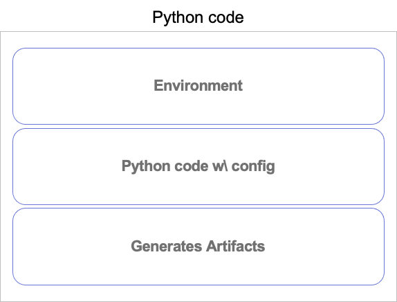
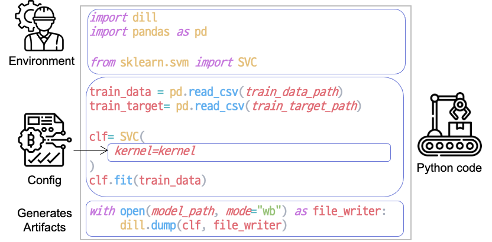
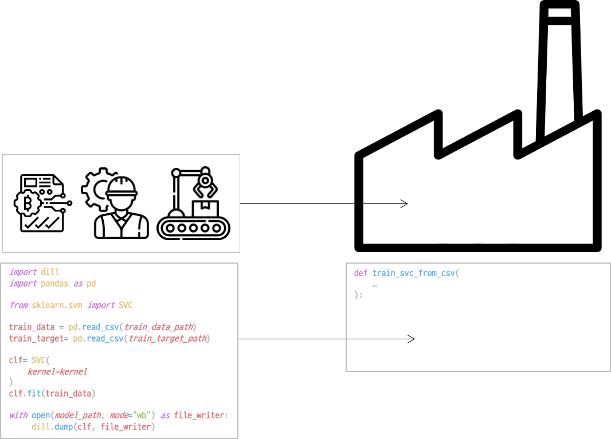
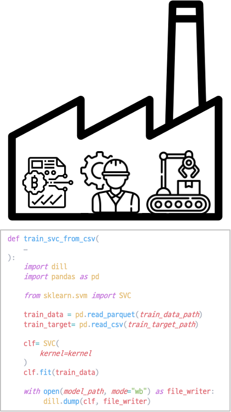
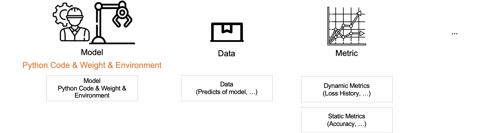
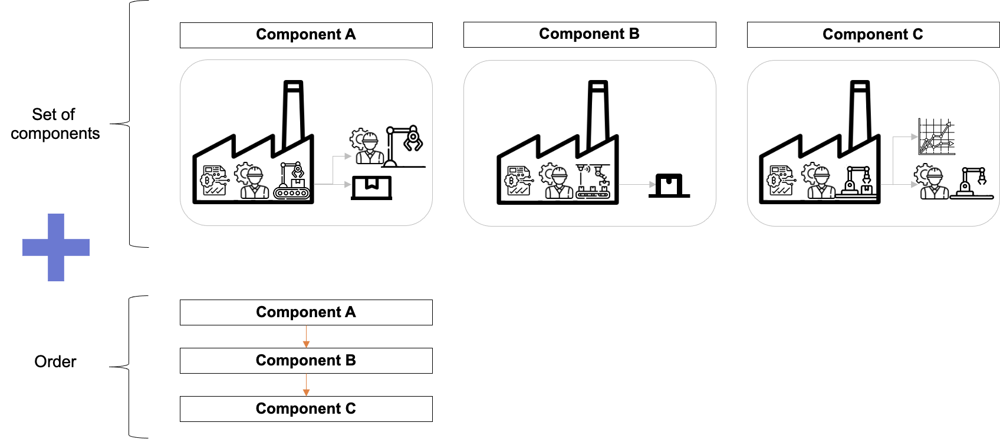
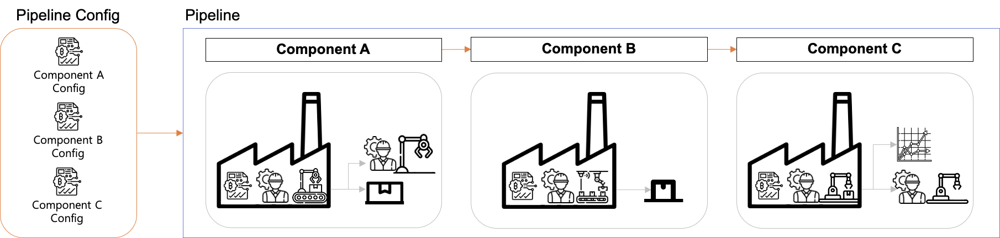
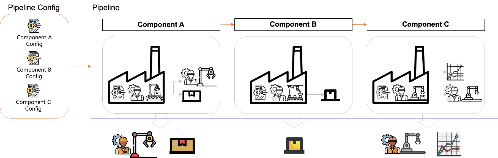
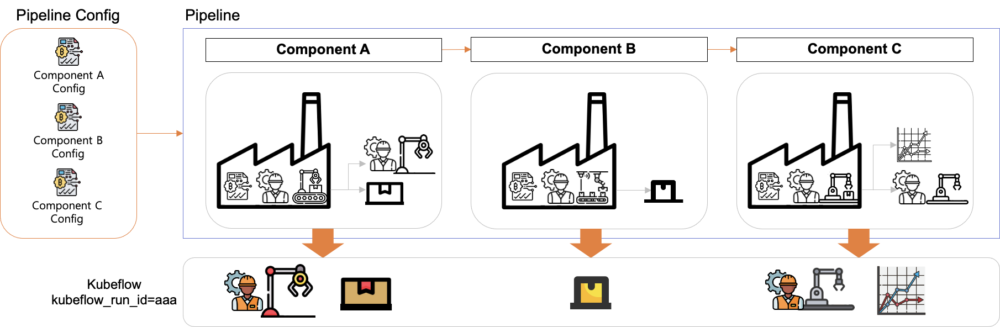

## Component

A component is composed of Component contents and a Component wrapper.
A single component is delivered to Kubeflow through a Component wrapper and the delivered component executes the defined Component contents and produces artifacts.


### Component Contents

There are three components that make up the component contents:



1. Environment
2. Python code w/ Config
3. Generates Artifacts

Let's explore each component with an example.
Here is a Python code that loads data, trains an SVC (Support Vector Classifier) model, and saves the SVC model.

```python
import dill
import pandas as pd

from sklearn.svm import SVC

train_data = pd.read_csv(train_data_path)
train_target= pd.read_csv(train_target_path)

clf= SVC(
    kernel=kernel
)
clf.fit(train_data)

with open(model_path, mode="wb") as file_writer:
     dill.dump(clf, file_writer)
```

The above Python code can be divided into components contents as follows.



Environment is the part of the Python code where the packages used in the code are imported.  
Next, Python Code w\ Config is where the given Config is used to actually perform the training.  
Finally, there is a process to save the artifacts.  

### Component Wrapper

Component wrappers deliver the necessary Config and execute tasks for component content.



In Kubeflow, component wrappers are defined as functions, similar to the `train_svc_from_csv` example above.
When a component wrapper wraps the contents, it looks like the following:



### Artifacts

In the explanation above, it was mentioned that the component creates Artifacts. Artifacts is a term used to refer to any form of a file that is generated, such as evaluation results, logs, etc.
Of the ones that we are interested in, the following are significant: Models, Data, Metrics, and etc.



- Model
- Data
- Metric
- etc

#### Model

We defined the model as follows: 

> A model is a form that includes Python code, trained weights and network architecture, and an environment to run it.

#### Data

Data includes preprocessed features, model predictions, etc. 

#### Metric

Metric is divided into two categories: dynamic metrics and static metrics.

- Dynamic metrics refer to values that continuously change during the training process, such as train loss per epoch.
- Static metrics refer to evaluation metrics, such as accuracy, that are calculated after the training is completed.

## Pipeline

A pipeline consists of a collection of components and the order in which they are executed. The order forms a directed acyclic graph (DAG), which can include simple conditional statements.



### Pipeline Config

As mentioned earlier, components require config to be executed. The pipeline config contains the configs for all the components in the pipeline.



## Run

To execute a pipeline, the pipeline config specific to that pipeline is required. In Kubeflow, an executed pipeline is called a "Run."



When a pipeline is executed, each component generates artifacts. Kubeflow pipeline assigns a unique ID to each Run, and all artifacts generated during the Run are stored.



Now, let's learn how to write components and pipelines.
