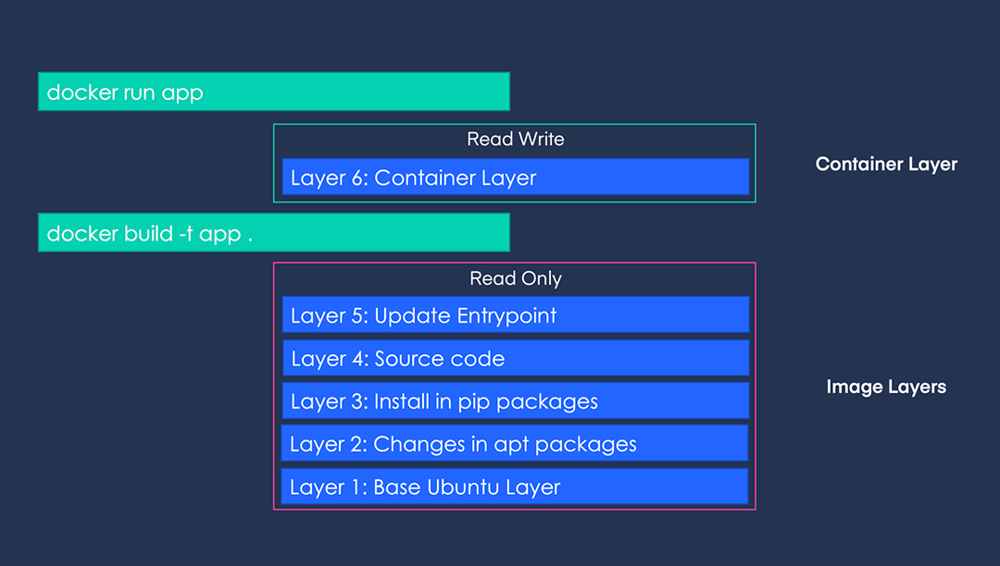
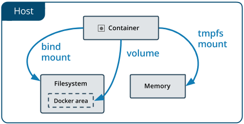

## Making a good Docker image

### Considerations to make Docker image:

When creating a Docker image using a Dockerfile, the **order** of the commands is important.  
This is because Docker images are composed of many Read-Only layers and when building the image, existing layers are **cached** and reused, so if you structure your Dockerfile with this in mind, you can **reduce the build time**.

Each of the `RUN`, `ADD`, `COPY` commands in a Dockerfile are stored as one layer.

For example, if we have the following `Dockerfile`:

```docker
# Layer 1
FROM ubuntu:latest

# Layer 2
RUN apt-get update && apt-get install python3 pip3 -y

# Layer 3
RUN pip3 install -U pip && pip3 install torch

# Layer 4
COPY src/ src/

# Layer 5
CMD python src/app.py
```

If you run the image built with the above `Dockerfile` with the command `docker run -it app:latest /bin/bash`, it can be represented in the following layers. 



The topmost R/W layer does not affect the image. In other words, any changes made inside the container are volatile.

When a lower layer is changed, all the layers above it need to be rebuilt. Therefore, the order of Dockerfile instructions is important. It is recommended to place the parts that are frequently changed towards the end. (e.g., `COPY src/ app/src/`)

Conversely, parts that are unlikely to change should be placed towards the beginning.

If there are parts that are rarely changed but used in multiple places, they can be consolidated. It is advisable to create a separate image for those common parts in advance and use it as a base image.

For example, if you want to create separate images for an environment that uses `tensorflow-cpu` and another environment that uses `tensorflow-gpu`, you can do the following:
Create a base image [`ghcr.io/makinarocks/python:3.8-base`](http://ghcr.io/makinarocks/python:3.8-base-cpu) that includes Python and other basic packages installed. Then, when creating the images with the CPU and GPU versions of TensorFlow, you can use the base image as the `FROM` instruction and write the separate instructions for installing TensorFlow in each Dockerfile. Managing two Dockerfiles in this way improves readability and reduces build time.

Combining layers had performance benefits in older versions of Docker. However, since you cannot guarantee the Docker version in which your Docker containers will run, it is recommended to combine layers for readability purposes. It is best to combine layers that can be combined appropriately.

Here is an example of a Dockerfile:

```docker
# Bad Case
RUN apt-get update
RUN apt-get install build-essential -y
RUN apt-get install curl -y
RUN apt-get install jq -y
RUN apt-get install git -y
```

This can be written by combining it as follows.

```docker
# Better Case
RUN apt-get update && \
    apt-get install -y \
    build-essential \
    curl \
    jq \
    git
```

For convenience, it is better to use `.dockerignore`.  
`.dockerignore` is similar to `.gitignore` in the sense that it can be excluded when doing a `docker build` just like when doing a `git add`. 

More information can be found in the [Docker Official Documentation](https://docs.docker.com/develop/develop-images/dockerfile_best-practices/).

### ENTRYPOINT vs CMD

`ENTRYPOINT` and `CMD` are both used when you want to execute a command at the runtime of the container. One of them must be present in the Dockerfile.

- **Difference**
  - `CMD`: Easily modifiable when running `docker run` command
  - `ENTRYPOINT`: Requires the use of `--entrypoint` to modify

When `ENTRYPOINT` and `CMD` are used together, `CMD` typically represents the arguments (parameters) for the command specified in `ENTRYPOINT`.

For example, consider the following Dockerfile:

```docker
FROM ubuntu:latest

# 아래 4 가지 option 을 바꿔가며 직접 테스트해보시면 이해하기 편합니다.
# 단, NO ENTRYPOINT 옵션은 base image 인 ubuntu:latest 에 이미 있어서 테스트해볼 수는 없고 나머지 v2, 3, 5, 6, 8, 9, 11, 12 를 테스트해볼 수 있습니다.
# ENTRYPOINT echo "Hello ENTRYPOINT"
# ENTRYPOINT ["echo", "Hello ENTRYPOINT"]
# CMD echo "Hello CMD"
# CMD ["echo", "Hello CMD"]
```


If you build and run the above `Dockerfile` with the parts marked as comments deactivated, you can get the following results: 

|                    | No ENTRYPOINT  | ENTRYPOINT a b | ENTRYPOINT ["a", "b"] |
| ------------------ | -------------- | -------------- | --------------------- |
| **NO CMD**         | Error!         | /bin/sh -c a b | a b                   |
| **CMD ["x", "y"]** | x y            | /bin/sh -c a b | a b x y               |
| **CMD x y**        | /bin/sh -c x y | /bin/sh -c a b | a b /bin/sh -c x y    |

- In Kubernetes pod, 
    - `ENTRYPOINT` corresponds to the command
    - `CMD` corresponds to the arguments

### Naming docker tag

Recommend not using "latest" as a tag for a Docker image, as it is the default tag name and can be easily overwritten unintentionally.

It is important to ensure uniqueness of one image with one tag for the sake of collaboration and debugging in the production stage.  
Using the same tag for different contents can lead to dangling images, which are not shown in the `docker images` but still take up storage space.

### ETC

1. Logs and other information are stored separately from the container, not inside it.
    This is because data written from within the container can be lost at any time.
2. Secrets and environment-dependent information should not be written directly into the Dockerfile but should be passed in via environment variables or a .env config file.
3. There is a **linter** for Dockerfiles, so it is useful to use it when collaborating.
    [https://github.com/hadolint/hadolint](https://github.com/hadolint/hadolint)

## Several options for docker run

When using Docker containers, there are some inconveniences.
Specifically, Docker does not store any of the work done within the Docker container by default.
This is because Docker containers use isolated file systems. Therefore, it is difficult to share data between multiple Docker containers.

To solve this problem, there are two approaches offered by Docker.



#### Docker volume

- Use the Docker CLI to directly manage a resource called `volume`.
- Create a specific directory under the Docker area (`/var/lib/docker`) on the host and mount that path to a Docker container.

#### Bind mount

- Mount a specific path on the host to a Docker container.

#### How to use?

The usage is through the same interface, using the `-v` option.  
However, when using volumes, you need to manage them directly by performing commands like `docker volume create`, `docker volume ls`, `docker volume rm`, etc.

- Docker volume

    ```bash
    docker run \
        -v my_volume:/app \
        nginx:latest
    ````

- Blind mount

    ```bash
    docker run \
        -v /home/user/some/path:/app \
        nginx:latest
    ```

When developing locally, bind mount can be convenient, but if you want to maintain a clean environment, using Docker volume and explicitly performing create and rm operations can be another approach.

The way storage is provided in Kubernetes ultimately relies on Docker's bind mount as well.

### Docker run with resource limit

Basically, docker containers can **fully utilize the CPU and memory resources of the host OS**. However, when using this, depending on the resource situation of the host OS, docker containers may abnormally terminate due to issues such as **OOM**.
To address this problem, docker provides the `-m` [option](https://docs.docker.com/config/containers/resource_constraints/#limit-a-containers-access-to-memory) which allows you to **limit the usage of CPU and memory** when running the docker container.

```bash
docker run -d -m 512m --memory-reservation=256m --name 512-limit ubuntu sleep 3600
docker run -d -m 1g --memory-reservation=256m --name 1g-limit ubuntu sleep 3600
```

After running the Docker above, you can check the usage through the 'docker stats' command.

```bash
CONTAINER ID   NAME        CPU %     MEM USAGE / LIMIT   MEM %     NET I/O       BLOCK I/O   PIDS
4ea1258e2e09   1g-limit    0.00%     300KiB / 1GiB       0.03%     1kB / 0B      0B / 0B     1
4edf94b9a3e5   512-limit   0.00%     296KiB / 512MiB     0.06%     1.11kB / 0B   0B / 0B     1
```

In Kubernetes, when you limit the CPU and memory resources of a pod resource, it is provided using this technique.

### docker run with restart policy

If there is a need to keep a particular container running continuously, the `--restart=always` option is provided to try to re-create the container immediately after it is terminated.

After entering the option, run the docker.

```bash
docker run --restart=always ubuntu
```

Run `watch -n1 docker ps` to check if it is restarting.
If it is running normally, `Restarting (0)` will be printed in STATUS.

```bash
CONTAINER ID   IMAGE     COMMAND   CREATED          STATUS                         PORTS     NAMES
a911850276e8   ubuntu    "bash"    35 seconds ago   Restarting (0) 6 seconds ago             hungry_vaughan
```

- [https://docs.docker.com/engine/reference/commandline/run/#restart-policies---restart](https://docs.docker.com/engine/reference/commandline/run/#restart-policies---restart)
  - Provides options such as "on-failure with max retries" and "always"

When specifying the restart option for a job resource in Kubernetes, this approach is used.

### Running docker run as a background process

By default, when running a Docker container, it is executed as a foreground process. This means that the terminal that launched the container is automatically attached to it, preventing you from running other commands.

Let's try an example. Open two terminals, and in one terminal, continuously monitor `docker ps`, while in the other terminal, execute the following commands one by one and observe the behavior.

#### First Practice

```bash
docker run -it ubuntu sleep 10
```

You must remain stopped for 10 seconds and you cannot perform any other commands from that container. After 10 seconds, you can check in docker ps that the container has terminated.

#### Second Practice

```bash
docker run -it ubuntu sleep 10
```

After that, press `ctrl + p` -> `ctrl + q`.

Now you can perform other commands in that terminal, and you can also see that the container is still alive for up to 10 seconds with `docker ps`. This situation, where you exit from the Docker container, is called "detached". Docker provides an option to run containers in detached mode, which allows you to run the container in the background while executing the `run` command.

#### Third Practice

```bash
docker run -d ubuntu sleep 10
```

In detached mode, you can perform other actions in the terminal that executed the command.

It is good to use detached mode appropriately according to the situation.  
For example, when developing a backend API server that communicates with the DB, the backend API server needs to be constantly checked with hot-loading while changing the source code, but the DB does not need to be monitored, so it can be executed as follows.  
Run the DB container in detached mode, and run the backend API server in attached mode to follow the logs.


## References

- [https://towardsdatascience.com/docker-storage-598e385f4efe](https://towardsdatascience.com/docker-storage-598e385f4efe)
- [https://vsupalov.com/docker-latest-tag/](https://vsupalov.com/docker-latest-tag/)
- [https://docs.microsoft.com/ko-kr/azure/container-registry/container-registry-image-tag-version](https://docs.microsoft.com/ko-kr/azure/container-registry/container-registry-image-tag-version)
- [https://stevelasker.blog/2018/03/01/docker-tagging-best-practices-for-tagging-and-versioning-docker-images/](https://stevelasker.blog/2018/03/01/docker-tagging-best-practices-for-tagging-and-versioning-docker-images/)
