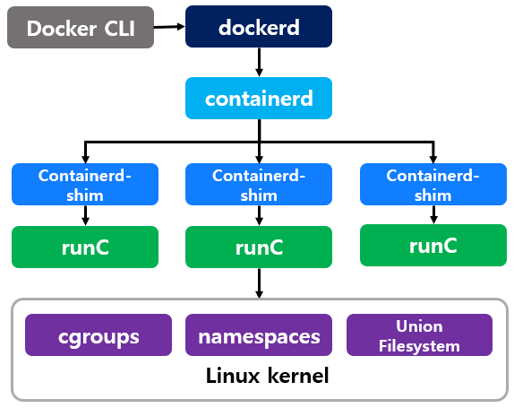

## Container

- Containerization:
  - A technology that allows applications to be executed uniformly anywhere.
- Container Image:
  - A collection of all the files required to run an application.
  - → Similar to a mold for making fish-shaped bread (Bungeoppang).
- Container:
  - A single process that is executed based on a container image.
  - → A fish-shaped bread (Bungeoppang) produced using a mold.

## Docker

Docker is a platform that allows you to manage and use containers.  
Its slogan is "Build Once, Run Anywhere," guaranteeing the same execution results anywhere.

In the Docker, the resources for the container are separated and the lifecycle is controlled by Linux kernel's cgroups, etc.  
However, it is too difficult to use these interfaces directly, so an abstraction layer is created.

Through this, users can easily control containers with just the user-friendly API **Docker CLI**.
- Users can easily control containers using the user-friendly API called **Docker CLI**.

## Interpretation of Layer

The roles of the layers mentioned above are as follows:

1. runC: Utilizes the functionality of the Linux kernel to isolate namespaces, CPUs, memory, filesystems, etc., for a container, which is a single process.
2. containerd: Acts as an abstraction layer to communicate with runC (OCI layer) and uses the standardized interface (OCI).
3. dockerd: Solely responsible for issuing commands to containerd.
4. Docker CLI: Users only need to issue commands to dockerd (Docker daemon) using Docker CLI.
   - During this communication process, Unix socket is used, so sometimes Docker-related errors occur, such as "the /var/run/docker.sock is in use" or "insufficient permissions" error messages.

Although Docker encompasses many stages, when the term "Docker" is used, it can refer to Docker CLI, Dockerd (Docker daemon), or even a single Docker container, which can lead to confusion.  
In the upcoming text, the term "Docker" may be used in various contexts.

## For ML Engineer

ML engineers use Docker for the following reasons:

1. ML training/inference code needs to be independent of the underlying operating system, Python version, Python environment, and specific versions of Python packages.
2. Therefore, the goal is to bundle not only the code but also all the dependent packages, environment variables, folder names, etc., into a single package. Containerization technology enables this.
3. Docker is one of the software tools that makes it easy to use and manage this technology, and the packaged units are referred to as Docker images.
