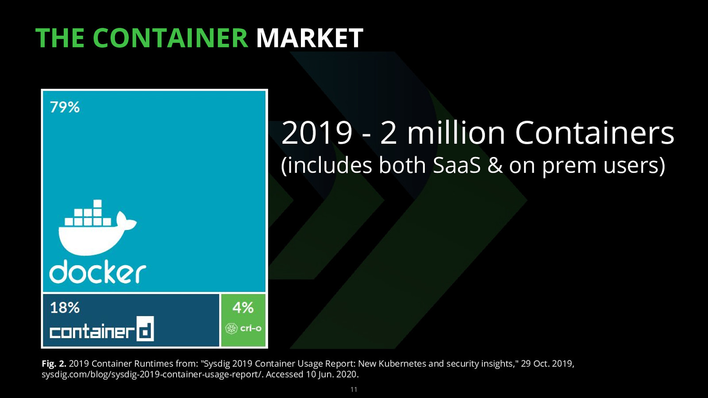
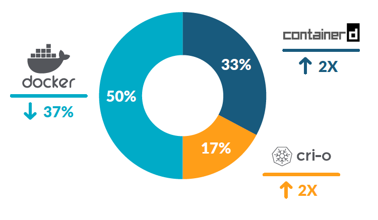
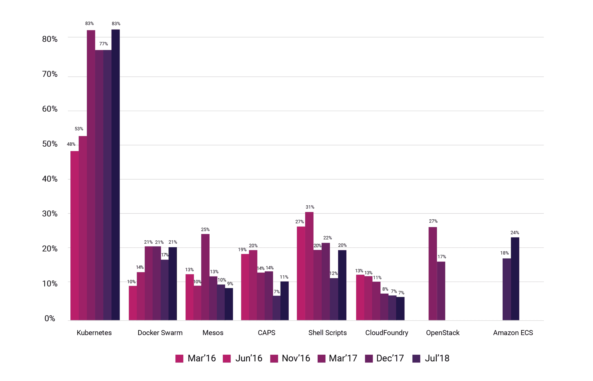
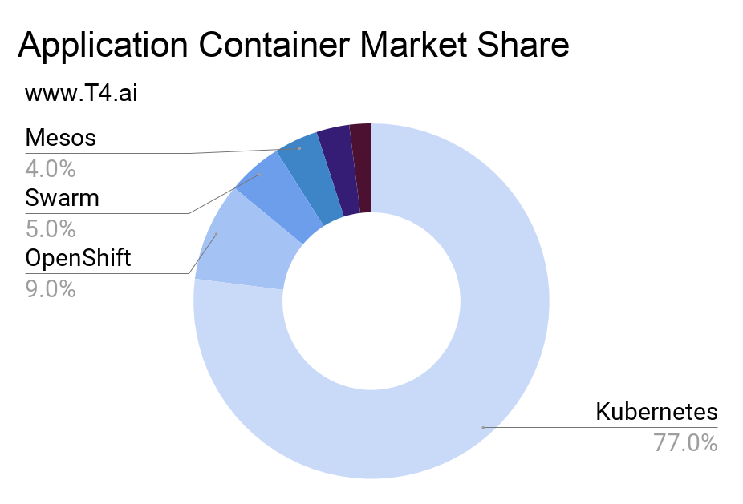

## Why Kubernetes ?

To operationalize machine learning models, additional functionalities beyond model development are required.

1. Training Phase
   - Schedule management for model training commands
   - Ensuring reproducibility of trained models
2. Deployment Phase
   - Traffic distribution
   - Monitoring service failures
   - Troubleshooting in case of failures

Fortunately, the software development field has already put a lot of thought and effort into addressing these needs. Therefore, when deploying machine learning models, leveraging the outcomes of these considerations can be highly beneficial. Docker and Kubernetes are two prominent software products widely used in MLOps to address these needs.

## Docker & Kubernetes

### Not a software but  a product

Docker and Kubernetes are representative software (products) that provide containerization and container orchestration functions respectively.

#### Docker

Docker was the mainstream in the past, but its usage has been decreasing gradually with the addition of various paid policy.  
However, as of March 2022, it is still the most commonly used container virtualization software.

 [from sysdig 2019] 

 [from sysdig 2021]  

#### Kubernetes

Kubernetes: Kubernetes is a product that has almost no comparison so far.

 [from cncf survey] 

 [from t4.ai]  

### History of Open source

#### Initial Docker & Kubernetes

At the beginning of Docker development, **one package** called Docker Engine contained multiple features such as API, CLI, networking, storage, etc., but it began to be **divided one by one** according to the philosophy of **MSA**.  
However, the initial Kubernetes included Docker Engine for container virtualization.  
Therefore, whenever the Docker version was updated, the interface of Docker Engine changed and Kubernetes was greatly affected.

#### Open Container Initiative

In order to alleviate such inconveniences, many groups interested in container technology such as Google have come together to start the Open Container Initiative (OCI) project to set standards for containers.  
Docker further separated its interface and developed Containerd, a Container Runtime that adheres to the OCI standard, and added an abstraction layer so that dockerd calls the API of Containerd.

In accordance with this flow, Kubernetes also now supports not only Docker, but any Container Runtime that adheres to the OCI standard and the specified specifications with the Container Runtime Interface (CRI) specification, starting from version 1.5. 

#### CRI-O

CRI-O is a container runtime developed by Red Hat, Intel, SUSE, and IBM, which adheres to the OCI standard + CRI specifications, specifically for Kubernetes.

#### Current docker & kubernetes

Currently, Docker and Kubernetes have been using Docker Engine as the default container runtime, but since Docker's API did not match the CRI specification (*OCI follows*), Kubernetes developed and supported a **dockershim** to make Docker's API compatible with CRI, (*it was a huge burden for Kubernetes, not for Docker*). This was **deprecated from Kubernetes v1.20 and abandoned from v1.23**.

- v1.23 will be released in December 2021

So from Kubernetes v1.23, you can no longer use Docker natively. 
However, **users are not much affected by this change** because Docker images created through Docker Engine comply with the OCI standard, so they can be used regardless of what container runtime Kubernetes is made of.

### References

- [*https://www.linkedin.com/pulse/containerd는-무엇이고-왜-중요할까-sean-lee/?originalSubdomain=kr*](https://www.linkedin.com/pulse/containerd%EB%8A%94-%EB%AC%B4%EC%97%87%EC%9D%B4%EA%B3%A0-%EC%99%9C-%EC%A4%91%EC%9A%94%ED%95%A0%EA%B9%8C-sean-lee/?originalSubdomain=kr)
- [https://kubernetes.io/blog/2021/12/07/kubernetes-1-23-release-announcement/](https://kubernetes.io/blog/2021/12/07/kubernetes-1-23-release-announcement/)
- [https://kubernetes.io/blog/2020/12/02/dockershim-faq/](https://kubernetes.io/blog/2020/12/02/dockershim-faq/)
- [https://kubernetes.io/blog/2020/12/02/dont-panic-kubernetes-and-docker/](https://kubernetes.io/blog/2020/12/02/dont-panic-kubernetes-and-docker/)
- [https://kubernetes.io/ko/blog/2020/12/02/dont-panic-kubernetes-and-docker/](https://kubernetes.io/ko/blog/2020/12/02/dont-panic-kubernetes-and-docker/)
