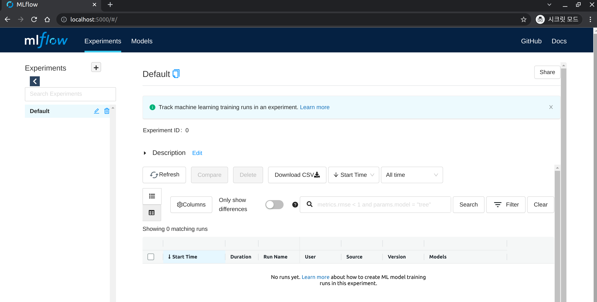

## Install MLflow Tracking Server

MLflow는 대표적인 오픈소스 ML 실험 관리 도구입니다. MLflow는 [실험 관리 용도](https://mlflow.org/docs/latest/tracking.html#tracking) 외에도 [ML Model 패키징](https://mlflow.org/docs/latest/projects.html#projects), [ML 모델 배포 관리](https://mlflow.org/docs/latest/models.html#models), [ML 모델 저장](https://mlflow.org/docs/latest/model-registry.html#registry)과 같은 기능도 제공하고 있습니다.

*모두의 MLOps*에서는 MLflow를 실험 관리 용도로 사용합니다.  
그래서 MLflow에서 관리하는 데이터를 저장하고 UI를 제공하는 MLflow Tracking Server를 쿠버네티스 클러스터에 배포하여 사용할 예정입니다.

## Before Install MLflow Tracking Server

### PostgreSQL DB 설치

MLflow Tracking Server가 Backend Store로 사용할 용도의 PostgreSQL DB를 쿠버네티스 클러스터에 배포합니다.

먼저 `mlflow-system`이라는 namespace 를 생성합니다.

```text
kubectl create ns mlflow-system
```

다음과 같은 메시지가 출력되면 정상적으로 생성된 것을 의미합니다.

```text
namespace/mlflow-system created
```

postgresql DB를 `mlflow-system` namespace 에 생성합니다.

```text
kubectl -n mlflow-system apply -f https://raw.githubusercontent.com/mlops-for-all/helm-charts/b94b5fe4133f769c04b25068b98ccfa7a505aa60/mlflow/manifests/postgres.yaml 
```

정상적으로 수행되면 다음과 같이 출력됩니다.

```text
service/postgresql-mlflow-service created
deployment.apps/postgresql-mlflow created
persistentvolumeclaim/postgresql-mlflow-pvc created
```

mlflow-system namespace 에 1개의 postgresql 관련 pod 가 Running 이 될 때까지 기다립니다.

```text
kubectl get pod -n mlflow-system | grep postgresql
```

다음과 비슷하게 출력되면 정상적으로 실행된 것입니다.

```text
postgresql-mlflow-7b9bc8c79f-srkh7   1/1     Running   0          38s
```

### Minio 설정

MLflow Tracking Server가 Artifacts Store로 사용할 용도의 Minio는 이전 Kubeflow 설치 단계에서 설치한 Minio를 활용합니다.  
단, kubeflow 용도와 mlflow 용도를 분리하기 위해, mlflow 전용 버킷(bucket)을 생성하겠습니다.  
minio 에 접속하여 버킷을 생성하기 위해, 우선 minio-service 를 포트포워딩합니다.

```text
kubectl port-forward svc/minio-service -n kubeflow 9000:9000
```

웹 브라우저를 열어 [localhost:9000](http://localhost:9000)으로 접속하면 다음과 같은 화면이 출력됩니다.


다음과 같은 접속 정보를 입력하여 로그인합니다.

- Username: `minio`
- Password: `minio123`

우측 하단의 **`+`** 버튼을 클릭하여, `Create Bucket`를 클릭합니다.


`Bucket Name`에 `mlflow`를 입력하여 버킷을 생성합니다.

정상적으로 생성되면 다음과 같이 왼쪽에 `mlflow`라는 이름의 버킷이 생성됩니다.


---

## Let's Install MLflow Tracking Server

### Helm Repository 추가

```text
helm repo add mlops-for-all https://mlops-for-all.github.io/helm-charts
```

다음과 같은 메시지가 출력되면 정상적으로 추가된 것을 의미합니다.

```text
"mlops-for-all" has been added to your repositories
```

### Helm Repository 업데이트

```text
helm repo update
```

다음과 같은 메시지가 출력되면 정상적으로 업데이트된 것을 의미합니다.

```text
Hang tight while we grab the latest from your chart repositories...
...Successfully got an update from the "mlops-for-all" chart repository
Update Complete. ⎈Happy Helming!⎈
```

### Helm Install

mlflow-server Helm Chart 0.2.0 버전을 설치합니다.

```text
helm install mlflow-server mlops-for-all/mlflow-server \
  --namespace mlflow-system \
  --version 0.2.0
```

- **주의**: 위의 helm chart는 MLflow 의 backend store 와 artifacts store 의 접속 정보를 kubeflow 설치 과정에서 생성한 minio와 위의 [PostgreSQL DB 설치](#postgresql-db-설치)에서 생성한 postgresql 정보를 default로 하여 설치합니다.
  - 별개로 생성한 DB 혹은 Object storage를 활용하고 싶은 경우, [Helm Chart Repo](https://github.com/mlops-for-all/helm-charts/tree/main/mlflow/chart)를 참고하여 helm install 시 value를 따로 설정하여 설치하시기 바랍니다.

다음과 같은 메시지가 출력되어야 합니다.

```text
NAME: mlflow-server
LAST DEPLOYED: Sat Dec 18 22:02:13 2021
NAMESPACE: mlflow-system
STATUS: deployed
REVISION: 1
TEST SUITE: None
```

정상적으로 설치되었는지 확인합니다.

```text
kubectl get pod -n mlflow-system | grep mlflow-server
```

mlflow-system namespace 에 1 개의 mlflow-server 관련 pod 가 Running 이 될 때까지 기다립니다.  
다음과 비슷하게 출력되면 정상적으로 실행된 것입니다.

```text
mlflow-server-ffd66d858-6hm62        1/1     Running   0          74s
```

### 정상 설치 확인

그럼 이제 MLflow Server에 정상적으로 접속되는지 확인해보겠습니다.

우선 클라이언트 노드에서 접속하기 위해, 포트포워딩을 수행합니다.

```text
kubectl port-forward svc/mlflow-server-service -n mlflow-system 5000:5000
```

웹 브라우저를 열어 [localhost:5000](http://localhost:5000)으로 접속하면 다음과 같은 화면이 출력됩니다.



