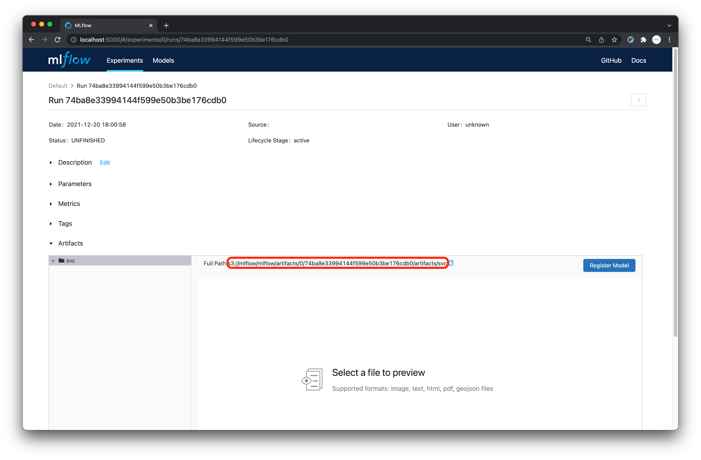

## Model from MLflow

On this page, we will learn how to create an API using a model saved in the [MLflow Component](../kubeflow/advanced-mlflow.md).

## Secret

The initContainer needs credentials to access minio and download the model. The credentials for access to minio are as follows.

```text
apiVersion: v1
type: Opaque
kind: Secret
metadata:
  name: seldon-init-container-secret
  namespace: kubeflow-user-example-com
data:
  AWS_ACCESS_KEY_ID: bWluaW8K=
  AWS_SECRET_ACCESS_KEY: bWluaW8xMjM=
  AWS_ENDPOINT_URL: aHR0cDovL21pbmlvLm1ha2luYXJvY2tzLmFp
  USE_SSL: ZmFsc2U=
```

The input value for `AWS_ACCESS_KEY_ID` is `minio`. However, since the input value for the secret must be an encoded value, the value that is actually entered must be the value that comes out after performing the following. 

The values that need to be entered in data are as follows.

- AWS_ACCESS_KEY_ID: minio
- AWS_SECRET_ACCESS_KEY: minio123
- AWS_ENDPOINT_URL: http://minio-service.kubeflow.svc:9000
- USE_SSL: false

The encoding can be done using the following command.

```text
echo -n minio | base64
```

Then the following values will be output.

```text
bWluaW8=
```

If you do the encoding for the entire value, it will look like this:

- AWS_ACCESS_KEY_ID: minio=
- AWS_SECRET_ACCESS_KEY: minio123=
- AWS_ENDPOINT_URL: http://minio-service.kubeflow.svc:9000=
- USE_SSL: false=

You can generate a yaml file through the following command to create the secret.

```text
cat <<EOF > seldon-init-container-secret.yaml
apiVersion: v1
kind: Secret
metadata:
  name: seldon-init-container-secret
  namespace: kubeflow-user-example-com
type: Opaque
data:
  AWS_ACCESS_KEY_ID: bWluaW8=
  AWS_SECRET_ACCESS_KEY: bWluaW8xMjM=
  AWS_ENDPOINT_URL: aHR0cDovL21pbmlvLXNlcnZpY2Uua3ViZWZsb3cuc3ZjOjkwMDA=
  USE_SSL: ZmFsc2U=
EOF
```

Create the secret through the following command.

```text
kubectl apply -f seldon-init-container-secret.yaml
```

If performed normally, it will be output as follows.

```text
secret/seldon-init-container-secret created
```

## Seldon Core yaml

Now let's write the yaml file to create Seldon Core.

```text
apiVersion: machinelearning.seldon.io/v1
kind: SeldonDeployment
metadata:
  name: seldon-example
  namespace: kubeflow-user-example-com
spec:
  name: model
  predictors:
  - name: model

    componentSpecs:
    - spec:
        volumes:
        - name: model-provision-location
          emptyDir: {}

        initContainers:
        - name: model-initializer
          image: gcr.io/kfserving/storage-initializer:v0.4.0
          args:
            - "s3://mlflow/mlflow/artifacts/0/74ba8e33994144f599e50b3be176cdb0/artifacts/svc"
            - "/mnt/models"
          volumeMounts:
          - mountPath: /mnt/models
            name: model-provision-location
          envFrom:
          - secretRef:
              name: seldon-init-container-secret

        containers:
        - name: model
          image: ghcr.io/mlops-for-all/mlflowserver
          volumeMounts:
          - mountPath: /mnt/models
            name: model-provision-location
            readOnly: true
          securityContext:
            privileged: true
            runAsUser: 0
            runAsGroup: 0

    graph:
      name: model
      type: MODEL
      parameters:
      - name: model_uri
        type: STRING
        value: "/mnt/models"
      children: []
```

There are two major changes compared to the previously created [Seldon Fields](../api-deployment/seldon-fields.md):

1. The `envFrom` field is added to the initContainer.
2. The address in the args has been changed to `s3://mlflow/mlflow/artifacts/0/74ba8e33994144f599e50b3be176cdb0/artifacts/svc`.

### args

Previously, we mentioned that the first element of the args array is the path to the model we want to download. So, how can we determine the path of the model stored in MLflow?

To find the path, go back to MLflow and click on the run, then click on the model, as shown below:



You can use the path obtained from there.

### envFrom

This process involves providing the environment variables required to access MinIO and download the model. We will use the `seldon-init-container-secret` created earlier.

## API Creation

First, let's generate the YAML file based on the specification defined above.

```text
apiVersion: machinelearning.seldon.io/v1
kind: SeldonDeployment
metadata:
  name: seldon-example
  namespace: kubeflow-user-example-com
spec:
  name: model
  predictors:
  - name: model

    componentSpecs:
    - spec:
        volumes:
        - name: model-provision-location
          emptyDir: {}

        initContainers:
        - name: model-initializer
          image: gcr.io/kfserving/storage-initializer:v0.4.0
          args:
            - "s3://mlflow/mlflow/artifacts/0/74ba8e33994144f599e50b3be176cdb0/artifacts/svc"
            - "/mnt/models"
          volumeMounts:
          - mountPath: /mnt/models
            name: model-provision-location
          envFrom:
          - secretRef:
              name: seldon-init-container-secret

        containers:
        - name: model
          image: ghcr.io/mlops-for-all/mlflowserver
          volumeMounts:
          - mountPath: /mnt/models
            name: model-provision-location
            readOnly: true
          securityContext:
            privileged: true
            runAsUser: 0
            runAsGroup: 0

    graph:
      name: model
      type: MODEL
      parameters:
      - name: model_uri
        type: STRING
        value: "/mnt/models"
      - name: xtype
        type: STRING
        value: "dataframe"
      children: []
EOF
```

Create a seldon pod.

```text
kubectl apply -f seldon-mlflow.yaml

```

If it is performed normally, it will be outputted as follows.

```text
seldondeployment.machinelearning.seldon.io/seldon-example created
```

Now we wait until the pod is up and running properly.

```text
kubectl get po -n kubeflow-user-example-com | grep seldon
```

If it is outputted similarly to the following, the API has been created normally.

```text
seldon-example-model-0-model-5c949bd894-c5f28      3/3     Running     0          69s
```

You can confirm the execution through the following request on the API created through the CLI.

```text
curl -X POST http://$NODE_IP:$NODE_PORT/seldon/seldon-deploy/sklearn/api/v1.0/predictions \
-H 'Content-Type: application/json' \
-d '{
    "data": {
        "ndarray": [
            [
                143.0,
                0.0,
                30.0,
                30.0
            ]
        ],
        "names": [
            "sepal length (cm)",
            "sepal width (cm)",
            "petal length (cm)",
            "petal width (cm)"
        ]
    }
}'
```

If executed normally, you can get the following results.

```text
{"data":{"names":[],"ndarray":["Virginica"]},"meta":{"requestPath":{"model":"ghcr.io/mlops-for-all/mlflowserver:e141f57"}}}
```
