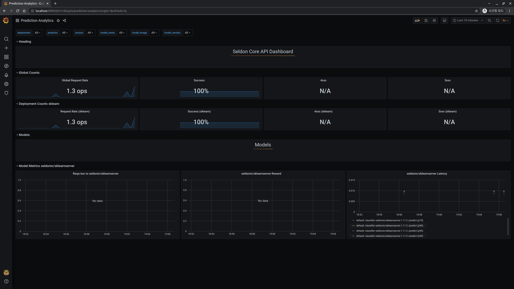

## Grafana & Prometheus

Now, let's perform repeated API requests with the SeldonDeployment we created on the [previous page](../api-deployment/seldon-iris.md) and check if the dashboard changes.

### Dashboard

[Forward the dashboard created earlier](../setup-components/install-components-pg.md).

```bash
kubectl port-forward svc/seldon-core-analytics-grafana -n seldon-system 8090:80
```

### Request API

Request **repeated** to the [previously created Seldon Deployment](../api-deployment/seldon-iris.md#using-cli).

```bash
curl -X POST http://$NODE_IP:$NODE_PORT/seldon/seldon-deploy/sklearn/api/v1.0/predictions \
-H 'Content-Type: application/json' \
-d '{ "data": { "ndarray": [[1,2,3,4]] } }'
```

Furthermore, when checking the Grafana dashboard, you can observe that the Global Request Rate increases momentarily from `0 ops`.



This confirms that Prometheus and Grafana have been successfully installed and configured.
