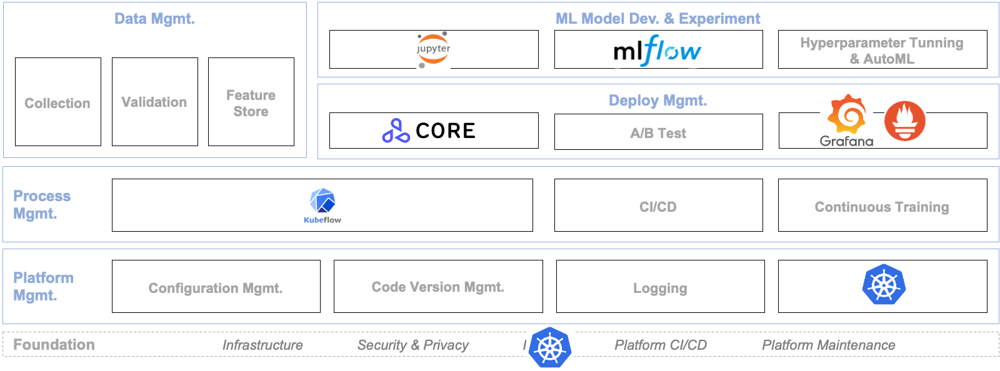

## MLOps Component

From the components covered in [MLOps Concepts](../introduction/component.md), the following diagram illustrates them. 

The technology stacks covered in *Everyone's MLOps* are as follows.

| | Storage | [Minio](https://min.io/)                            |
| | Data Processing | [Apache Spark](https://spark.apache.org/)                             |
| | Data Visualization | [Tableau](https://www.tableau.com/)                               |
| Workflow Mgmt.             | Orchestration               | [Airflow](https://airflow.apache.org/)                              |
| | Scheduling               | [Kubernetes](https://kubernetes.io/)                            |
| Security & Compliance      | Authentication & Authorization | [Ldap](https://www.openldap.org/)                               |
| | Data Encryption & Tokenization | [Vault](https://www.vaultproject.io/)                         |
| | Governance & Auditing | [Open Policy Agent](https://www.openpolicyagent.org/)              |

As you can see, there are still many MLOps components that we have not covered yet. We could not cover them all this time due to time constraints, but if you need it, it might be a good idea to refer to the following open source projects first.

For details:

| Mgmt.                      | Component                   | Open Soruce                           |
| -------------------------- | --------------------------- | ------------------------------------- |
| Data Mgmt.                 | Collection                  | [Kafka](https://kafka.apache.org/)                                 |
|                            | Validation                  | [Beam](https://beam.apache.org/)                                  |
|                            | Feature Store               | [Flink](https://flink.apache.org/)                                 |
| ML Model Dev. & Experiment | Modeling                    | [Jupyter](https://jupyter.org/)                               |
|                            | Analysis & Experiment Mgmt. | [MLflow](https://mlflow.org/)                                |
|                            | HPO Tuning & AutoML         | [Katib](https://github.com/kubeflow/katib)                                 |
| Deploy Mgmt.               | Serving Framework           | [Seldon Core](https://docs.seldon.io/projects/seldon-core/en/latest/index.html)                           |
|                            | A/B Test                    | [Iter8](https://iter8.tools/)                                 |
|                            | Monitoring                  | [Grafana](https://grafana.com/oss/grafana/), [Prometheus](https://prometheus.io/)                   |
| Process Mgmt.              | pipeline                    | [Kubeflow](https://www.kubeflow.org/)                              |
|                            | CI/CD                       | [Github Action](https://docs.github.com/en/actions)                         |
|                            | Continuous Training         | [Argo Events](https://argoproj.github.io/events/)                           |
| Platform Mgmt.             | Configuration Mgmt.         | [Consul](https://www.consul.io/)                                |
|                            | Code Version Mgmt.          | [Github](https://github.com/), [Minio](https://min.io/)                         |
|                            | Logging                     | (EFK) [Elastic Search](https://www.elastic.co/kr/elasticsearch/), [Fluentd](https://www.fluentd.org/), [Kibana](https://www.elastic.co/kr/kibana/) |
|                            | Resource Mgmt.              | [Kubernetes](https://kubernetes.io/)                            |
