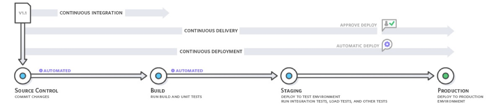
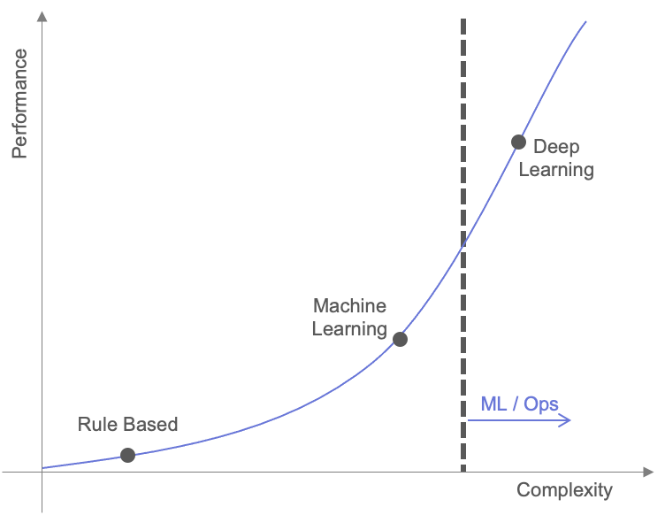

## Machine Learning Project

Since 2012, when Alexnet was introduced, Machine Learning and Deep Learning have been introduced in any domain where data exists, such as Computer Vision and Natural Language Processing. Deep Learning and Machine Learning were referred to collectively as AI, and the need for AI was shouted from many media. And many companies conducted numerous projects using Machine Learning and Deep Learning. But what was the result? Byungchan Eum, the Head of North East Asia at Element AI, said “If 10 companies start an AI project, 9 of them will only be able to do concept validation (POC)”.

In this way, in many projects, Machine Learning and Deep Learning only showed the possibility that they could solve this problem and then disappeared. And around this time, the outlook that [AI Winter was coming again](https://www.aifutures.org/2021/ai-winter-is-coming/) also began to emerge.

Why did most projects end at the concept validation (POC) stage? Because it is impossible to operate an actual service with only Machine Learning and Deep Learning code.

At the actual service stage, the portion taken up by machine learning and deep learning code is not as large as one would think, so one must consider many other aspects besides simply the performance of the model. Google has pointed out this problem in their 2015 paper [Hidden Technical Debt in Machine Learning Systems](https://proceedings.neurips.cc/paper/2015/file/86df7dcfd896fcaf2674f757a2463eba-Paper.pdf). However, at the time this paper was released, many ML engineers were busy proving the potential of deep learning and machine learning, so the points made in the paper were not given much attention. 

And after a few years, machine learning and deep learning had proven their potential and people were now looking to apply it to actual services. However, soon many people realized that actual services were not as easy as they thought.

## Devops

MLOps is not a new concept, but rather a term derived from the development methodology called DevOps. Therefore, understanding DevOps can help in understanding MLOps.

### DevOps

DevOps is a portmanteau of "Development" and "Operations," referring to a development and operations methodology that emphasizes communication, collaboration, and integration between software developers and IT professionals. It encompasses both the development and operation phases of software, aiming to achieve a symbiotic relationship between the two. The primary goal of DevOps is to enable organizations to develop and deploy software products and services rapidly by fostering close collaboration and interdependence between development and operations teams.

### Silo Effect
Let's explore why DevOps is necessary through a simple scenario.

In the early stages of a service, there are fewer supported features, and the team or company is relatively small. At this point, there may not be a clear distinction between development and operations, or the teams may be small. The key point here is the small scale. In such cases, there are many points of contact for effective communication, and with a limited number of services to focus on, it is possible to rapidly improve the service.

However, as the service scales up, the development and operations teams tend to separate, and the physical limitations of communication channels become apparent. For example, in meetings involving multiple teams, only team leaders or a small number of seniors may attend, rather than the entire team. These limitations in communication channels inevitably lead to a lack of communication. Consequently, the development team continues to develop new features, while the operations team faces issues during deployment caused by the features developed by the development team.

When such situations are repeated, it can lead to organizational silos, a phenomenon known as silo mentality.

> Indeed, the term "silo" originally refers to a tall, cylindrical structure used for storing grain or livestock feed. Silos are designed to keep the stored materials separate and prevent them from mixing. 
> In the context of organizations, the "silo effect" or "organizational silos effect" refers to a phenomenon where departments or teams within an organization operate independently and prioritize their own interests without effective collaboration. It reflects a mentality where individual departments focus on building their own "silos" and solely pursue their own interests.

The silo effect can lead to a decline in service quality and hinder organizational performance. To address this issue, DevOps emerged as a solution. DevOps emphasizes collaboration, communication, and integration between development and operations teams, breaking down the barriers and fostering a culture of shared responsibility and collaboration. By promoting cross-functional teamwork and streamlining processes, DevOps aims to overcome silos and improve the efficiency and effectiveness of software development and operations.

### CI/CD

Continuous Integration (CI) and Continuous Delivery (CD) are concrete methods to break down the barriers between development teams and operations teams.

Through this method, the development team can understand the operational environment and check whether the features being developed can be seamlessly deployed. The operations team can deploy validated features or improved products more often to increase customer product experience. In summary, DevOps is a methodology to solve the problem between development teams and operations teams.

## MLOps

### 1) ML + Ops

DevOps is a methodology that addresses the challenges between development and operations teams, promoting collaboration and effective communication. By applying DevOps principles, development teams gain a better understanding of the operational environment, and the developed features can be seamlessly integrated and deployed. On the other hand, operations teams can deploy validated features or improved products more frequently, enhancing the overall customer experience.

MLOps, which stands for Machine Learning Operations, extends the DevOps principles and practices specifically to the field of machine learning. In MLOps, the "Dev" in DevOps is replaced with "ML" to emphasize the unique challenges and considerations related to machine learning.

MLOps aims to address the issues that arise between machine learning teams and operations teams. To understand these issues, let's consider an example using a recommendation system.

#### Rule-Based Approach

In the initial stages of building a recommendation system, a simple rule-based approach may be used. For example, items could be recommended based on the highest sales volume in the past week. With this approach, there is no need for model updates unless there are specific reasons for modification.

#### Machine Learning Approach

As the scale of the service grows and more log data accumulates, machine learning models can be developed based on item-based or user-based recommendations. In this case, the models are periodically retrained and redeployed.

#### Deep Learning Approach

When there is a greater demand for personalized recommendations and a need for models that deliver higher performance, deep learning models are developed. Similar to machine learning, these models are periodically retrained and redeployed.

By considering these examples, it becomes evident that challenges can arise between the machine learning team and the operations team. MLOps aims to address these challenges and provide a methodology and set of practices to facilitate the development, deployment, and operation of machine learning models in a collaborative and efficient manner.

If we represent the concepts explained earlier on a graph, with model complexity on the x-axis and model performance on the y-axis, we can observe an upward trend where the model performance improves as the complexity increases. This often leads to the emergence of separate machine learning teams specializing in transitioning from traditional machine learning to deep learning.

If there are only a few models to manage, collaboration between teams can be sufficient to address the challenges. However, as the number of models to develop increases, silos similar to those observed in DevOps can emerge.

Considering the goals of DevOps, we can understand the goals of MLOps as ensuring that the developed models can be deployed successfully. While DevOps focuses on verifying that the features developed by the development team can be deployed correctly, MLOps focuses on verifying that the models developed by the machine learning team can be deployed effectively.

### 2) ML -> Ops

However, recent MLOps-related products and explanations indicate that the goals are not limited to what was previously described. In some cases, the goal is to enable the machine learning team to directly operate and manage the models they develop. This need arises from the process of ongoing machine learning projects.

In the case of recommendation systems, it was possible to start with simple models in operations. However, in domains such as natural language processing and image analysis, it is common to perform verification (POC) to determine if deep learning models can solve the given tasks. Once the verification is complete, the focus shifts to developing the operational environment for serving the models. However, it may not be easy for the machine learning team to handle this challenge with their internal capabilities alone. This is where MLOps becomes necessary.

### 3) Conclusion

In summary, MLOps has two main goals. The earlier explanation of MLOps focused on ML+Ops, aiming to enhance productivity and collaboration between the two teams. On the other hand, the latter explanation focused on ML -> Ops, aiming to enable the machine learning team to directly operate and manage their models.
