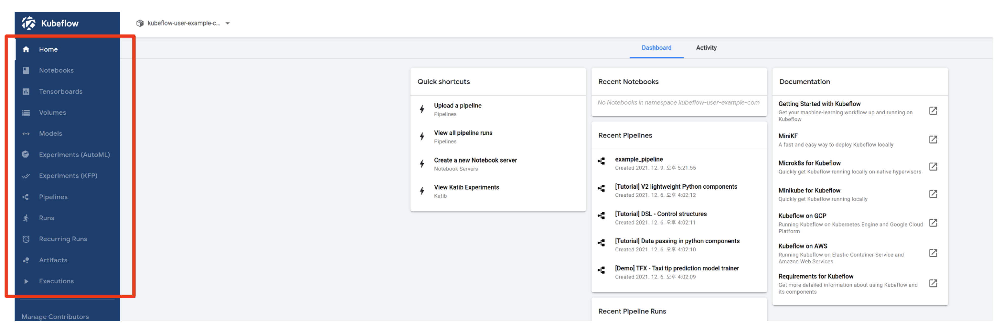

Next, we will click the Experiments(AutoML) tab on the left of the Central Dashboard.

The Experiments(AutoML) page is where you can manage [Katib](https://www.kubeflow.org/docs/components/katib/overview/), which is responsible for AutoML through Hyperparameter Tuning and Neural Architecture Search in Kubeflow.

The usage of Katib and Experiments(AutoML) is not covered in *MLOps for Everyone* v1.0, and will be added in v2.0.
