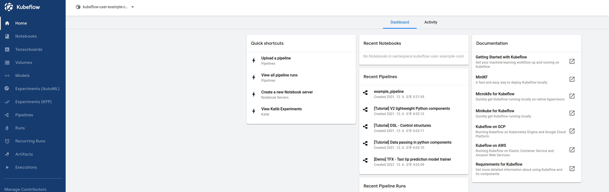

Once you have completed [Kubeflow installation](../setup-components/install-components-kf.md), you can access the dashboard through the following command.

```text
kubectl port-forward --address 0.0.0.0 svc/istio-ingressgateway -n istio-system 8080:80
```



The Central Dashboard is a UI that integrates all the features provided by Kubeflow. The features provided by the Central Dashboard can be divided based on the tabs on the left side


- Home
- Notebooks
- Tensorboards
- Volumes
- Models
- Experiments(AutoML)
- Experiments(KFP)
- Pipelines
- Runs
- Recurring Runs
- Artifacts
- Executions

Let's now look at the simple usage of each feature.
