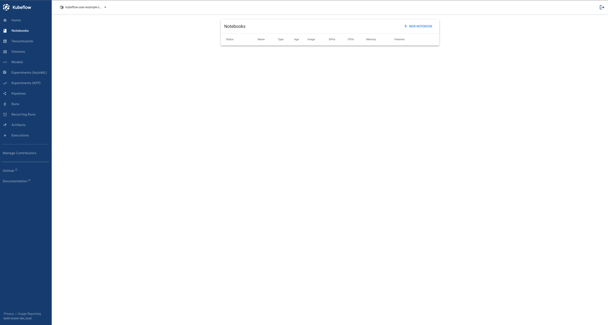
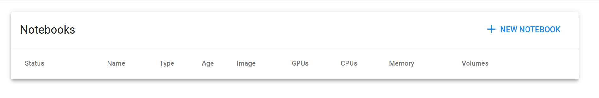
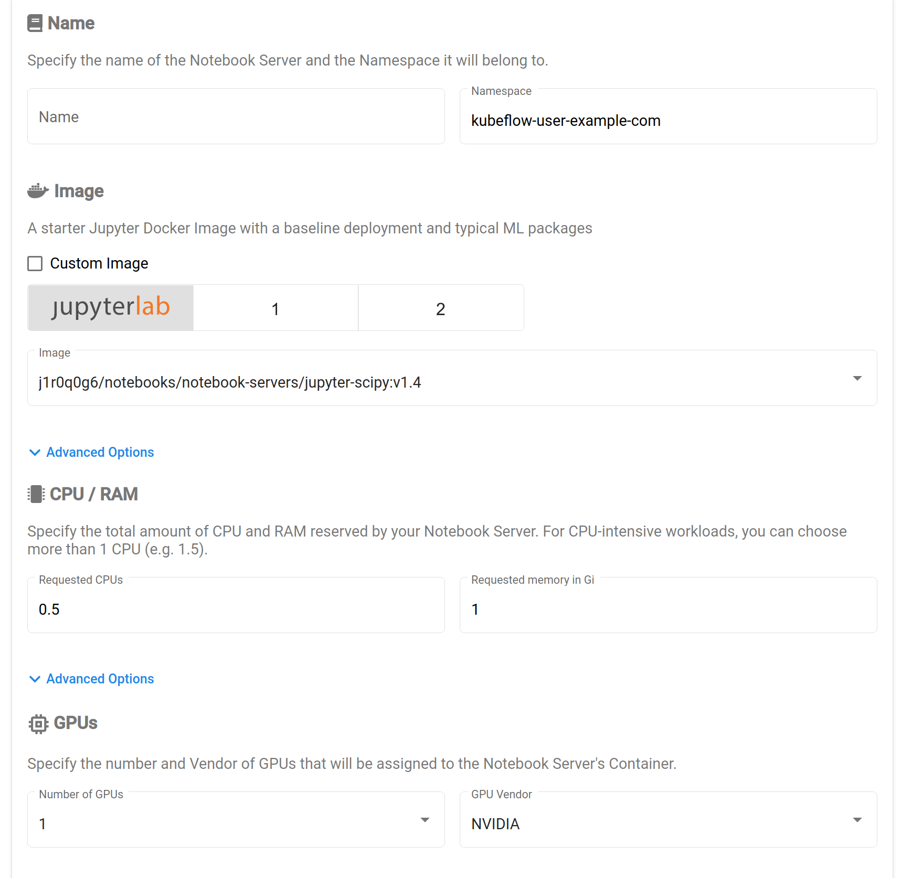
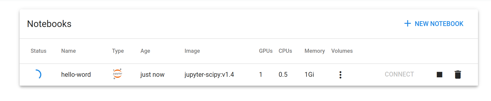
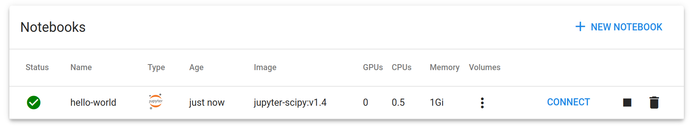
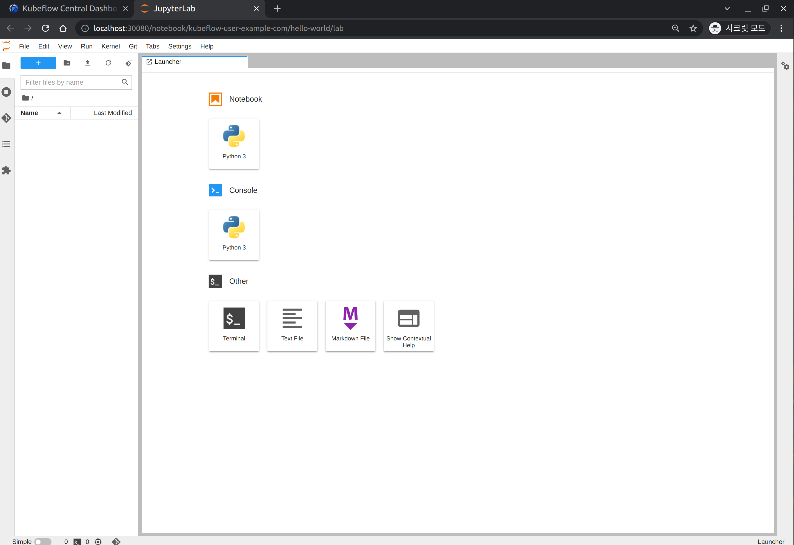
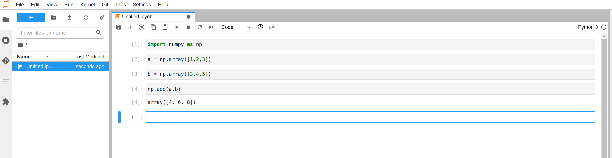
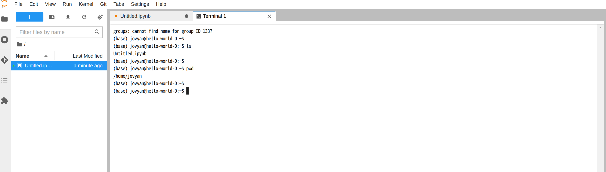
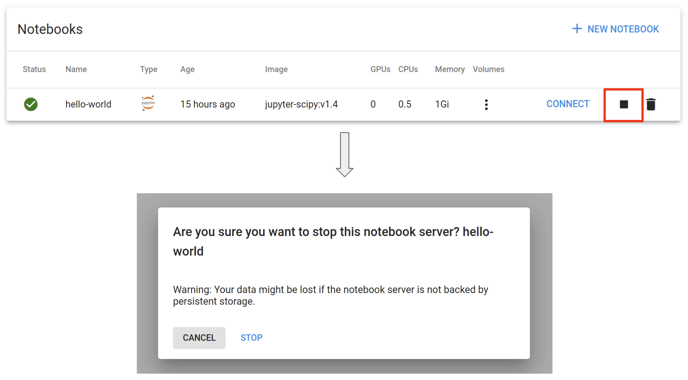
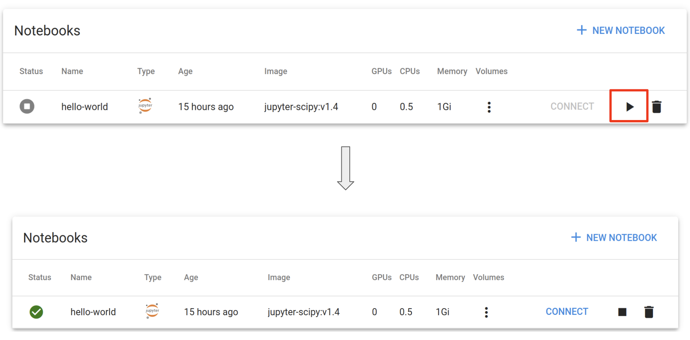

## Launch Notebook Server

Click on the Notebooks tab on the left side of the Central Dashboard.

You will see a similar screen.

The Notebooks tab is a page where users can independently create and access jupyter notebook and code server environments (hereinafter referred to as a notebook server).

Click the "+ NEW NOTEBOOK" button at the top right. 

When the screen shown below appears, now specify the spec (Spec) of the notebook server to be created.

For details for spec:

- **name**:
  - Specifies a name to identify the notebook server.
- **namespace**:
  - Cannot be changed. (It is automatically set to the namespace of the currently logged-in user account.)
- **Image**:
  - Selects the image to use from pre-installed JupyterLab images with Python packages like sklearn, pytorch, tensorflow, etc.
    - If you want to use an image that utilizes GPU within the notebook server, refer to the **GPUs** section below.
  - If you want to use a custom notebook server that includes additional packages or source code, you can create a custom image and deploy it for use.
- **CPU / RAM**:
  - Specifies the amount of resources required.
    - cpu: in core units
      - Represents the number of virtual cores, and can also be specified as a float value such as `1.5`, `2.7`, etc.
    - memory: in Gi units
- **GPUs**:
  - Specifies the number of GPUs to allocate to the Jupyter notebook.
    - `None`
      - When GPU resources are not required.
    - 1, 2, 4
      - Allocates 1, 2, or 4 GPUs.
  - GPU Vendor:
    - If you have followed the [(Optional) Setup GPU](../setup-kubernetes/setup-nvidia-gpu.md) guide and installed the NVIDIA GPU plugin, select NVIDIA.
- **Workspace Volume**:
  - Specifies the amount of disk space required within the notebook server.
  - Do not change the Type and Name fields unless you want to increase the disk space or change the AccessMode.
    - Check the **"Don't use Persistent Storage for User's home"** checkbox only if it is not necessary to save the notebook server's work. **It is generally recommended not to check this option.**
    - If you want to use a pre-existing Persistent Volume Claim (PVC), select Type as "Existing" and enter the name of the PVC to use.
- **Data Volumes**:
  - If additional storage resources are required, click the **"+ ADD VOLUME"** button to create them.
- ~~Configurations, Affinity/Tolerations, Miscellaneous Settings~~
  - These are generally not needed, so detailed explanations are omitted in *MLOps for All*.

If you followed the [Setup GPU (Optional)](../setup-kubernetes/setup-nvidia-gpu.md), select NVIDIA if you have installed the nvidia gpu plugin.

After creation, the **Status** will change to a green check mark icon, and the **CONNECT button** will be activated.

---
## Accessing the Notebook Server

Clicking the **CONNECT button** will open a new browser window, where you will see the following screen:

You can use the Notebook, Console, and Terminal icons in the **Launcher** to start using them.

  Notebook Interface

  Terminal Interface

---

## Stopping the Notebook Server

If you haven't used the notebook server for an extended period of time, you can stop it to optimize resource usage in the Kubernetes cluster. **Note that stopping the notebook server will result in the deletion of all data stored outside the Workspace Volume or Data Volume specified when creating the notebook server.**  
If you haven't changed the path during notebook server creation, the default Workspace Volume path is `/home/jovyan` inside the notebook server, so any data stored outside the `/home/jovyan` directory will be deleted.

Clicking the `STOP` button as shown below will stop the notebook server:

Once the server is stopped, the `CONNECT` button will be disabled. To restart the notebook server and use it again, click the `PLAY` button.

