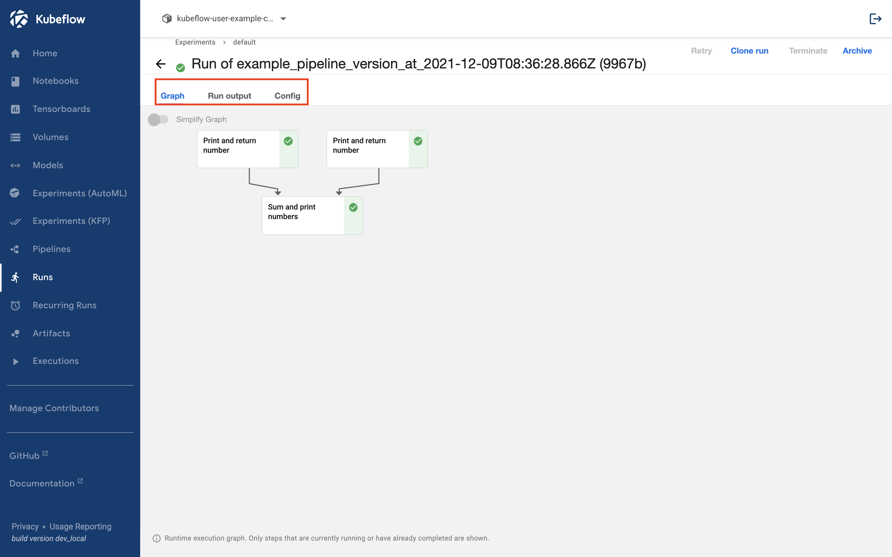
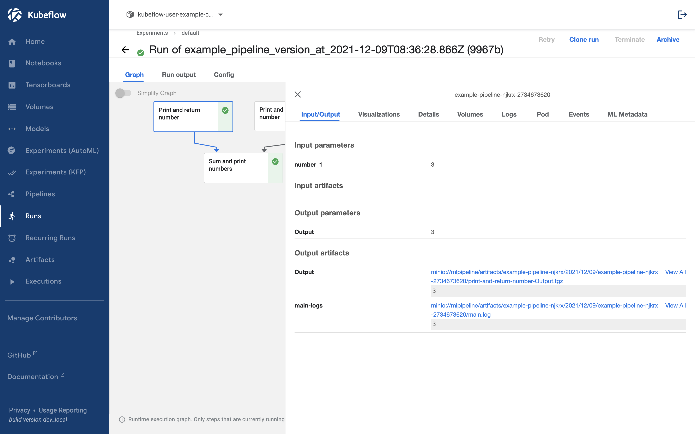
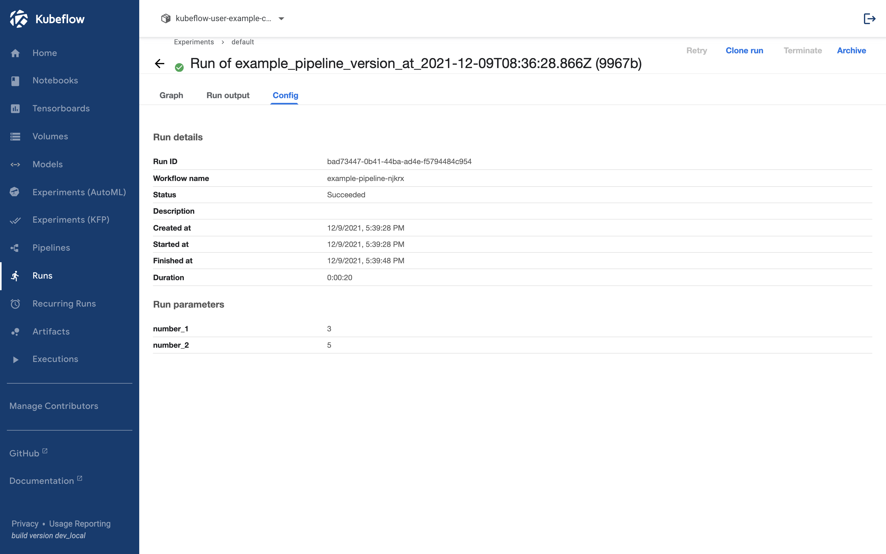

## Run Result

Run 실행 결과를 눌러보면 3개의 탭이 존재합니다.
각각 Graph, Run output, Config 입니다.



## Graph



그래프에서는 실행된 컴포넌트를 누르면 컴포넌트의 실행 정보를 확인할 수 있습니다.

### Input/Output

Input/Output 탭은 컴포넌트에서 사용한 Config들과 Input, Output Artifacts를 확인하고 다운로드 받을 수 있습니다.

### Logs

Logs에서는 파이썬 코드 실행 중 나오는 모든 stdout을 확인할 수 있습니다.
다만 pod은 일정 시간이 지난 후 지워지기 때문에 일정 시간이 지나면 이 탭에서는 확인할 수 없습니다.
이때는 Output artifacts의 main-logs에서 확인할 수 있습니다.

### Visualizations

Visualizations에서는 컴포넌트에서 생성된 플랏을 보여줍니다.

플랏을 생성하기 위해서는 `mlpipeline_ui_metadata: OutputPath("UI_Metadata")` argument로 보여주고 싶은 값을 저장하면 됩니다. 이 때 플랏의 형태는 html 포맷이어야 합니다.
변환하는 과정은 다음과 같습니다.

```python

@partial(
    create_component_from_func,
    packages_to_install=["matplotlib"],
)
def plot_linear(
    mlpipeline_ui_metadata: OutputPath("UI_Metadata")
):
    import base64
    import json
    from io import BytesIO

    import matplotlib.pyplot as plt

    plt.plot(x=[1, 2, 3], y=[1, 2,3])

    tmpfile = BytesIO()
    plt.savefig(tmpfile, format="png")
    encoded = base64.b64encode(tmpfile.getvalue()).decode("utf-8")

    html = f""
    metadata = {
        "outputs": [
            {
                "type": "web-app",
                "storage": "inline",
                "source": html,
            },
        ],
    }
    with open(mlpipeline_ui_metadata, "w") as html_writer:
        json.dump(metadata, html_writer)
```

파이프라인으로 작성하면 다음과 같이 됩니다.

```python
from functools import partial

import kfp
from kfp.components import create_component_from_func, OutputPath
from kfp.dsl import pipeline


@partial(
    create_component_from_func,
    packages_to_install=["matplotlib"],
)
def plot_linear(mlpipeline_ui_metadata: OutputPath("UI_Metadata")):
    import base64
    import json
    from io import BytesIO

    import matplotlib.pyplot as plt

    plt.plot([1, 2, 3], [1, 2, 3])

    tmpfile = BytesIO()
    plt.savefig(tmpfile, format="png")
    encoded = base64.b64encode(tmpfile.getvalue()).decode("utf-8")

    html = f""
    metadata = {
        "outputs": [
            {
                "type": "web-app",
                "storage": "inline",
                "source": html,
            },
        ],
    }
    with open(mlpipeline_ui_metadata, "w") as html_writer:
        json.dump(metadata, html_writer)


@pipeline(name="plot_pipeline")
def plot_pipeline():
    plot_linear()


if __name__ == "__main__":
    kfp.compiler.Compiler().compile(plot_pipeline, "plot_pipeline.yaml")
```

이 스크립트를 실행해서 나온 `plot_pipeline.yaml`을 확인하면 다음과 같습니다.

<p>
  <details>
    <summary>plot_pipeline.yaml</summary>

```text
apiVersion: argoproj.io/v1alpha1
kind: Workflow
metadata:
  generateName: plot-pipeline-
  annotations: {pipelines.kubeflow.org/kfp_sdk_version: 1.8.9, pipelines.kubeflow.org/pipeline_compilation_time: '2
022-01-17T13:31:32.963214',
    pipelines.kubeflow.org/pipeline_spec: '{"name": "plot_pipeline"}'}
  labels: {pipelines.kubeflow.org/kfp_sdk_version: 1.8.9}
spec:
  entrypoint: plot-pipeline
  templates:
  - name: plot-linear
    container:
      args: [--mlpipeline-ui-metadata, /tmp/outputs/mlpipeline_ui_metadata/data]
      command:
      - sh
      - -c
      - (PIP_DISABLE_PIP_VERSION_CHECK=1 python3 -m pip install --quiet --no-warn-script-location
        'matplotlib' || PIP_DISABLE_PIP_VERSION_CHECK=1 python3 -m pip install --quiet
        --no-warn-script-location 'matplotlib' --user) && "$0" "$@"
      - sh
      - -ec
      - |
        program_path=$(mktemp)
        printf "%s" "$0" > "$program_path"
        python3 -u "$program_path" "$@"
      - |
        def _make_parent_dirs_and_return_path(file_path: str):
            import os
            os.makedirs(os.path.dirname(file_path), exist_ok=True)
            return file_path
        def plot_linear(mlpipeline_ui_metadata):
            import base64
            import json
            from io import BytesIO
            import matplotlib.pyplot as plt
            plt.plot([1, 2, 3], [1, 2, 3])
            tmpfile = BytesIO()
            plt.savefig(tmpfile, format="png")
            encoded = base64.b64encode(tmpfile.getvalue()).decode("utf-8")
            html = f""
            metadata = {
                "outputs": [
                    {
                        "type": "web-app",
                        "storage": "inline",
                        "source": html,
                    },
                ],
            }
            with open(mlpipeline_ui_metadata, "w") as html_writer:
                json.dump(metadata, html_writer)

        import argparse
        _parser = argparse.ArgumentParser(prog='Plot linear', description='')
        _parser.add_argument("--mlpipeline-ui-metadata", dest="mlpipeline_ui_metadata", type=_make_parent_dirs_and_return_path, required=True, default=argparse.SUPPRESS)
        _parsed_args = vars(_parser.parse_args())
        _outputs = plot_linear(**_parsed_args)
      image: python:3.7
    outputs:
      artifacts:
      - {name: mlpipeline-ui-metadata, path: /tmp/outputs/mlpipeline_ui_metadata/data}
    metadata:
      labels:
        pipelines.kubeflow.org/kfp_sdk_version: 1.8.9
        pipelines.kubeflow.org/pipeline-sdk-type: kfp
        pipelines.kubeflow.org/enable_caching: "true"
      annotations: {pipelines.kubeflow.org/component_spec: '{"implementation": {"container":
          {"args": ["--mlpipeline-ui-metadata", {"outputPath": "mlpipeline_ui_metadata"}],
          "command": ["sh", "-c", "(PIP_DISABLE_PIP_VERSION_CHECK=1 python3 -m pip
          install --quiet --no-warn-script-location ''matplotlib'' || PIP_DISABLE_PIP_VERSION_CHECK=1
          python3 -m pip install --quiet --no-warn-script-location ''matplotlib''
          --user) && \"$0\" \"$@\"", "sh", "-ec", "program_path=$(mktemp)\nprintf
          \"%s\" \"$0\" > \"$program_path\"\npython3 -u \"$program_path\" \"$@\"\n",
          "def _make_parent_dirs_and_return_path(file_path: str):\n    import os\n    os.makedirs(os.path.dirname(file_path),
          exist_ok=True)\n    return file_path\n\ndef plot_linear(mlpipeline_ui_metadata):\n    import
          base64\n    import json\n    from io import BytesIO\n\n    import matplotlib.pyplot
          as plt\n\n    plt.plot([1, 2, 3], [1, 2, 3])\n\n    tmpfile = BytesIO()\n    plt.savefig(tmpfile,
          format=\"png\")\n    encoded = base64.b64encode(tmpfile.getvalue()).decode(\"utf-8\")\n\n    html
          = f\"\"\n    metadata = {\n        \"outputs\":
          [\n            {\n                \"type\": \"web-app\",\n                \"storage\":
          \"inline\",\n                \"source\": html,\n            },\n        ],\n    }\n    with
          open(mlpipeline_ui_metadata, \"w\") as html_writer:\n        json.dump(metadata,
          html_writer)\n\nimport argparse\n_parser = argparse.ArgumentParser(prog=''Plot
          linear'', description='''')\n_parser.add_argument(\"--mlpipeline-ui-metadata\",
          dest=\"mlpipeline_ui_metadata\", type=_make_parent_dirs_and_return_path,
          required=True, default=argparse.SUPPRESS)\n_parsed_args = vars(_parser.parse_args())\n\n_outputs
          = plot_linear(**_parsed_args)\n"], "image": "python:3.7"}}, "name": "Plot
          linear", "outputs": [{"name": "mlpipeline_ui_metadata", "type": "UI_Metadata"}]}',
        pipelines.kubeflow.org/component_ref: '{}'}
  - name: plot-pipeline
    dag:
      tasks:
      - {name: plot-linear, template: plot-linear}
  arguments:
    parameters: []
  serviceAccountName: pipeline-runner
```

  </details>
</p>

실행 후 Visualization을 클릭합니다.


## Run output


Run output은 kubeflow에서 지정한 형태로 생긴 Artifacts를 모아서 보여주는 곳이며 평가 지표(Metric)를 보여줍니다.

평가 지표(Metric)을 보여주기 위해서는 `mlpipeline_metrics_path: OutputPath("Metrics")` argument에 보여주고 싶은 이름과 값을 json 형태로 저장하면 됩니다.
예를 들어서 다음과 같이 작성할 수 있습니다.

```python
@create_component_from_func
def show_metric_of_sum(
    number: int,
    mlpipeline_metrics_path: OutputPath("Metrics"),
  ):
    import json
    metrics = {
        "metrics": [
            {
                "name": "sum_value",
                "numberValue": number,
            },
        ],
    }
    with open(mlpipeline_metrics_path, "w") as f:
        json.dump(metrics, f)
```

평가 지표를 생성하는 컴포넌트를 [파이프라인](../kubeflow/basic-pipeline.md)에서 생성한 파이프라인에 추가 후 실행해 보겠습니다.
전체 파이프라인은 다음과 같습니다.

```python
import kfp
from kfp.components import create_component_from_func, OutputPath
from kfp.dsl import pipeline


@create_component_from_func
def print_and_return_number(number: int) -> int:
    print(number)
    return number

@create_component_from_func
def sum_and_print_numbers(number_1: int, number_2: int) -> int:
    sum_number = number_1 + number_2
    print(sum_number)
    return sum_number

@create_component_from_func
def show_metric_of_sum(
    number: int,
    mlpipeline_metrics_path: OutputPath("Metrics"),
  ):
    import json
    metrics = {
        "metrics": [
            {
                "name": "sum_value",
                "numberValue": number,
            },
        ],
    }
    with open(mlpipeline_metrics_path, "w") as f:
        json.dump(metrics, f)

@pipeline(name="example_pipeline")
def example_pipeline(number_1: int, number_2: int):
    number_1_result = print_and_return_number(number_1)
    number_2_result = print_and_return_number(number_2)
    sum_result = sum_and_print_numbers(
        number_1=number_1_result.output, number_2=number_2_result.output
    )
    show_metric_of_sum(sum_result.output)


if __name__ == "__main__":
    kfp.compiler.Compiler().compile(example_pipeline, "example_pipeline.yaml")
```

실행 후 Run Output을 클릭하면 다음과 같이 나옵니다.


## Config



Config에서는 파이프라인 Config로 입력받은 모든 값을 확인할 수 있습니다.
