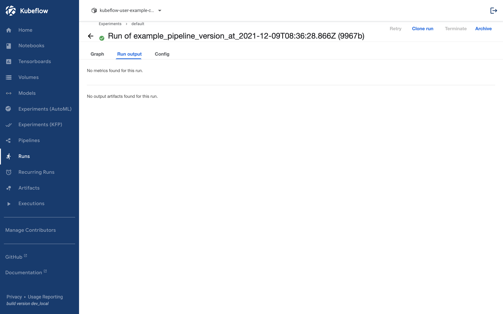
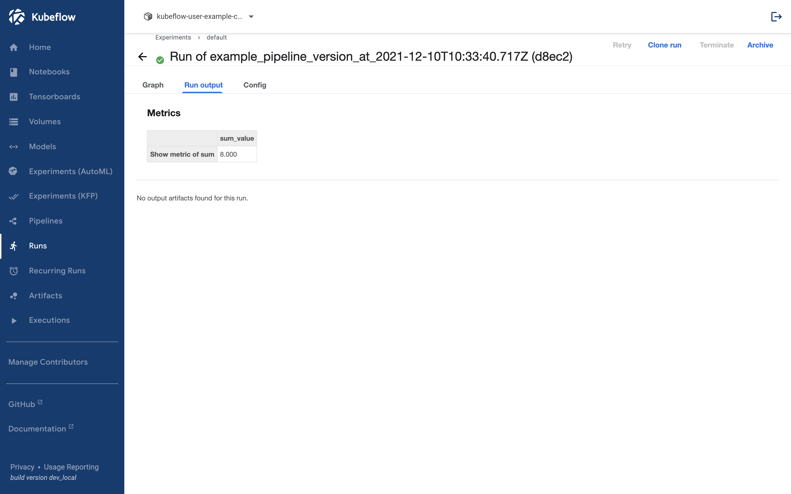

## Run Result

Click Run Result and you will see three tabs:
Graph, Run Output, and Config.


## Graph


In the graph, if you click on the run component, you can check the running information of the component.

### Input/Output

The Input/Output tab allows you to view and download the Configurations, Input, and Output Artifacts used in the components.

### Logs

In the Logs tab, you can view all the stdout output generated during the execution of the Python code.
However, pods are deleted after a certain period of time, so you may not be able to view them in this tab after a certain time.
In that case, you can check them in the main-logs section of the Output artifacts.

### Visualizations

The Visualizations tab displays plots generated by the components.

To generate a plot, you can save the desired values as an argument using `mlpipeline_ui_metadata: OutputPath("UI_Metadata")`. The plot should be in HTML format.
The conversion process is as follows.

```python

@partial(
    create_component_from_func,
    packages_to_install=["matplotlib"],
)
def plot_linear(
    mlpipeline_ui_metadata: OutputPath("UI_Metadata")
):
    import base64
    import json
    from io import BytesIO

    import matplotlib.pyplot as plt

    plt.plot(x=[1, 2, 3], y=[1, 2,3])

    tmpfile = BytesIO()
    plt.savefig(tmpfile, format="png")
    encoded = base64.b64encode(tmpfile.getvalue()).decode("utf-8")

    html = f""
    metadata = {
        "outputs": [
            {
                "type": "web-app",
                "storage": "inline",
                "source": html,
            },
        ],
    }
    with open(mlpipeline_ui_metadata, "w") as html_writer:
        json.dump(metadata, html_writer)
```

If written in pipeline, it will be like this.

```python
from functools import partial

import kfp
from kfp.components import create_component_from_func, OutputPath
from kfp.dsl import pipeline


@partial(
    create_component_from_func,
    packages_to_install=["matplotlib"],
)
def plot_linear(mlpipeline_ui_metadata: OutputPath("UI_Metadata")):
    import base64
    import json
    from io import BytesIO

    import matplotlib.pyplot as plt

    plt.plot([1, 2, 3], [1, 2, 3])

    tmpfile = BytesIO()
    plt.savefig(tmpfile, format="png")
    encoded = base64.b64encode(tmpfile.getvalue()).decode("utf-8")

    html = f""
    metadata = {
        "outputs": [
            {
                "type": "web-app",
                "storage": "inline",
                "source": html,
            },
        ],
    }
    with open(mlpipeline_ui_metadata, "w") as html_writer:
        json.dump(metadata, html_writer)


@pipeline(name="plot_pipeline")
def plot_pipeline():
    plot_linear()


if __name__ == "__main__":
    kfp.compiler.Compiler().compile(plot_pipeline, "plot_pipeline.yaml")
```

If you run this script and check the resulting `plot_pipeline.yaml`, you will see the following.

<p>
  <details>
    <summary>plot_pipeline.yaml</summary>

```text
apiVersion: argoproj.io/v1alpha1
kind: Workflow
metadata:
  generateName: plot-pipeline-
  annotations: {pipelines.kubeflow.org/kfp_sdk_version: 1.8.9, pipelines.kubeflow.org/pipeline_compilation_time: '2
022-01-17T13:31:32.963214',
    pipelines.kubeflow.org/pipeline_spec: '{"name": "plot_pipeline"}'}
  labels: {pipelines.kubeflow.org/kfp_sdk_version: 1.8.9}
spec:
  entrypoint: plot-pipeline
  templates:
  - name: plot-linear
    container:
      args: [--mlpipeline-ui-metadata, /tmp/outputs/mlpipeline_ui_metadata/data]
      command:
      - sh
      - -c
      - (PIP_DISABLE_PIP_VERSION_CHECK=1 python3 -m pip install --quiet --no-warn-script-location
        'matplotlib' || PIP_DISABLE_PIP_VERSION_CHECK=1 python3 -m pip install --quiet
        --no-warn-script-location 'matplotlib' --user) && "$0" "$@"
      - sh
      - -ec
      - |
        program_path=$(mktemp)
        printf "%s" "$0" > "$program_path"
        python3 -u "$program_path" "$@"
      - |
        def _make_parent_dirs_and_return_path(file_path: str):
            import os
            os.makedirs(os.path.dirname(file_path), exist_ok=True)
            return file_path
        def plot_linear(mlpipeline_ui_metadata):
            import base64
            import json
            from io import BytesIO
            import matplotlib.pyplot as plt
            plt.plot([1, 2, 3], [1, 2, 3])
            tmpfile = BytesIO()
            plt.savefig(tmpfile, format="png")
            encoded = base64.b64encode(tmpfile.getvalue()).decode("utf-8")
            html = f""
            metadata = {
                "outputs": [
                    {
                        "type": "web-app",
                        "storage": "inline",
                        "source": html,
                    },
                ],
            }
            with open(mlpipeline_ui_metadata, "w") as html_writer:
                json.dump(metadata, html_writer)

        import argparse
        _parser = argparse.ArgumentParser(prog='Plot linear', description='')
        _parser.add_argument("--mlpipeline-ui-metadata", dest="mlpipeline_ui_metadata", type=_make_parent_dirs_and_return_path, required=True, default=argparse.SUPPRESS)
        _parsed_args = vars(_parser.parse_args())
        _outputs = plot_linear(**_parsed_args)
      image: python:3.7
    outputs:
      artifacts:
      - {name: mlpipeline-ui-metadata, path: /tmp/outputs/mlpipeline_ui_metadata/data}
    metadata:
      labels:
        pipelines.kubeflow.org/kfp_sdk_version: 1.8.9
        pipelines.kubeflow.org/pipeline-sdk-type: kfp
        pipelines.kubeflow.org/enable_caching: "true"
      annotations: {pipelines.kubeflow.org/component_spec: '{"implementation": {"container":
          {"args": ["--mlpipeline-ui-metadata", {"outputPath": "mlpipeline_ui_metadata"}],
          "command": ["sh", "-c", "(PIP_DISABLE_PIP_VERSION_CHECK=1 python3 -m pip
          install --quiet --no-warn-script-location ''matplotlib'' || PIP_DISABLE_PIP_VERSION_CHECK=1
          python3 -m pip install --quiet --no-warn-script-location ''matplotlib''
          --user) && \"$0\" \"$@\"", "sh", "-ec", "program_path=$(mktemp)\nprintf
          \"%s\" \"$0\" > \"$program_path\"\npython3 -u \"$program_path\" \"$@\"\n",
          "def _make_parent_dirs_and_return_path(file_path: str):\n    import os\n    os.makedirs(os.path.dirname(file_path),
          exist_ok=True)\n    return file_path\n\ndef plot_linear(mlpipeline_ui_metadata):\n    import
          base64\n    import json\n    from io import BytesIO\n\n    import matplotlib.pyplot
          as plt\n\n    plt.plot([1, 2, 3], [1, 2, 3])\n\n    tmpfile = BytesIO()\n    plt.savefig(tmpfile,
          format=\"png\")\n    encoded = base64.b64encode(tmpfile.getvalue()).decode(\"utf-8\")\n\n    html
          = f\"\"\n    metadata = {\n        \"outputs\":
          [\n            {\n                \"type\": \"web-app\",\n                \"storage\":
          \"inline\",\n                \"source\": html,\n            },\n        ],\n    }\n    with
          open(mlpipeline_ui_metadata, \"w\") as html_writer:\n        json.dump(metadata,
          html_writer)\n\nimport argparse\n_parser = argparse.ArgumentParser(prog=''Plot
          linear'', description='''')\n_parser.add_argument(\"--mlpipeline-ui-metadata\",
          dest=\"mlpipeline_ui_metadata\", type=_make_parent_dirs_and_return_path,
          required=True, default=argparse.SUPPRESS)\n_parsed_args = vars(_parser.parse_args())\n\n_outputs
          = plot_linear(**_parsed_args)\n"], "image": "python:3.7"}}, "name": "Plot
          linear", "outputs": [{"name": "mlpipeline_ui_metadata", "type": "UI_Metadata"}]}',
        pipelines.kubeflow.org/component_ref: '{}'}
  - name: plot-pipeline
    dag:
      tasks:
      - {name: plot-linear, template: plot-linear}
  arguments:
    parameters: []
  serviceAccountName: pipeline-runner
```

  </details>
</p>

After running, click Visualization.


## Run output



Run output is where Kubeflow gathers the Artifacts generated in the specified form and shows the evaluation index (Metric).

To show the evaluation index (Metric), you can save the name and value you want to show in the `mlpipeline_metrics_path: OutputPath("Metrics")` argument in json format. For example, you can write it like this.

```python
@create_component_from_func
def show_metric_of_sum(
    number: int,
    mlpipeline_metrics_path: OutputPath("Metrics"),
  ):
    import json
    metrics = {
        "metrics": [
            {
                "name": "sum_value",
                "numberValue": number,
            },
        ],
    }
    with open(mlpipeline_metrics_path, "w") as f:
        json.dump(metrics, f)
```

We will add a component to generate evaluation metrics to the pipeline created in the [Pipeline](../kubeflow/basic-pipeline.md) and execute it. The whole pipeline is as follows.

```python
import kfp
from kfp.components import create_component_from_func, OutputPath
from kfp.dsl import pipeline


@create_component_from_func
def print_and_return_number(number: int) -> int:
    print(number)
    return number

@create_component_from_func
def sum_and_print_numbers(number_1: int, number_2: int) -> int:
    sum_number = number_1 + number_2
    print(sum_number)
    return sum_number

@create_component_from_func
def show_metric_of_sum(
    number: int,
    mlpipeline_metrics_path: OutputPath("Metrics"),
  ):
    import json
    metrics = {
        "metrics": [
            {
                "name": "sum_value",
                "numberValue": number,
            },
        ],
    }
    with open(mlpipeline_metrics_path, "w") as f:
        json.dump(metrics, f)

@pipeline(name="example_pipeline")
def example_pipeline(number_1: int, number_2: int):
    number_1_result = print_and_return_number(number_1)
    number_2_result = print_and_return_number(number_2)
    sum_result = sum_and_print_numbers(
        number_1=number_1_result.output, number_2=number_2_result.output
    )
    show_metric_of_sum(sum_result.output)


if __name__ == "__main__":
    kfp.compiler.Compiler().compile(example_pipeline, "example_pipeline.yaml")
```

After execution, click Run Output and it will show like this.



## Config


In the Config tab, you can view all the values received as pipeline configurations.
