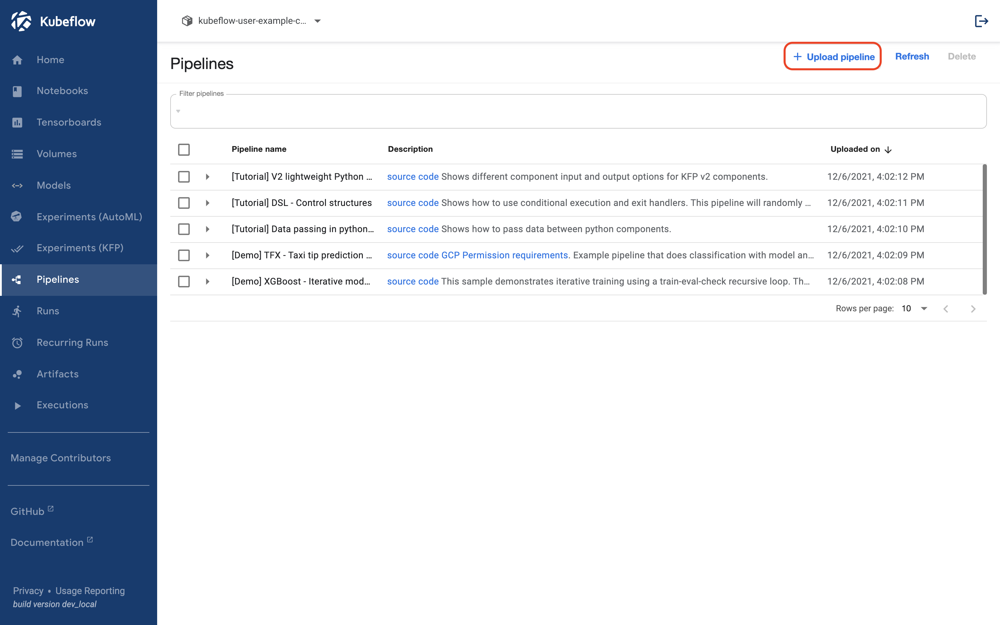
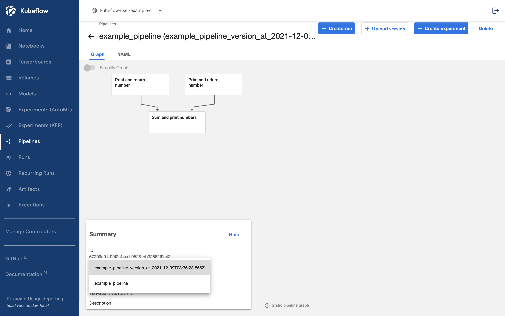

## Upload Pipeline

Now, let's upload the pipeline we created directly to kubeflow.  
Pipeline uploads can be done through the kubeflow dashboard UI.
Use the method used in [Install Kubeflow](../setup-components/install-components-kf.md) to do port forwarding.

```bash
kubectl port-forward svc/istio-ingressgateway -n istio-system 8080:80
```

Access [http://localhost:8080](http://localhost:8080) to open the dashboard.

### 1. Click Pipelines Tab


### 2. Click Upload Pipeline



### 3. Click Choose file


### 4. Upload created yaml file


### 5. Create


## Upload Pipeline Version


The uploaded pipeline allows you to manage versions through uploads. However, it serves the role of gathering pipelines with the same name rather than version management at the code level, such as Github.
In the example above, clicking on example_pipeline will bring up the following screen.


If you click this screen shows.


If you click Upload Version, a screen appears where you can upload the pipeline.


Now, upload your pipeline.


Once uploaded, you can check the pipeline version as follows.


