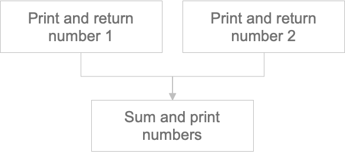

## Pipeline

Components do not run independently but rather as components of a pipeline. Therefore, in order to run a component, a pipeline must be written.
And in order to write a pipeline, a set of components and the order of execution of those components is necessary.

On this page, we will create a pipeline with a component that takes a number as input and outputs it, and a component that takes two numbers from two components and outputs the sum.

## Component Set

First, let's create the components that will be used in the pipeline.

1. `print_and_return_number`

   This component prints and returns the input number.  
   Since the component returns the input value, we specify `int` as the return type hint.

   ```python
   @create_component_from_func
   def print_and_return_number(number: int) -> int:
       print(number)
       return number
   ```

2. `sum_and_print_numbers`

   This component calculates the sum of two input numbers and prints it.  
   Similarly, since the component returns the sum, we specify `int` as the return type hint.

   ```python
   @create_component_from_func
   def sum_and_print_numbers(number_1: int, number_2: int) -> int:
       sum_num = number_1 + number_2
       print(sum_num)
       return sum_num
   ```

## Component Order

### Define Order

If you have created the necessary set of components, the next step is to define their sequence.  
The diagram below represents the order of the pipeline components to be created on this page.



### Single Output

Now let's translate this sequence into code.

First, writing `print_and_return_number_1` and `print_and_return_number_2` from the picture above would look like this.

```python
def example_pipeline():
    number_1_result = print_and_return_number(number_1)
    number_2_result = print_and_return_number(number_2)
```

Run the component and store the return values in `number_1_result` and `number_2_result`, respectively.  
The return value of the stored `number_1_result` can be used through `number_1_resulst.output`.

### Multi Output

In the example above, the components return a single value, so it can be directly used with `output`.  
However, if there are multiple return values, they will be stored in `outputs` as a dictionary. You can use the keys to access the desired return values.
Let's consider an example with a component that returns multiple values, like the one mentioned in the [component](../kubeflow/basic-component.md#define-a-standalone-python-function) definition. The `divide_and_return_number` component returns `quotient` and `remainder`. Here's an example of passing these two values to `print_and_return_number`:

```python
def multi_pipeline():
    divided_result = divde_and_return_number(number)
    num_1_result = print_and_return_number(divided_result.outputs["quotient"])
    num_2_result = print_and_return_number(divided_result.outputs["remainder"])
```

Store the result of `divide_and_return_number` in `divided_result` and you can get the values of each by `divided_result.outputs["quotient"]` and `divided_result.outputs["remainder"]`.

### Write to python code

Now, let's get back to the main topic and pass the result of these two values to `sum_and_print_numbers`.

```python
def example_pipeline():
    number_1_result = print_and_return_number(number_1)
    number_2_result = print_and_return_number(number_2)
    sum_result = sum_and_print_numbers(
        number_1=number_1_result.output, number_2=number_2_result.output
    )
```

Next, gather the necessary Configs for each component and define it as a pipeline Config.

```python
def example_pipeline(number_1: int, number_2:int):
    number_1_result = print_and_return_number(number_1)
    number_2_result = print_and_return_number(number_2)
    sum_result = sum_and_print_numbers(
        number_1=number_1_result.output, number_2=number_2_result.output
    )
```

## Convert to Kubeflow Format

Finally, convert it into a format that can be used in Kubeflow. The conversion can be done using the `kfp.dsl.pipeline` function.

```python
from kfp.dsl import pipeline


@pipeline(name="example_pipeline")
def example_pipeline(number_1: int, number_2: int):
    number_1_result = print_and_return_number(number_1)
    number_2_result = print_and_return_number(number_2)
    sum_result = sum_and_print_numbers(
        number_1=number_1_result.output, number_2=number_2_result.output
    )
```

In order to run a pipeline in Kubeflow, it needs to be compiled into the designated yaml format as only yaml format is possible, so the created pipeline needs to be compiled into a specific yaml format.
Compilation can be done using the following command.

```python
if __name__ == "__main__":
    import kfp
    kfp.compiler.Compiler().compile(example_pipeline, "example_pipeline.yaml")
```

## Conclusion

As explained earlier, if we gather the content into a Python code, it will look like this.

```python
import kfp
from kfp.components import create_component_from_func
from kfp.dsl import pipeline

@create_component_from_func
def print_and_return_number(number: int) -> int:
    print(number)
    return number

@create_component_from_func
def sum_and_print_numbers(number_1: int, number_2: int):
    print(number_1 + number_2)

@pipeline(name="example_pipeline")
def example_pipeline(number_1: int, number_2: int):
    number_1_result = print_and_return_number(number_1)
    number_2_result = print_and_return_number(number_2)
    sum_result = sum_and_print_numbers(
        number_1=number_1_result.output, number_2=number_2_result.output
    )

if __name__ == "__main__":
    kfp.compiler.Compiler().compile(example_pipeline, "example_pipeline.yaml")
```

The compiled result is as follows.

<details>
  <summary>example_pipeline.yaml</summary>

```text
apiVersion: argoproj.io/v1alpha1
kind: Workflow
metadata:
  generateName: example-pipeline-
  annotations: {pipelines.kubeflow.org/kfp_sdk_version: 1.6.3, pipelines.kubeflow.org/pipeline_compilation_time: '2021-12-05T13:38:51.566777',
    pipelines.kubeflow.org/pipeline_spec: '{"inputs": [{"name": "number_1", "type":
      "Integer"}, {"name": "number_2", "type": "Integer"}], "name": "example_pipeline"}'}
  labels: {pipelines.kubeflow.org/kfp_sdk_version: 1.6.3}
spec:
  entrypoint: example-pipeline
  templates:
  - name: example-pipeline
    inputs:
      parameters:
      - {name: number_1}
      - {name: number_2}
    dag:
      tasks:
      - name: print-and-return-number
        template: print-and-return-number
        arguments:
          parameters:
          - {name: number_1, value: '{{inputs.parameters.number_1}}'}
      - name: print-and-return-number-2
        template: print-and-return-number-2
        arguments:
          parameters:
          - {name: number_2, value: '{{inputs.parameters.number_2}}'}
      - name: sum-and-print-numbers
        template: sum-and-print-numbers
        dependencies: [print-and-return-number, print-and-return-number-2]
        arguments:
          parameters:
          - {name: print-and-return-number-2-Output, value: '{{tasks.print-and-return-number-2.outputs.parameters.print-and-return-number-2-Output}}'}
          - {name: print-and-return-number-Output, value: '{{tasks.print-and-return-number.outputs.parameters.print-and-return-number-Output}}'}
  - name: print-and-return-number
    container:
      args: [--number, '{{inputs.parameters.number_1}}', '----output-paths', /tmp/outputs/Output/data]
      command:
      - sh
      - -ec
      - |
        program_path=$(mktemp)
        printf "%s" "$0" > "$program_path"
        python3 -u "$program_path" "$@"
      - |
        def print_and_return_number(number):
            print(number)
            return number

        def _serialize_int(int_value: int) -> str:
            if isinstance(int_value, str):
                return int_value
            if not isinstance(int_value, int):
                raise TypeError('Value "{}" has type "{}" instead of int.'.format(str(int_value), str(type(int_value))))
            return str(int_value)

        import argparse
        _parser = argparse.ArgumentParser(prog='Print and return number', description='')
        _parser.add_argument("--number", dest="number", type=int, required=True, default=argparse.SUPPRESS)
        _parser.add_argument("----output-paths", dest="_output_paths", type=str, nargs=1)
        _parsed_args = vars(_parser.parse_args())
        _output_files = _parsed_args.pop("_output_paths", [])

        _outputs = print_and_return_number(**_parsed_args)

        _outputs = [_outputs]

        _output_serializers = [
            _serialize_int,

        ]

        import os
        for idx, output_file in enumerate(_output_files):
            try:
                os.makedirs(os.path.dirname(output_file))
            except OSError:
                pass
            with open(output_file, 'w') as f:
                f.write(_output_serializers[idx](_outputs[idx]))
      image: python:3.7
    inputs:
      parameters:
      - {name: number_1}
    outputs:
      parameters:
      - name: print-and-return-number-Output
        valueFrom: {path: /tmp/outputs/Output/data}
      artifacts:
      - {name: print-and-return-number-Output, path: /tmp/outputs/Output/data}
    metadata:
      labels: {pipelines.kubeflow.org/kfp_sdk_version: 1.6.3, pipelines.kubeflow.org/pipeline-sdk-type: kfp}
      annotations: {pipelines.kubeflow.org/component_spec: '{"implementation": {"container":
          {"args": ["--number", {"inputValue": "number"}, "----output-paths", {"outputPath":
          "Output"}], "command": ["sh", "-ec", "program_path=$(mktemp)\nprintf \"%s\"
          \"$0\" > \"$program_path\"\npython3 -u \"$program_path\" \"$@\"\n", "def
          print_and_return_number(number):\n    print(number)\n    return number\n\ndef
          _serialize_int(int_value: int) -> str:\n    if isinstance(int_value, str):\n        return
          int_value\n    if not isinstance(int_value, int):\n        raise TypeError(''Value
          \"{}\" has type \"{}\" instead of int.''.format(str(int_value), str(type(int_value))))\n    return
          str(int_value)\n\nimport argparse\n_parser = argparse.ArgumentParser(prog=''Print
          and return number'', description='''')\n_parser.add_argument(\"--number\",
          dest=\"number\", type=int, required=True, default=argparse.SUPPRESS)\n_parser.add_argument(\"----output-paths\",
          dest=\"_output_paths\", type=str, nargs=1)\n_parsed_args = vars(_parser.parse_args())\n_output_files
          = _parsed_args.pop(\"_output_paths\", [])\n\n_outputs = print_and_return_number(**_parsed_args)\n\n_outputs
          = [_outputs]\n\n_output_serializers = [\n    _serialize_int,\n\n]\n\nimport
          os\nfor idx, output_file in enumerate(_output_files):\n    try:\n        os.makedirs(os.path.dirname(output_file))\n    except
          OSError:\n        pass\n    with open(output_file, ''w'') as f:\n        f.write(_output_serializers[idx](_outputs[idx]))\n"],
          "image": "python:3.7"}}, "inputs": [{"name": "number", "type": "Integer"}],
          "name": "Print and return number", "outputs": [{"name": "Output", "type":
          "Integer"}]}', pipelines.kubeflow.org/component_ref: '{}', pipelines.kubeflow.org/arguments.parameters: '{"number":
          "{{inputs.parameters.number_1}}"}'}
  - name: print-and-return-number-2
    container:
      args: [--number, '{{inputs.parameters.number_2}}', '----output-paths', /tmp/outputs/Output/data]
      command:
      - sh
      - -ec
      - |
        program_path=$(mktemp)
        printf "%s" "$0" > "$program_path"
        python3 -u "$program_path" "$@"
      - |
        def print_and_return_number(number):
            print(number)
            return number

        def _serialize_int(int_value: int) -> str:
            if isinstance(int_value, str):
                return int_value
            if not isinstance(int_value, int):
                raise TypeError('Value "{}" has type "{}" instead of int.'.format(str(int_value), str(type(int_value))))
            return str(int_value)

        import argparse
        _parser = argparse.ArgumentParser(prog='Print and return number', description='')
        _parser.add_argument("--number", dest="number", type=int, required=True, default=argparse.SUPPRESS)
        _parser.add_argument("----output-paths", dest="_output_paths", type=str, nargs=1)
        _parsed_args = vars(_parser.parse_args())
        _output_files = _parsed_args.pop("_output_paths", [])

        _outputs = print_and_return_number(**_parsed_args)

        _outputs = [_outputs]

        _output_serializers = [
            _serialize_int,

        ]

        import os
        for idx, output_file in enumerate(_output_files):
            try:
                os.makedirs(os.path.dirname(output_file))
            except OSError:
                pass
            with open(output_file, 'w') as f:
                f.write(_output_serializers[idx](_outputs[idx]))
      image: python:3.7
    inputs:
      parameters:
      - {name: number_2}
    outputs:
      parameters:
      - name: print-and-return-number-2-Output
        valueFrom: {path: /tmp/outputs/Output/data}
      artifacts:
      - {name: print-and-return-number-2-Output, path: /tmp/outputs/Output/data}
    metadata:
      labels: {pipelines.kubeflow.org/kfp_sdk_version: 1.6.3, pipelines.kubeflow.org/pipeline-sdk-type: kfp}
      annotations: {pipelines.kubeflow.org/component_spec: '{"implementation": {"container":
          {"args": ["--number", {"inputValue": "number"}, "----output-paths", {"outputPath":
          "Output"}], "command": ["sh", "-ec", "program_path=$(mktemp)\nprintf \"%s\"
          \"$0\" > \"$program_path\"\npython3 -u \"$program_path\" \"$@\"\n", "def
          print_and_return_number(number):\n    print(number)\n    return number\n\ndef
          _serialize_int(int_value: int) -> str:\n    if isinstance(int_value, str):\n        return
          int_value\n    if not isinstance(int_value, int):\n        raise TypeError(''Value
          \"{}\" has type \"{}\" instead of int.''.format(str(int_value), str(type(int_value))))\n    return
          str(int_value)\n\nimport argparse\n_parser = argparse.ArgumentParser(prog=''Print
          and return number'', description='''')\n_parser.add_argument(\"--number\",
          dest=\"number\", type=int, required=True, default=argparse.SUPPRESS)\n_parser.add_argument(\"----output-paths\",
          dest=\"_output_paths\", type=str, nargs=1)\n_parsed_args = vars(_parser.parse_args())\n_output_files
          = _parsed_args.pop(\"_output_paths\", [])\n\n_outputs = print_and_return_number(**_parsed_args)\n\n_outputs
          = [_outputs]\n\n_output_serializers = [\n    _serialize_int,\n\n]\n\nimport
          os\nfor idx, output_file in enumerate(_output_files):\n    try:\n        os.makedirs(os.path.dirname(output_file))\n    except
          OSError:\n        pass\n    with open(output_file, ''w'') as f:\n        f.write(_output_serializers[idx](_outputs[idx]))\n"],
          "image": "python:3.7"}}, "inputs": [{"name": "number", "type": "Integer"}],
          "name": "Print and return number", "outputs": [{"name": "Output", "type":
          "Integer"}]}', pipelines.kubeflow.org/component_ref: '{}', pipelines.kubeflow.org/arguments.parameters: '{"number":
          "{{inputs.parameters.number_2}}"}'}
  - name: sum-and-print-numbers
    container:
      args: [--number-1, '{{inputs.parameters.print-and-return-number-Output}}', --number-2,
        '{{inputs.parameters.print-and-return-number-2-Output}}']
      command:
      - sh
      - -ec
      - |
        program_path=$(mktemp)
        printf "%s" "$0" > "$program_path"
        python3 -u "$program_path" "$@"
      - |
        def sum_and_print_numbers(number_1, number_2):
            print(number_1 + number_2)

        import argparse
        _parser = argparse.ArgumentParser(prog='Sum and print numbers', description='')
        _parser.add_argument("--number-1", dest="number_1", type=int, required=True, default=argparse.SUPPRESS)
        _parser.add_argument("--number-2", dest="number_2", type=int, required=True, default=argparse.SUPPRESS)
        _parsed_args = vars(_parser.parse_args())

        _outputs = sum_and_print_numbers(**_parsed_args)
      image: python:3.7
    inputs:
      parameters:
      - {name: print-and-return-number-2-Output}
      - {name: print-and-return-number-Output}
    metadata:
      labels: {pipelines.kubeflow.org/kfp_sdk_version: 1.6.3, pipelines.kubeflow.org/pipeline-sdk-type: kfp}
      annotations: {pipelines.kubeflow.org/component_spec: '{"implementation": {"container":
          {"args": ["--number-1", {"inputValue": "number_1"}, "--number-2", {"inputValue":
          "number_2"}], "command": ["sh", "-ec", "program_path=$(mktemp)\nprintf \"%s\"
          \"$0\" > \"$program_path\"\npython3 -u \"$program_path\" \"$@\"\n", "def
          sum_and_print_numbers(number_1, number_2):\n    print(number_1 + number_2)\n\nimport
          argparse\n_parser = argparse.ArgumentParser(prog=''Sum and print numbers'',
          description='''')\n_parser.add_argument(\"--number-1\", dest=\"number_1\",
          type=int, required=True, default=argparse.SUPPRESS)\n_parser.add_argument(\"--number-2\",
          dest=\"number_2\", type=int, required=True, default=argparse.SUPPRESS)\n_parsed_args
          = vars(_parser.parse_args())\n\n_outputs = sum_and_print_numbers(**_parsed_args)\n"],
          "image": "python:3.7"}}, "inputs": [{"name": "number_1", "type": "Integer"},
          {"name": "number_2", "type": "Integer"}], "name": "Sum and print numbers"}',
        pipelines.kubeflow.org/component_ref: '{}', pipelines.kubeflow.org/arguments.parameters: '{"number_1":
          "{{inputs.parameters.print-and-return-number-Output}}", "number_2": "{{inputs.parameters.print-and-return-number-2-Output}}"}'}
  arguments:
    parameters:
    - {name: number_1}
    - {name: number_2}
  serviceAccountName: pipeline-runner
```

</details>
