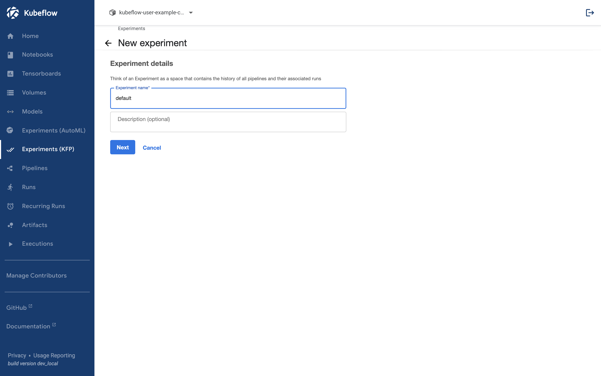

## Run Pipeline

Now we will run the uploaded pipeline.

## Before Run

### 1. Create Experiment

Experiments in Kubeflow are units that logically manage runs executed within them.

When you first enter the namespace in Kubeflow, there are no Experiments created. Therefore, you must create an Experiment beforehand in order to run the pipeline. If an Experiment already exists, you can go to [Run Pipeline](../kubeflow/basic-run.md#run-pipeline-1).

Experiments can be created via the Create Experiment button.

### 2. Name 입력

## Run Pipeline

### 1. Select Create Run

### 2. Select Experiment

### 3. Enter Pipeline Config

Fill in the values of the Config provided when creating the pipeline. The uploaded pipeline requires input values for `number_1` and `number_2`.

### 4. Start

Click the Start button after entering the values. The pipeline will start running.

## Run Result

The executed pipelines can be viewed in the Runs tab.
Clicking on a run provides detailed information related to the executed pipeline.

Upon clicking, the following screen appears. Components that have not yet executed are displayed in gray.

When a component has completed execution, it is marked with a green checkmark.

If we look at the last component, we can see that it has outputted the sum of the input values, which in this case is 8 (the sum of 3 and 5).

