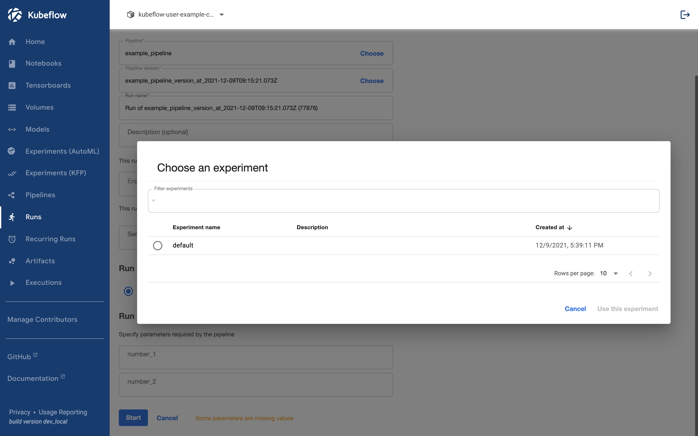
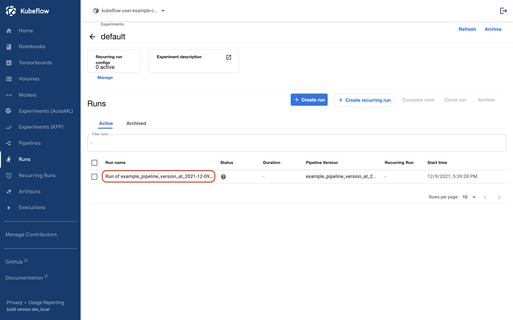

## Run Pipeline

이제 업로드한 파이프라인을 실행시켜 보겠습니다.

## Before Run

### 1. Create Experiment

Experiment란 Kubeflow 에서 실행되는 Run을 논리적으로 관리하는 단위입니다.  

Kubeflow에서 namespace를 처음 들어오면 생성되어 있는 Experiment가 없습니다. 따라서 파이프라인을 실행하기 전에 미리 Experiment를 생성해두어야 합니다. Experiment이 있다면 [Run Pipeline](../kubeflow/basic-run.md#run-pipeline-1)으로 넘어가도 무방합니다.

Experiment는 Create Experiment 버튼을 통해 생성할 수 있습니다.

### 2. Name 입력

Experiment로 사용할 이름을 입력합니다.

## Run Pipeline

### 1. Create Run 선택

### 2. Experiment 선택

### 3. Pipeline Config 입력

파이프라인을 생성할 때 입력한 Config 값들을 채워 넣습니다.
업로드한 파이프라인은 number_1과 number_2를 입력해야 합니다.

### 4. Start

입력 후 Start 버튼을 누르면 파이프라인이 실행됩니다.

## Run Result

실행된 파이프라인들은 Runs 탭에서 확인할 수 있습니다.
Run을 클릭하면 실행된 파이프라인과 관련된 자세한 내용을 확인해 볼 수 있습니다.

클릭하면 다음과 같은 화면이 나옵니다. 아직 실행되지 않은 컴포넌트는 회색 표시로 나옵니다.

컴포넌트가 실행이 완료되면 초록색 체크 표시가 나옵니다.

가장 마지막 컴포넌트를 보면 입력한 Config인 3과 5의 합인 8이 출력된 것을 확인할 수 있습니다.

