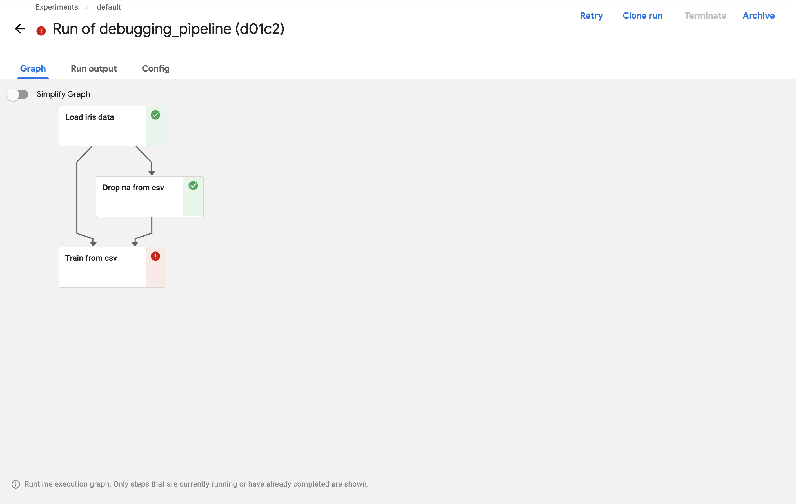
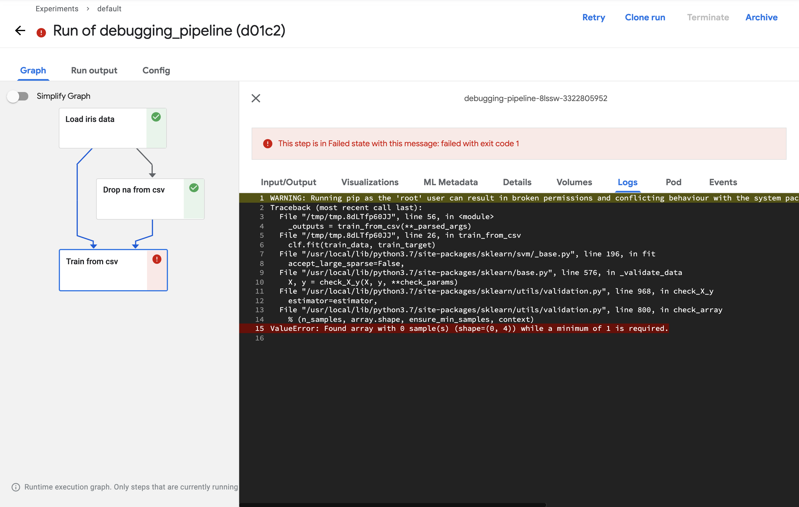
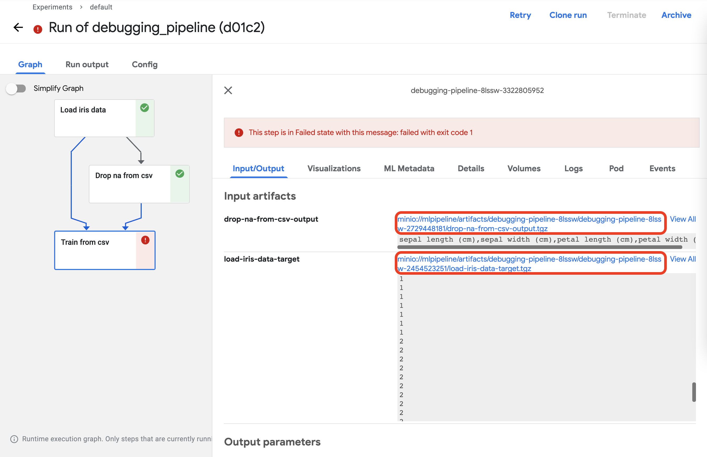
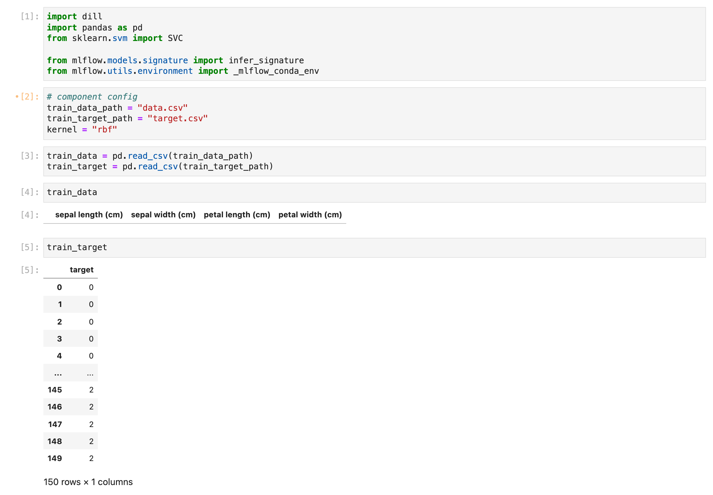

## Debugging Pipeline

This page covers how to debug Kubeflow components.

## Failed Component

We will modify a pipeline used in [Component - MLFlow](../kubeflow/advanced-mlflow.md#mlflow-pipeline) in this page.

First, let's modify the pipeline so that the component fails.

```python
from functools import partial

import kfp
from kfp.components import InputPath, OutputPath, create_component_from_func
from kfp.dsl import pipeline


@partial(
    create_component_from_func,
    packages_to_install=["pandas", "scikit-learn"],
)
def load_iris_data(
    data_path: OutputPath("csv"),
    target_path: OutputPath("csv"),
):
    import pandas as pd
    from sklearn.datasets import load_iris

    iris = load_iris()

    data = pd.DataFrame(iris["data"], columns=iris["feature_names"])
    target = pd.DataFrame(iris["target"], columns=["target"])
    
    data["sepal length (cm)"] = None
    data.to_csv(data_path, index=False)
    target.to_csv(target_path, index=False)


@partial(
    create_component_from_func,
    packages_to_install=["pandas"],
)
def drop_na_from_csv(
    data_path: InputPath("csv"),
    output_path: OutputPath("csv"),
):
    import pandas as pd

    data = pd.read_csv(data_path)
    data = data.dropna()
    data.to_csv(output_path, index=False)


@partial(
    create_component_from_func,
    packages_to_install=["dill", "pandas", "scikit-learn", "mlflow"],
)
def train_from_csv(
    train_data_path: InputPath("csv"),
    train_target_path: InputPath("csv"),
    model_path: OutputPath("dill"),
    input_example_path: OutputPath("dill"),
    signature_path: OutputPath("dill"),
    conda_env_path: OutputPath("dill"),
    kernel: str,
):
    import dill
    import pandas as pd
    from sklearn.svm import SVC

    from mlflow.models.signature import infer_signature
    from mlflow.utils.environment import _mlflow_conda_env

    train_data = pd.read_csv(train_data_path)
    train_target = pd.read_csv(train_target_path)

    clf = SVC(kernel=kernel)
    clf.fit(train_data, train_target)

    with open(model_path, mode="wb") as file_writer:
        dill.dump(clf, file_writer)

    input_example = train_data.sample(1)
    with open(input_example_path, "wb") as file_writer:
        dill.dump(input_example, file_writer)

    signature = infer_signature(train_data, clf.predict(train_data))
    with open(signature_path, "wb") as file_writer:
        dill.dump(signature, file_writer)

    conda_env = _mlflow_conda_env(
        additional_pip_deps=["dill", "pandas", "scikit-learn"]
    )
    with open(conda_env_path, "wb") as file_writer:
        dill.dump(conda_env, file_writer)


@pipeline(name="debugging_pipeline")
def debugging_pipeline(kernel: str):
    iris_data = load_iris_data()
    drop_data = drop_na_from_csv(data=iris_data.outputs["data"])
    model = train_from_csv(
        train_data=drop_data.outputs["output"],
        train_target=iris_data.outputs["target"],
        kernel=kernel,
    )

if __name__ == "__main__":
    kfp.compiler.Compiler().compile(debugging_pipeline, "debugging_pipeline.yaml")

```

The modifications are as follows:

1. In the `load_iris_data` component for loading data, `None` was injected into the `sepal length (cm)` feature.
2. In the `drop_na_from_csv` component, use the `drop_na()` function to remove rows with na values.

Now let's upload and run the pipeline.  
After running, if you press Run you will see that it has failed in the `Train from csv` component.



Click on the failed component and check the log to see the reason for the failure.



If the log shows that the data count is 0 and the component did not run, there may be an issue with the input data.  
Let's investigate what might be the problem.

First, click on the component and go to the Input/Output tab to download the input data.  
You can click on the link indicated by the red square to download the data.




Download both files to the same location. Then navigate to the specified path and check the downloaded files.


```bash
ls
```

There are two files as follows.

```bash
drop-na-from-csv-output.tgz load-iris-data-target.tgz
```

I will try to unzip it.

```bash
tar -xzvf load-iris-data-target.tgz ; mv data target.csv
tar -xzvf drop-na-from-csv-output.tgz ; mv data data.csv
```

And then run the component code using a Jupyter notebook.


Debugging revealed that dropping the data was based on rows instead of columns, resulting in all the data being removed.
Now that we know the cause of the problem, we can modify the component to drop based on columns.

```python
@partial(
    create_component_from_func,
    packages_to_install=["pandas"],
)
def drop_na_from_csv(
    data_path: InputPath("csv"),
    output_path: OutputPath("csv"),
):
    import pandas as pd

    data = pd.read_csv(data_path)
    data = data.dropna(axis="columns")
    data.to_csv(output_path, index=False)
```

After modifying, upload the pipeline again and run it to confirm that it is running normally as follows.


