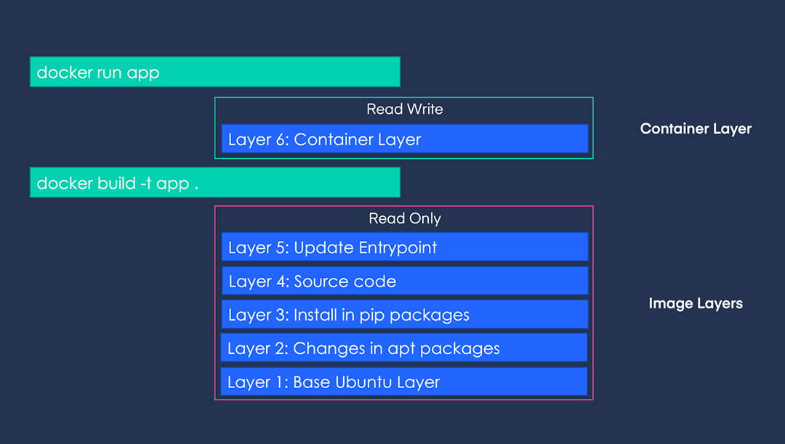
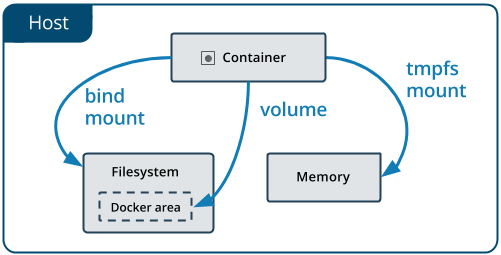

## 도커 이미지 잘 만들기

### 도커 이미지를 만들 때 고려해야 될 점

Dockerfile 을 활용하여 도커 이미지를 만들 때는 명령어의 **순서**가 중요합니다.  
그 이유는 도커 이미지는 여러 개의 Read-Only Layer 로 구성되어있고, 이미지를 빌드할 때 이미 존재하는 레이어는 **캐시되어** 재사용되기 때문에, 이를 생각해서 Dockerfile 을 구성한다면 **빌드 시간을 줄일 수 있습니다.**

Dockerfile에서 `RUN`, `ADD`, `COPY` 명령어 하나가 하나의 레이어로 저장됩니다.

예를 들어서 다음과 같은 `Dockerfile`이 있습니다.

```docker
# Layer 1
FROM ubuntu:latest

# Layer 2
RUN apt-get update && apt-get install python3 pip3 -y

# Layer 3
RUN pip3 install -U pip && pip3 install torch

# Layer 4
COPY src/ src/

# Layer 5
CMD python src/app.py
```

위의 `Dockerfile`로 빌드된 이미지를 `docker run -it app:latest /bin/bash` 명령어로 실행하면 다음과 같은 레이어로 표현할 수 있습니다.



최상단의 R/W Layer 는 이미지에 영향을 주지 않습니다. 즉, 컨테이너 내부에서 작업한 내역은 모두 휘발성입니다.

하단의 레이어가 변경되면, 그 위의 레이어는 모두 새로 빌드됩니다. 그래서 Dockerfile 내장 명령어의 순서가 중요합니다.  
예를 들면, **자주 변경**되는 부분은 **최대한 뒤쪽으로** 정렬하는 것을 추천합니다. (ex. `COPY src/ app/src/`)

그렇기 때문에 반대로 변경되지 않는 부분은 최대한 앞쪽으로 정렬하는게 좋습니다.

만약 거의 **변경되지 않지만**, 여러 곳에서 **자주** 쓰이는 부분을 공통화할 수도 있습니다.
해당 공통부분만 묶어서 별도의 이미지는 미리 만들어둔 다음, **베이스 이미지** 로 활용하는 것이 좋습니다.

예를 들어, 다른 건 거의 똑같은데, tensorflow-cpu 를 사용하는 이미지와, tensorflow-gpu 를 사용하는 환경을 분리해서 이미지로 만들고 싶은 경우에는 다음과 같이 할 수 있습니다.  
python 과 기타 기본적인 패키지가 설치된 [`ghcr.io/makinarocks/python:3.8-base`](http://ghcr.io/makinarocks/python:3.8-base-cpu) 를 만들어두고, **tensorflow cpu 버전과 gpu 버전이** 설치된 이미지 새로 만들때는, 위의 이미지를 `FROM` 으로 불러온 다음, tensorflow install 하는 부분만 별도로 작성해서 Dockerfile 을 2 개로 관리한다면 가독성도 좋고 빌드 시간도 줄일 수 있습니다.

**합칠 수 있는 Layer 는 합치는 것**이 Old version 의 도커에서는 성능 향상 효과를 이끌었습니다. 여러분의 도커 컨테이너가 어떤 도커 버전에서 실행될 것인지 보장할 수 없으며, **가독성**을 위해서도 합칠 수 있는 Layer 는 적절히 합치는 것이 좋습니다.

예를 들면, 다음과 같이 작성된 `Dockerfile`이 있습니다.

```docker
# Bad Case
RUN apt-get update
RUN apt-get install build-essential -y
RUN apt-get install curl -y
RUN apt-get install jq -y
RUN apt-get install git -y
```

이를 아래와 같이 합쳐서 적을 수 있습니다.

```docker
# Better Case
RUN apt-get update && \
    apt-get install -y \
    build-essential \
    curl \
    jq \
    git
```

편의를 위해서는 `.dockerignore` 도 사용하는게 좋습니다.
`.dockerignore`는 `.gitignore` 와 비슷한 역할을 한다고 이해하면 됩니다. (git add 할 때 제외할 수 있듯이, docker build 할 때 자동으로 제외)

더 많은 정보는 [Docker 공식 문서](https://docs.docker.com/develop/develop-images/dockerfile_best-practices/)에서 확인하실 수 있습니다.

### ENTRYPOINT vs CMD

`ENTRYPOINT` 와 `CMD` 는 모두 컨테이너의 실행 시점에서 어떤 명령어를 실행시키고 싶을 때 사용합니다.
그리고 이 둘 중 하나는 반드시 존재해야 합니다.

- **차이점**
  - `CMD`: docker run 을 수행할 때, 쉽게 변경하여 사용할 수 있음
  - `ENTRYPOINT`: `--entrypoint`  를 사용해야 변경할 수 있음

`ENTRYPOINT` 와 `CMD` 가 함께 쓰일 때는 보통 `CMD`는 `ENTRYPOINT` 에서 적은 명령의 arguments(parameters) 를 의미합니다.

예를 들어서 다음과 같은 `Dockerfile` 이 있습니다.

```docker
FROM ubuntu:latest

# 아래 4 가지 option 을 바꿔가며 직접 테스트해보시면 이해하기 편합니다.
# 단, NO ENTRYPOINT 옵션은 base image 인 ubuntu:latest 에 이미 있어서 테스트해볼 수는 없고 나머지 v2, 3, 5, 6, 8, 9, 11, 12 를 테스트해볼 수 있습니다.
# ENTRYPOINT echo "Hello ENTRYPOINT"
# ENTRYPOINT ["echo", "Hello ENTRYPOINT"]
# CMD echo "Hello CMD"
# CMD ["echo", "Hello CMD"]
```

위의 `Dockerfile`에서 주석으로 표시된 부분들을 해제하며 빌드하고 실행하면 다음과 같은 결과를 얻을 수 있습니다.

|                    | No ENTRYPOINT  | ENTRYPOINT a b | ENTRYPOINT ["a", "b"] |
| ------------------ | -------------- | -------------- | --------------------- |
| **NO CMD**         | Error!         | /bin/sh -c a b | a b                   |
| **CMD ["x", "y"]** | x y            | /bin/sh -c a b | a b x y               |
| **CMD x y**        | /bin/sh -c x y | /bin/sh -c a b | a b /bin/sh -c x y    |

- In Kubernetes pod
  - `ENTRYPOINT` → command
  - `CMD` → args

### Docker tag 이름 짓기

도커 이미지의 tag 로 **latest 는 사용하지 않는 것을 권장**합니다.  
이유는 latest 는 default tag name 이므로 **의도치 않게 overwritten** 되는 경우가 너무 많이 발생하기 때문입니다.

하나의 이미지는 하나의 태그를 가짐(**uniqueness**)을 보장해야 추후 Production 단계에서 **협업/디버깅**에 용이합니다.  
내용은 다르지만, 동일한 tag 를 사용하게 되면 추후 dangling image 로 취급되어 관리하기 어려워집니다.  
dangling image는 `docker images`에는 나오지 않지만 계속해서 저장소를 차지하고 있습니다.

### ETC

1. log 등의 정보는 container 내부가 아닌 곳에 따로 저장합니다.
    container 내부에서 write 한 data 는 언제든지 사라질 수 있기 때문입니다.
2. secret 한 정보, 환경(dev/prod) dependent 한 정보 등은 Dockerfile 에 직접 적는 게 아니라, env var 또는 .env config file 을 사용합니다.
3. Dockerfile **linter** 도 존재하므로, 협업 시에는 활용하면 좋습니다.
    [https://github.com/hadolint/hadolint](https://github.com/hadolint/hadolint)

## docker run 의 다양한 옵션

### docker run with volume

Docker container 사용 시 불편한 점이 있습니다.
바로 Docker는 기본적으로 Docker **container 내부에서 작업한 모든 사항은 저장되지 않습니다.**
이유는 Docker container 는 각각 격리된 파일시스템을 사용합니다. 따라서, **여러 docker container 끼리 데이터를 공유하기 어렵습니다.**

이 문제를 해결하기 위해서 Docker에서 제공하는 방식은 **2 가지**가 있습니다.



#### Docker volume

- docker cli 를 사용해 `volume` 이라는 리소스를 직접 관리
- host 에서 Docker area(`/var/lib/docker`) 아래에 특정 디렉토리를 생성한 다음, 해당 경로를 docker container 에 mount

#### Bind mount

- host 의 특정 경로를 docker container 에 mount

#### How to use?

사용 방식은 **동일한 인터페이스**로 `-v` 옵션을 통해 사용할 수 있습니다.  
다만, volume 을 사용할 때에는 `docker volume create`, `docker volume ls`, `docker volume rm` 등을 수행하여 직접 관리해주어야 합니다.

- Docker volume

    ```bash
    docker run \
        -v my_volume:/app \
        nginx:latest
    ````

- Blind mount

    ```bash
    docker run \
        -v /home/user/some/path:/app \
        nginx:latest
    ```

로컬에서 개발할 때는 bind mount 가 편하긴 하지만, 환경을 깔끔하게 유지하고 싶다면 docker volume 을 사용하여 create, rm 을 명시적으로 수행하는 것도 하나의 방법입니다.

쿠버네티스에서 스토리지를 제공하는 방식도 결국 docker 의 bind mount 를 활용하여 제공합니다.

### docker run with resource limit

기본적으로 docker container 는 **host OS 의 cpu, memory 자원을 fully 사용**할 수 있습니다. 하지만 이렇게 사용하게 되면 host OS 의 자원 상황에 따라서 **OOM** 등의 이슈로 docker container 가 비정상적으로 종료되는 상황이 발생할 수 있습니다.  
이런 문제를 다루기 위해 **docker container 실행 시, cpu 와 memory 의 사용량 제한**을 걸 수 있는 `-m` [옵션](https://docs.docker.com/config/containers/resource_constraints/#limit-a-containers-access-to-memory)을 제공합니다.

```bash
docker run -d -m 512m --memory-reservation=256m --name 512-limit ubuntu sleep 3600
docker run -d -m 1g --memory-reservation=256m --name 1g-limit ubuntu sleep 3600
```

위의 도커를 실행 후 `docker stats` 커맨드를 통해 사용량을 확인할 수 있습니다.

```bash
CONTAINER ID   NAME        CPU %     MEM USAGE / LIMIT   MEM %     NET I/O       BLOCK I/O   PIDS
4ea1258e2e09   1g-limit    0.00%     300KiB / 1GiB       0.03%     1kB / 0B      0B / 0B     1
4edf94b9a3e5   512-limit   0.00%     296KiB / 512MiB     0.06%     1.11kB / 0B   0B / 0B     1
```

쿠버네티스에서 pod 라는 리소스에 cpu, memory 제한을 줄 때, 이 방식을 활용하여 제공합니다.

### docker run with restart policy

특정 컨테이너가 계속해서 running 상태를 유지시켜야 하는 경우가 존재합니다. 이런 경우를 위해서 해당 컨테이너가 종료되자마자 바로 재생성을 시도할 수 있는 `--restart=always` 옵션을 제공하고 있습니다.

옵션 입력 후 도커를 실행합니다.

```bash
docker run --restart=always ubuntu
```

`watch -n1 docker ps`를 통해 재실행이 되고 있는지 확인합니다.
정상적으로 수행되고 있다면 다음과 같이 STATUS에 `Restarting (0)` 이 출력됩니다.

```text
CONTAINER ID   IMAGE     COMMAND   CREATED          STATUS                         PORTS     NAMES
a911850276e8   ubuntu    "bash"    35 seconds ago   Restarting (0) 6 seconds ago             hungry_vaughan
```

- [https://docs.docker.com/engine/reference/commandline/run/#restart-policies---restart](https://docs.docker.com/engine/reference/commandline/run/#restart-policies---restart)
  - on-failure with max retries
  - always 등의 선택지 제공

쿠버네티스에서 job 이라는 resource 의 restart 옵션을 줄 때, 이 방식을 활용하여 제공합니다.

### docker run as a background process

도커 컨테이너를 실행할 때는 기본적으로 foreground process 로 실행됩니다. 즉, 컨테이너를 실행한 터미널이 해당 컨테이너에 자동으로 attach 되어 있어, 다른 명령을 실행할 수 없습니다.

다음과 같은 예시를 수행해봅니다.  
우선 터미널 2 개를 열어, 하나의 터미널에서는 `docker ps` 를 지켜보고, 다른 하나의 터미널에서는 다음과 같은 명령을 차례로 실행해보며 동작을 지켜봅니다.

#### First Practice

```bash
docker run -it ubuntu sleep 10
```

10 초동안 멈춰 있어야 하고, 해당 컨테이너에서 다른 명령을 수행할 수 없습니다. 10초 뒤에는 docker ps 에서 container 가 종료되는 것을 확인할 수 있습니다.

#### Second Pratice

```bash
docker run -it ubuntu sleep 10
```

이후, `ctrl + p` -> `ctrl + q`

해당 터미널에서 이제 다른 명령을 수행할 수 있게 되었으며, docker ps 로도 10초까지는 해당 컨테이너가 살아있는 것을 확인할 수 있습니다.
이렇게 docker container 내부에서 빠져나온 상황을 detached 라고 부릅니다.
도커에서는 run 을 실행함과 동시에 detached mode 로 실행시킬 수 있는 옵션을 제공합니다.

#### Third Pratice

```bash
docker run -d ubuntu sleep 10
```

detached mode 이므로 해당 명령을 실행시킨 터미널에서 다른 액션을 수행시킬 수 있습니다.

상황에 따라 detached mode 를 적절히 활용하면 좋습니다.  
예를 들어, DB 와 통신하는 Backend API server 를 개발할 때 Backend API server 는 source code 를 변경시켜가면서 hot-loading 으로 계속해서 로그를 확인해봐야 하지만, DB 는 로그를 지켜볼 필요는 없는 경우라면 다음과 같이 실행할 수 있습니다.  
DB 는 docker container 를 detached mode 로 실행시키고, Backend API server 는 attached mode 로 log 를 following 하면서 실행시키면 효율적입니다.

## References

- [https://towardsdatascience.com/docker-storage-598e385f4efe](https://towardsdatascience.com/docker-storage-598e385f4efe)
- [https://vsupalov.com/docker-latest-tag/](https://vsupalov.com/docker-latest-tag/)
- [https://docs.microsoft.com/ko-kr/azure/container-registry/container-registry-image-tag-version](https://docs.microsoft.com/ko-kr/azure/container-registry/container-registry-image-tag-version)
- [https://stevelasker.blog/2018/03/01/docker-tagging-best-practices-for-tagging-and-versioning-docker-images/](https://stevelasker.blog/2018/03/01/docker-tagging-best-practices-for-tagging-and-versioning-docker-images/)
