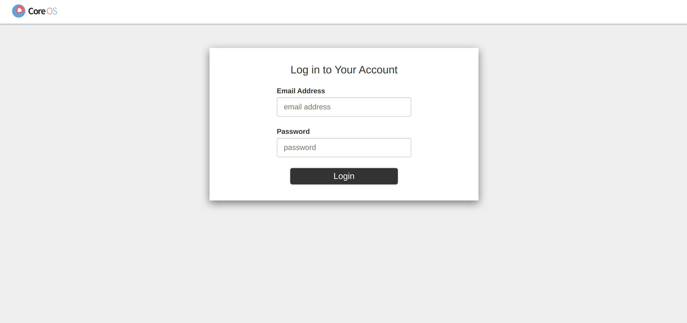

## Prepare the installation file

Prepare the installation files for installing Kubeflow **v1.4.0**

Clone the [kubeflow/manifests Repository](https://github.com/kubeflow/manifests) with the **v1.4.0** tag, and move to the corresponding folder.

```bash
git clone -b v1.4.0 https://github.com/kubeflow/manifests.git
cd manifests
```

## Install each components

The kubeflow/manifests repository provides installation commands for each component, but it often lacks information on potential issues that may arise during installation or how to verify if the installation was successful. This can make it challenging for first-time users.  
Therefore, in this document, we will provide instructions on how to verify the successful installation of each component.

Please note that this document will not cover the installation of components that are not covered in *MLOps for ALL*, such as Knative, KFServing, and MPI Operator, as we prioritize efficient resource usage.

### Cert-manager

1. Install cert-manager.

  ```bash
  kustomize build common/cert-manager/cert-manager/base | kubectl apply -f -
  ```

  If the installation is successful, you should see output similar to the following:

  ```bash
  namespace/cert-manager created
  customresourcedefinition.apiextensions.k8s.io/certificaterequests.cert-manager.io created
  customresourcedefinition.apiextensions.k8s.io/certificates.cert-manager.io created
  customresourcedefinition.apiextensions.k8s.io/challenges.acme.cert-manager.io created
  customresourcedefinition.apiextensions.k8s.io/clusterissuers.cert-manager.io created
  customresourcedefinition.apiextensions.k8s.io/issuers.cert-manager.io created
  customresourcedefinition.apiextensions.k8s.io/orders.acme.cert-manager.io created
  serviceaccount/cert-manager created
  serviceaccount/cert-manager-cainjector created
  serviceaccount/cert-manager-webhook created
  role.rbac.authorization.k8s.io/cert-manager-webhook:dynamic-serving created
  role.rbac.authorization.k8s.io/cert-manager-cainjector:leaderelection created
  role.rbac.authorization.k8s.io/cert-manager:leaderelection created
  clusterrole.rbac.authorization.k8s.io/cert-manager-cainjector created
  clusterrole.rbac.authorization.k8s.io/cert-manager-controller-approve:cert-manager-io created
  clusterrole.rbac.authorization.k8s.io/cert-manager-controller-certificates created
  clusterrole.rbac.authorization.k8s.io/cert-manager-controller-challenges created
  clusterrole.rbac.authorization.k8s.io/cert-manager-controller-clusterissuers created
  clusterrole.rbac.authorization.k8s.io/cert-manager-controller-ingress-shim created
  clusterrole.rbac.authorization.k8s.io/cert-manager-controller-issuers created
  clusterrole.rbac.authorization.k8s.io/cert-manager-controller-orders created
  clusterrole.rbac.authorization.k8s.io/cert-manager-edit created
  clusterrole.rbac.authorization.k8s.io/cert-manager-view created
  clusterrole.rbac.authorization.k8s.io/cert-manager-webhook:subjectaccessreviews created
  rolebinding.rbac.authorization.k8s.io/cert-manager-webhook:dynamic-serving created
  rolebinding.rbac.authorization.k8s.io/cert-manager-cainjector:leaderelection created
  rolebinding.rbac.authorization.k8s.io/cert-manager:leaderelection created
  clusterrolebinding.rbac.authorization.k8s.io/cert-manager-cainjector created
  clusterrolebinding.rbac.authorization.k8s.io/cert-manager-controller-approve:cert-manager-io created
  clusterrolebinding.rbac.authorization.k8s.io/cert-manager-controller-certificates created
  clusterrolebinding.rbac.authorization.k8s.io/cert-manager-controller-challenges created
  clusterrolebinding.rbac.authorization.k8s.io/cert-manager-controller-clusterissuers created
  clusterrolebinding.rbac.authorization.k8s.io/cert-manager-controller-ingress-shim created
  clusterrolebinding.rbac.authorization.k8s.io/cert-manager-controller-issuers created
  clusterrolebinding.rbac.authorization.k8s.io/cert-manager-controller-orders created
  clusterrolebinding.rbac.authorization.k8s.io/cert-manager-webhook:subjectaccessreviews created
  service/cert-manager created
  service/cert-manager-webhook created
  deployment.apps/cert-manager created
  deployment.apps/cert-manager-cainjector created
  deployment.apps/cert-manager-webhook created
  mutatingwebhookconfiguration.admissionregistration.k8s.io/cert-manager-webhook created
  validatingwebhookconfiguration.admissionregistration.k8s.io/cert-manager-webhook created
  ```

  Wait for all 3 pods in the cert-manager namespace to become Running:

  ```bash
  kubectl get pod -n cert-manager
  ```

  Once all the pods are Running, you should see output similar to the following:

  ```bash
  NAME                                       READY   STATUS    RESTARTS   AGE
  cert-manager-7dd5854bb4-7nmpd              1/1     Running   0          2m10s
  cert-manager-cainjector-64c949654c-2scxr   1/1     Running   0          2m10s
  cert-manager-webhook-6b57b9b886-7q6g2      1/1     Running   0          2m10s
  ```

2. To install `kubeflow-issuer`, run the following command:

  ```bash
  kustomize build common/cert-manager/kubeflow-issuer/base | kubectl apply -f -
  ```

  If the installation is successful, you should see the following output:

  ```bash
  clusterissuer.cert-manager.io/kubeflow-self-signing-issuer created
  ```

  Note: If the `cert-manager-webhook` deployment is not in the Running state, you may encounter an error similar to the one below, and the `kubeflow-issuer` may not be installed. In this case, please ensure that all 3 pods of cert-manager are Running before retrying the command.  
  If you encounter the below error, make sure that the `cert-manager` deployment and all its pods are running properly before proceeding.

  ```bash
  Error from server: error when retrieving current configuration of:
  Resource: "cert-manager.io/v1alpha2, Resource=clusterissuers", GroupVersionKind: "cert-manager.io/v1alpha2, Kind=ClusterIssuer"
  Name: "kubeflow-self-signing-issuer", Namespace: ""
  from server for: "STDIN": conversion webhook for cert-manager.io/v1, Kind=ClusterIssuer failed: Post "https://cert-manager-webhook.cert-manager.svc:443/convert?timeout=30s": dial tcp 10.101.177.157:443: connect: connection refused
  ```

### Istio

1. Install Custom Resource Definition(CRD) for istio.

  ```bash
  kustomize build common/istio-1-9/istio-crds/base | kubectl apply -f -
  ```

  if run properly,  you should see the following output:

  ```bash
  customresourcedefinition.apiextensions.k8s.io/authorizationpolicies.security.istio.io created
  customresourcedefinition.apiextensions.k8s.io/destinationrules.networking.istio.io created
  customresourcedefinition.apiextensions.k8s.io/envoyfilters.networking.istio.io created
  customresourcedefinition.apiextensions.k8s.io/gateways.networking.istio.io created
  customresourcedefinition.apiextensions.k8s.io/istiooperators.install.istio.io created
  customresourcedefinition.apiextensions.k8s.io/peerauthentications.security.istio.io created
  customresourcedefinition.apiextensions.k8s.io/requestauthentications.security.istio.io created
  customresourcedefinition.apiextensions.k8s.io/serviceentries.networking.istio.io created
  customresourcedefinition.apiextensions.k8s.io/sidecars.networking.istio.io created
  customresourcedefinition.apiextensions.k8s.io/virtualservices.networking.istio.io created
  customresourcedefinition.apiextensions.k8s.io/workloadentries.networking.istio.io created
  customresourcedefinition.apiextensions.k8s.io/workloadgroups.networking.istio.io created
  ```

1. Install istio namespace

  ```bash
  kustomize build common/istio-1-9/istio-namespace/base | kubectl apply -f -
  ```

  if run properly,  you should see the following output:

  ```bash
  namespace/istio-system created
  ```

3. Install istio.

  ```bash
  kustomize build common/istio-1-9/istio-install/base | kubectl apply -f -
  ```

  if run properly,  you should see the following output:

  ```bash
  serviceaccount/istio-ingressgateway-service-account created
  serviceaccount/istio-reader-service-account created
  serviceaccount/istiod-service-account created
  role.rbac.authorization.k8s.io/istio-ingressgateway-sds created
  role.rbac.authorization.k8s.io/istiod-istio-system created
  clusterrole.rbac.authorization.k8s.io/istio-reader-istio-system created
  clusterrole.rbac.authorization.k8s.io/istiod-istio-system created
  rolebinding.rbac.authorization.k8s.io/istio-ingressgateway-sds created
  rolebinding.rbac.authorization.k8s.io/istiod-istio-system created
  clusterrolebinding.rbac.authorization.k8s.io/istio-reader-istio-system created
  clusterrolebinding.rbac.authorization.k8s.io/istiod-istio-system created
  configmap/istio created
  configmap/istio-sidecar-injector created
  service/istio-ingressgateway created
  service/istiod created
  deployment.apps/istio-ingressgateway created
  deployment.apps/istiod created
  envoyfilter.networking.istio.io/metadata-exchange-1.8 created
  envoyfilter.networking.istio.io/metadata-exchange-1.9 created
  envoyfilter.networking.istio.io/stats-filter-1.8 created
  envoyfilter.networking.istio.io/stats-filter-1.9 created
  envoyfilter.networking.istio.io/tcp-metadata-exchange-1.8 created
  envoyfilter.networking.istio.io/tcp-metadata-exchange-1.9 created
  envoyfilter.networking.istio.io/tcp-stats-filter-1.8 created
  envoyfilter.networking.istio.io/tcp-stats-filter-1.9 created
  envoyfilter.networking.istio.io/x-forwarded-host created
  gateway.networking.istio.io/istio-ingressgateway created
  authorizationpolicy.security.istio.io/global-deny-all created
  authorizationpolicy.security.istio.io/istio-ingressgateway created
  mutatingwebhookconfiguration.admissionregistration.k8s.io/istio-sidecar-injector created
  validatingwebhookconfiguration.admissionregistration.k8s.io/istiod-istio-system created
  ```

  Wait for all 2 pods in the cert-manager namespace to become Running:

  ```bash
  kubectl get po -n istio-system
  ```

  Once all the pods are Running, you should see output similar to the following:

  ```bash
  NAME                                   READY   STATUS    RESTARTS   AGE
  istio-ingressgateway-79b665c95-xm22l   1/1     Running   0          16s
  istiod-86457659bb-5h58w                1/1     Running   0          16s
  ```

### Dex

Now, let's install dex.

```bash
kustomize build common/dex/overlays/istio | kubectl apply -f -
```

If performed normally, it will be printed as follows:

```bash
namespace/auth created
customresourcedefinition.apiextensions.k8s.io/authcodes.dex.coreos.com created
serviceaccount/dex created
clusterrole.rbac.authorization.k8s.io/dex created
clusterrolebinding.rbac.authorization.k8s.io/dex created
configmap/dex created
secret/dex-oidc-client created
service/dex created
deployment.apps/dex created
virtualservice.networking.istio.io/dex created
```

Wait until all one pod in the auth namespace is running.
```bash
kubectl get po -n auth
```

When everyone is running, similar results will be printed.
```bash
NAME                   READY   STATUS    RESTARTS   AGE
dex-5ddf47d88d-458cs   1/1     Running   1          12s
```

Install OIDC AuthService.
```bash
kustomize build common/oidc-authservice/base | kubectl apply -f -
```

If performed normally, it will be printed as follows.
```bash
configmap/oidc-authservice-parameters created
secret/oidc-authservice-client created
service/authservice created
persistentvolumeclaim/authservice-pvc created
statefulset.apps/authservice created
envoyfilter.networking.istio.io/authn-filter created
```

Wait until the authservice-0 pod in the istio-system namespace is Running.
```bash
kubectl get po -n istio-system -w
```

If everybody runs, a similar result will be printed.
```bash
NAME                                   READY   STATUS    RESTARTS   AGE
authservice-0                          1/1     Running   0          14s
istio-ingressgateway-79b665c95-xm22l   1/1     Running   0          2m37s
istiod-86457659bb-5h58w                1/1     Running   0          2m37s
```

Create a Kubeflow Namespace.
```bash
kustomize build common/kubeflow-namespace/base | kubectl apply -f -
```

If performed normally, it will be outputted as follows.
```bash
namespace/kubeflow created
```

Retrieve the Kubeflow namespace.
```bash
kubectl get ns kubeflow
```

If generated normally, similar results will be output.
```bash
NAME       STATUS   AGE
kubeflow   Active   8s
```

Install kubeflow-roles.
```bash
kustomize build common/kubeflow-roles/base | kubectl apply -f -
```

If properly performed, it will output as follows.
```bash
clusterrole.rbac.authorization.k8s.io/kubeflow-admin created
clusterrole.rbac.authorization.k8s.io/kubeflow-edit created
clusterrole.rbac.authorization.k8s.io/kubeflow-kubernetes-admin created
clusterrole.rbac.authorization.k8s.io/kubeflow-kubernetes-edit created
clusterrole.rbac.authorization.k8s.io/kubeflow-kubernetes-view created
clusterrole.rbac.authorization.k8s.io/kubeflow-view created
```

Retrieve the kubeflow roles just created.
```bash
kubectl get clusterrole | grep kubeflow
```

The following 6 clusterroles will be output.
```bash
kubeflow-admin                                                         2021-12-03T08:51:36Z
kubeflow-edit                                                          2021-12-03T08:51:36Z
kubeflow-kubernetes-admin                                              2021-12-03T08:51:36Z
kubeflow-kubernetes-edit                                               2021-12-03T08:51:36Z
kubeflow-kubernetes-view                                               2021-12-03T08:51:36Z
kubeflow-view                                                          2021-12-03T08:51:36Z
```

Install Kubeflow Istio Resources.
```bash
kustomize build common/istio-1-9/kubeflow-istio-resources/base | kubectl apply -f -
```

If performed normally, it will be output as follows.
```bash
clusterrole.rbac.authorization.k8s.io/kubeflow-istio-admin created
clusterrole.rbac.authorization.k8s.io/kubeflow-istio-edit created
clusterrole.rbac.authorization.k8s.io/kubeflow-istio-view created
gateway.networking.istio.io/kubeflow-gateway created
```

Retrieve the Kubeflow roles just created.
```bash
kubectl get clusterrole | grep kubeflow-istio
```
The following three clusterroles are output.
```bash
kubeflow-istio-admin                                                   2021-12-03T08:53:17Z
kubeflow-istio-edit                                                    2021-12-03T08:53:17Z
kubeflow-istio-view                                                    2021-12-03T08:53:17Z
```

Check if the gateway is properly installed in the Kubeflow namespace.
```bash
kubectl get gateway -n kubeflow
```

If generated normally, a result similar to the following will be output.
```bash
NAME               AGE
kubeflow-gateway   31s
```

Installing Kubeflow Pipelines.
```bash
kustomize build apps/pipeline/upstream/env/platform-agnostic-multi-user | kubectl apply -f -
```
If performed normally, it will be output as follows.
```bash
customresourcedefinition.apiextensions.k8s.io/clusterworkflowtemplates.argoproj.io created
customresourcedefinition.apiextensions.k8s.io/cronworkflows.argoproj.io created
customresourcedefinition.apiextensions.k8s.io/workfloweventbindings.argoproj.io created
...(생략)
authorizationpolicy.security.istio.io/ml-pipeline-visualizationserver created
authorizationpolicy.security.istio.io/mysql created
authorizationpolicy.security.istio.io/service-cache-server created
```

This command is installing multiple resources at once, but there are resources with dependencies on the installation order. Therefore, depending on the time, a similar error may occur.
```bash
"error: unable to recognize "STDIN": no matches for kind "CompositeController" in version "metacontroller.k8s.io/v1alpha1""  
```

If a similar error occurs, wait about 10 seconds and then try the command above again.
```bash
kustomize build apps/pipeline/upstream/env/platform-agnostic-multi-user | kubectl apply -f -
```

Check to see if it has been installed correctly.
```bash
kubectl get po -n kubeflow
```

Wait until all 16 pods are running as follows.
```bash
NAME                                                     READY   STATUS    RESTARTS   AGE
cache-deployer-deployment-79fdf9c5c9-bjnbg               2/2     Running   1          5m3s
cache-server-5bdf4f4457-48gbp                            2/2     Running   0          5m3s
kubeflow-pipelines-profile-controller-7b947f4748-8d26b   1/1     Running   0          5m3s
metacontroller-0                                         1/1     Running   0          5m3s
metadata-envoy-deployment-5b4856dd5-xtlkd                1/1     Running   0          5m3s
metadata-grpc-deployment-6b5685488-kwvv7                 2/2     Running   3          5m3s
metadata-writer-548bd879bb-zjkcn                         2/2     Running   1          5m3s
minio-5b65df66c9-k5gzg                                   2/2     Running   0          5m3s
ml-pipeline-8c4b99589-85jw6                              2/2     Running   1          5m3s
ml-pipeline-persistenceagent-d6bdc77bd-ssxrv             2/2     Running   0          5m3s
ml-pipeline-scheduledworkflow-5db54d75c5-zk2cw           2/2     Running   0          5m2s
ml-pipeline-ui-5bd8d6dc84-j7wqr                          2/2     Running   0          5m2s
ml-pipeline-viewer-crd-68fb5f4d58-mbcbg                  2/2     Running   1          5m2s
ml-pipeline-visualizationserver-8476b5c645-wljfm         2/2     Running   0          5m2s
mysql-f7b9b7dd4-xfnw4                                    2/2     Running   0          5m2s
workflow-controller-5cbbb49bd8-5zrwx                     2/2     Running   1          5m2s
```

Additionally, please check if the ml-pipeline UI is connected properly.
```bash
kubectl port-forward svc/ml-pipeline-ui -n kubeflow 8888:80
```

Open the web browser and connect to the path [http://localhost:8888/#/pipelines/](http://localhost:8888/#/pipelines/). Confirm that the following screen is displayed.

If you get the error "Connection refused on localhost", you can access it through the command line by setting the address, as long as there are no security issues. To check if the ml-pipeline UI connects normally, open the bind of all addresses with 0.0.0.0.
```bash
kubectl port-forward --address 0.0.0.0 svc/ml-pipeline-ui -n kubeflow 8888:80
```
Despite running with the above options, if connection refusal issues still occur, add access permission by allowing all TCP protocol ports in the firewall settings or by adding access permission to port 8888.

When you open the web browser and access the path `http://<your virtual instance public IP>:8888/#/pipelines/`, you can see the ml-pipeline UI screen.

When accessing the other ports path that is being processed in the bottom, run the command in the same way as above and add the port number to the firewall to run it.

English: We will install Katib.
```bash
kustomize build apps/katib/upstream/installs/katib-with-kubeflow | kubectl apply -f -
```

If performed normally, it will be output as follows.
```bash
customresourcedefinition.apiextensions.k8s.io/experiments.kubeflow.org created
customresourcedefinition.apiextensions.k8s.io/suggestions.kubeflow.org created
customresourcedefinition.apiextensions.k8s.io/trials.kubeflow.org created
serviceaccount/katib-controller created
serviceaccount/katib-ui created
clusterrole.rbac.authorization.k8s.io/katib-controller created
clusterrole.rbac.authorization.k8s.io/katib-ui created
clusterrole.rbac.authorization.k8s.io/kubeflow-katib-admin created
clusterrole.rbac.authorization.k8s.io/kubeflow-katib-edit created
clusterrole.rbac.authorization.k8s.io/kubeflow-katib-view created
clusterrolebinding.rbac.authorization.k8s.io/katib-controller created
clusterrolebinding.rbac.authorization.k8s.io/katib-ui created
configmap/katib-config created
configmap/trial-templates created
secret/katib-mysql-secrets created
service/katib-controller created
service/katib-db-manager created
service/katib-mysql created
service/katib-ui created
persistentvolumeclaim/katib-mysql created
deployment.apps/katib-controller created
deployment.apps/katib-db-manager created
deployment.apps/katib-mysql created
deployment.apps/katib-ui created
certificate.cert-manager.io/katib-webhook-cert created
issuer.cert-manager.io/katib-selfsigned-issuer created
virtualservice.networking.istio.io/katib-ui created
mutatingwebhookconfiguration.admissionregistration.k8s.io/katib.kubeflow.org created
validatingwebhookconfiguration.admissionregistration.k8s.io/katib.kubeflow.org created
```

Confirm if it has been installed properly.
```bash
kubectl get po -n kubeflow | grep katib
```
Wait until four pods are Running, like this.
```bash
katib-controller-68c47fbf8b-b985z                        1/1     Running   0          82s
katib-db-manager-6c948b6b76-2d9gr                        1/1     Running   0          82s
katib-mysql-7894994f88-scs62                             1/1     Running   0          82s
katib-ui-64bb96d5bf-d89kp                                1/1     Running   0          82s
```

Additionally, we will confirm that the Katib UI is connected normally.
```bash
kubectl port-forward svc/katib-ui -n kubeflow 8081:80
```

Open the web browser and access the path [http://localhost:8081/katib/](http://localhost:8081/katib/) to confirm the following screen is displayed.


```bash
kustomize build apps/centraldashboard/upstream/overlays/istio | kubectl apply -f -
```

If performed normally, it will be output as follows.
```bash
serviceaccount/centraldashboard created
role.rbac.authorization.k8s.io/centraldashboard created
clusterrole.rbac.authorization.k8s.io/centraldashboard created
rolebinding.rbac.authorization.k8s.io/centraldashboard created
clusterrolebinding.rbac.authorization.k8s.io/centraldashboard created
configmap/centraldashboard-config created
configmap/centraldashboard-parameters created
service/centraldashboard created
deployment.apps/centraldashboard created
virtualservice.networking.istio.io/centraldashboard created
```

Check to see if it has been installed normally.
```bash
kubectl get po -n kubeflow | grep centraldashboard
```

Wait until one pod related to centraldashboard in the kubeflow namespace becomes Running.
```bash
centraldashboard-8fc7d8cc-xl7ts                          1/1     Running   0          52s
```

Additionally, we will check if the Central Dashboard UI is connected properly.
```bash
kubectl port-forward svc/centraldashboard -n kubeflow 8082:80
```
Open the web browser to connect to the path [http://localhost:8082/](http://localhost:8082/) and check that the following screen is displayed.
```bash
kustomize build apps/admission-webhook/upstream/overlays/cert-manager | kubectl apply -f -
```

If performed normally, it will be output as follows.
```bash
customresourcedefinition.apiextensions.k8s.io/poddefaults.kubeflow.org created
serviceaccount/admission-webhook-service-account created
clusterrole.rbac.authorization.k8s.io/admission-webhook-cluster-role created
clusterrole.rbac.authorization.k8s.io/admission-webhook-kubeflow-poddefaults-admin created
clusterrole.rbac.authorization.k8s.io/admission-webhook-kubeflow-poddefaults-edit created
clusterrole.rbac.authorization.k8s.io/admission-webhook-kubeflow-poddefaults-view created
clusterrolebinding.rbac.authorization.k8s.io/admission-webhook-cluster-role-binding created
service/admission-webhook-service created
deployment.apps/admission-webhook-deployment created
certificate.cert-manager.io/admission-webhook-cert created
issuer.cert-manager.io/admission-webhook-selfsigned-issuer created
mutatingwebhookconfiguration.admissionregistration.k8s.io/admission-webhook-mutating-webhook-configuration created
```

Check if it is installed normally.
```bash
kubectl get po -n kubeflow | grep admission-webhook
```

Wait until one pod is running.
```bash
admission-webhook-deployment-667bd68d94-2hhrx            1/1     Running   0          11s
```

Install the Notebook controller.

If done successfully, it will output as follows.
  deployment.apps/notebook-controller created
  ```

A CustomResourceDefinition.apiextensions.k8s.io/notebooks.kubeflow.org, ServiceAccount/notebook-controller-service-account, Role.rbac.authorization.k8s.io/notebook-controller-leader-election-role, ClusterRole.rbac.authorization.k8s.io/notebook-controller-kubeflow-notebooks-admin, ClusterRole.rbac.authorization.k8s.io/notebook-controller-kubeflow-notebooks-edit, ClusterRole.rbac.authorization.k8s.io/notebook-controller-kubeflow-notebooks-view, ClusterRole.rbac.authorization.k8s.io/notebook-controller-role, RoleBinding.rbac.authorization.k8s.io/notebook-controller-leader-election-rolebinding, ClusterRoleBinding.rbac.authorization.k8s.io/notebook-controller-role-binding, ConfigMap/notebook-controller-config-m

Translation: Check if the installation was successful. Wait until one pod is running with the following command: kubectl get po -n kubeflow | grep notebook-controller.
Translation: Install Jupyter Web App.
  If performed correctly, the following will be output.
  ```
  Confirm that the installation was successful:
  configmap/jupyter-web-app-config-76844k4cd7 created
  configmap/jupyter-web-app-logos created
  configmap/jupyter-web-app-parameters-chmg88cm48 created
  service/jupyter-web-app-service created
  deployment.apps/jupyter-web-app-deployment created
  virtualservice.networking.istio.io/jupyter-web-app-jupyter-web-app created

Wait until one pod is Running.

English: We will install the Profile Controller.
```bash
kustomize build apps/profiles/upstream/overlays/kubeflow | kubectl apply -f -
```

If performed normally, it will be outputted as follows.
```bash
customresourcedefinition.apiextensions.k8s.io/profiles.kubeflow.org created
serviceaccount/profiles-controller-service-account created
role.rbac.authorization.k8s.io/profiles-leader-election-role created
rolebinding.rbac.authorization.k8s.io/profiles-leader-election-rolebinding created
clusterrolebinding.rbac.authorization.k8s.io/profiles-cluster-role-binding created
configmap/namespace-labels-data-48h7kd55mc created
configmap/profiles-config-46c7tgh6fd created
service/profiles-kfam created
deployment.apps/profiles-deployment created
virtualservice.networking.istio.io/profiles-kfam created
```

Check to see if it is installed normally.
```bash
kubectl get po -n kubeflow | grep profiles-deployment
```

Wait until one pod is running.
```bash
profiles-deployment-89f7d88b-qsnrd                       2/2     Running   0          42s
```

Install the Volumes Web App.
```bash
kustomize build apps/volumes-web-app/upstream/overlays/istio | kubectl apply -f -
```

If performed normally, it will be output as follows.
```bash
serviceaccount/volumes-web-app-service-account created
clusterrole.rbac.authorization.k8s.io/volumes-web-app-cluster-role created
clusterrole.rbac.authorization.k8s.io/volumes-web-app-kubeflow-volume-ui-admin created
clusterrole.rbac.authorization.k8s.io/volumes-web-app-kubeflow-volume-ui-edit created
clusterrole.rbac.authorization.k8s.io/volumes-web-app-kubeflow-volume-ui-view created
clusterrolebinding.rbac.authorization.k8s.io/volumes-web-app-cluster-role-binding created
configmap/volumes-web-app-parameters-4gg8cm2gmk created
service/volumes-web-app-service created
deployment.apps/volumes-web-app-deployment created
virtualservice.networking.istio.io/volumes-web-app-volumes-web-app created
```

Check if it is installed normally.
```bash
kubectl get po -n kubeflow | grep volumes-web-app
```

Wait until one pod is running.
```bash
volumes-web-app-deployment-8589d664cc-62svl              1/1     Running   0          27s
```
  ```bash
  Install Tensorboard Web App.

Service account/tensorboards-web-app-service-account created, Cluster role.rbac.authorization.k8s.io/tensorboards-web-app-cluster-role created, Cluster role.rbac.authorization.k8s.io/tensorboards-web-app-kubeflow-tensorboard-ui-admin created, Cluster role.rbac.authorization.k8s.io/tensorboards-web-app-kubeflow-tensorboard-ui-edit created, Cluster role.rbac.authorization.k8s.io/tensorboards-web-app-kubeflow-tensorboard-ui-view created, Cluster role binding.rbac.authorization.k8s.io/tensorboards-web-app-cluster-role-binding created, Config map/tensorboards-web-app-parameters-g28fbd6cch created, Service/tensorboards-web-app-service created, Deployment.apps/tensorboards-web-app-deployment created, and Virtual service.networking.istio.io/t
Check if it is installed correctly.
  ```bash
  Deployment "tensorboard-web-app-deployment-6ff79b7f44-qbzmw" created
  deployment.apps/tensorboard-controller-controller-manager created
```

A custom resource definition for 'tensorboards.tensorboard.kubeflow.org' was created, along with a service account, roles, role bindings, a config map, and a deployment for the controller manager metrics service.
  Check if the deployment.apps/tensorboard-controller-controller-manager was installed correctly. Wait for 1 pod to be Running.
Translation: Installing Training Operator.
```bash
kustomize build apps/training-operator/upstream/overlays/kubeflow | kubectl apply -f -
```

If performed normally, it will be output as follows.

```bash
customresourcedefinition.apiextensions.k8s.io/mxjobs.kubeflow.org created
customresourcedefinition.apiextensions.k8s.io/pytorchjobs.kubeflow.org created
customresourcedefinition.apiextensions.k8s.io/tfjobs.kubeflow.org created
customresourcedefinition.apiextensions.k8s.io/xgboostjobs.kubeflow.org created
serviceaccount/training-operator created
clusterrole.rbac.authorization.k8s.io/kubeflow-training-admin created
clusterrole.rbac.authorization.k8s.io/kubeflow-training-edit created
clusterrole.rbac.authorization.k8s.io/kubeflow-training-view created
clusterrole.rbac.authorization.k8s.io/training-operator created
clusterrolebinding.rbac.authorization.k8s.io/training-operator created
service/training-operator created
deployment.apps/training-operator created
```

Check to see if it has been installed normally.

```bash
kubectl get po -n kubeflow | grep training-operator
```

Wait until one pod is up and running.

```bash
training-operator-7d98f9dd88-6887f                          1/1     Running   0          28s
```

### User Namespace

For using Kubeflow, create a Kubeflow Profile for the User to be used.

```bash
kustomize build common/user-namespace/base | kubectl apply -f -
```

If performed normally, it will be outputted as follows.

```bash
configmap/default-install-config-9h2h2b6hbk created
profile.kubeflow.org/kubeflow-user-example-com created
```

Confirm that the kubeflow-user-example-com profile has been created.

```bash
kubectl get profile
```

```bash
kubeflow-user-example-com   37s
```

## Check installation

Confirm successful installation by port forwarding to access Kubeflow central dashboard with web browser.

```bash
kubectl port-forward svc/istio-ingressgateway -n istio-system 8080:80
```

Open a web browser and connect to [http://localhost:8080](http://localhost:8080) to confirm that the following screen is displayed. 


Enter the following connection information to connect.

- Email Address: `user@example.com`
- Password: `12341234`


