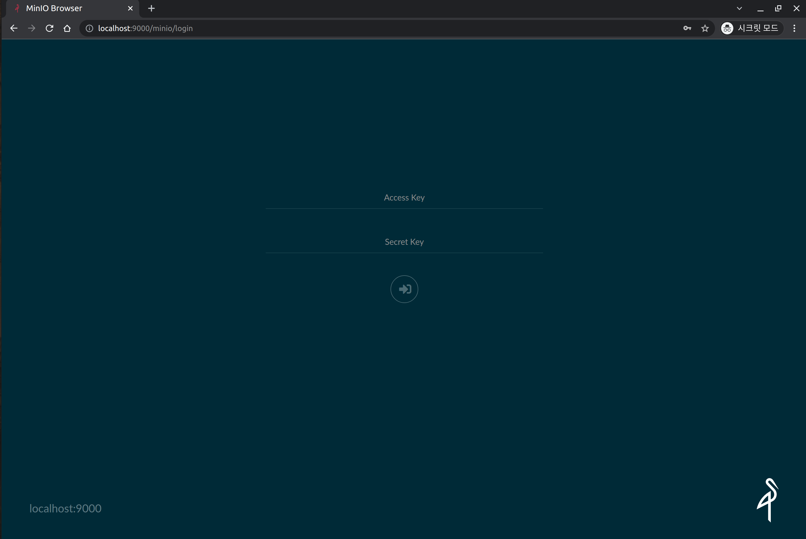
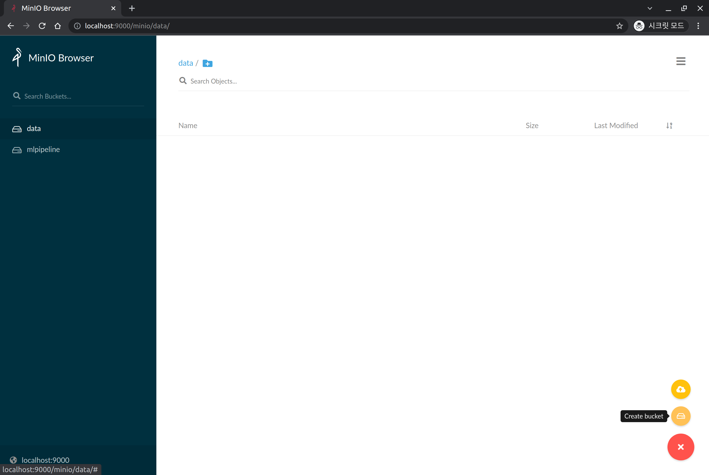
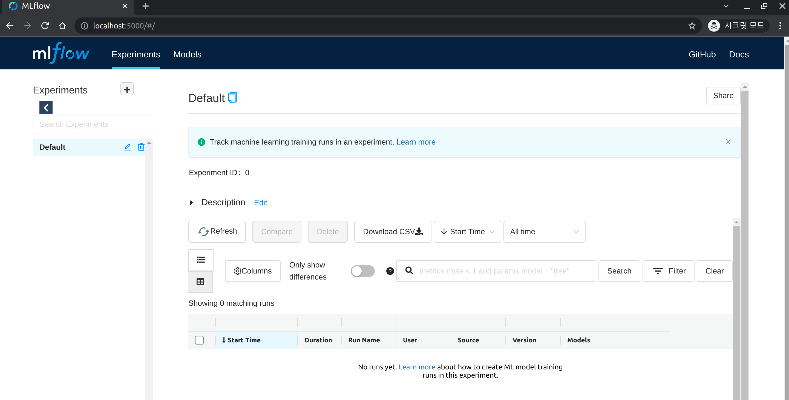

## Install MLflow Tracking Server

MLflow is a popular open-source ML experiment management tool. In addition to [experiment management](https://mlflow.org/docs/latest/tracking.html#tracking), MLflow provides functionalities for ML [model packaging](https://mlflow.org/docs/latest/projects.html#projects), [deployment management](https://mlflow.org/docs/latest/models.html#models), and [model storage](https://mlflow.org/docs/latest/model-registry.html#registry).

In *MLOps for ALL*, we will be using MLflow for experiment management purposes.   
o store the data managed by MLflow and provide a user interface, we will deploy the MLflow Tracking Server on the Kubernetes cluster.

## Before Install MLflow Tracking Server

### PostgreSQL DB 설치

MLflow Tracking Server deploys a PostgreSQL DB for use as a Backend Store to a Kubernetes cluster.

First, create a namespace called `mlflow-system`.

```text
kubectl create ns mlflow-system
```

If the following message is output, it means that it has been generated normally.

```text
namespace/mlflow-system created
```

Create a Postgresql DB in the `mlflow-system` namespace.

```text
kubectl -n mlflow-system apply -f https://raw.githubusercontent.com/mlops-for-all/helm-charts/b94b5fe4133f769c04b25068b98ccfa7a505aa60/mlflow/manifests/postgres.yaml 
```

If performed normally, it will be outputted as follows.

```text
service/postgresql-mlflow-service created
deployment.apps/postgresql-mlflow created
persistentvolumeclaim/postgresql-mlflow-pvc created
```

Wait until one postgresql related pod is running in the mlflow-system namespace.

```text
kubectl get pod -n mlflow-system | grep postgresql
```

If it is output similar to the following, it has executed normally.

```text
postgresql-mlflow-7b9bc8c79f-srkh7   1/1     Running   0          38s
```

### Setup Minio

We will utilize the Minio that was installed in the previous Kubeflow installation step. 
However, in order to separate it for kubeflow and mlflow purposes, we will create a mlflow-specific bucket.  
First, port-forward the minio-service to access Minio and create the bucket.

```text
kubectl port-forward svc/minio-service -n kubeflow 9000:9000
```

Open a web browser and connect to [localhost:9000](http://localhost:9000) to display the following screen.




Enter the following credentials to log in: 

- Username: `minio`
- Password: `minio123`

Click the **`+`** button on the right side bottom, then click `Create Bucket`. 




Enter `mlflow` in `Bucket Name` to create the bucket.

If successfully created, you will see a bucket named `mlflow` on the left.


---

## Let's Install MLflow Tracking Server

### Add Helm Repository

```text
helm repo add mlops-for-all https://mlops-for-all.github.io/helm-charts
```

If the following message is displayed, it means it has been added successfully.
```text
"mlops-for-all" has been added to your repositories
```

### Update Helm Repository

```text
helm repo update
```

If the following message is displayed, it means that the update has been successfully completed.

```text
Hang tight while we grab the latest from your chart repositories...
...Successfully got an update from the "mlops-for-all" chart repository
Update Complete. ⎈Happy Helming!⎈
```

### Helm Install

Install mlflow-server Helm Chart version 0.2.0.

```text
helm install mlflow-server mlops-for-all/mlflow-server \
  --namespace mlflow-system \
  --version 0.2.0
```

- The above Helm chart installs MLflow with the connection information for its backend store and artifacts store set to the default minio created during the Kubeflow installation process and the postgresql information created from the [PostgreSQL DB installation](#postgresql-db-installation) above.
  - If you want to use a separate DB or object storage, please refer to the [Helm Chart Repo](https://github.com/mlops-for-all/helm-charts/tree/main/mlflow/chart) and set the values separately during helm install.

The following message should be displayed:

```text
NAME: mlflow-server
LAST DEPLOYED: Sat Dec 18 22:02:13 2021
NAMESPACE: mlflow-system
STATUS: deployed
REVISION: 1
TEST SUITE: None
```

Check to see if it was installed normally.

```text
kubectl get pod -n mlflow-system | grep mlflow-server
```

Wait until one mlflow-server related pod is running in the mlflow-system namespace.  
If it is output similar to the following, then it has been successfully executed.

```text
mlflow-server-ffd66d858-6hm62        1/1     Running   0          74s
```

### Check installation

Let's now check if we can successfully connect to the MLflow Server.

First, we will perform port forwarding in order to connect from the client node.

```text
kubectl port-forward svc/mlflow-server-service -n mlflow-system 5000:5000
```

Open a web browser and connect to [localhost:5000](http://localhost:5000) and the following screen will be output.


