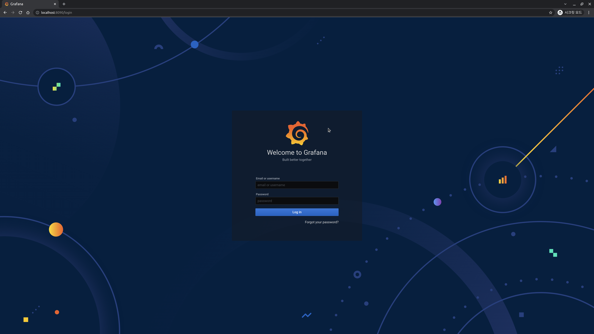
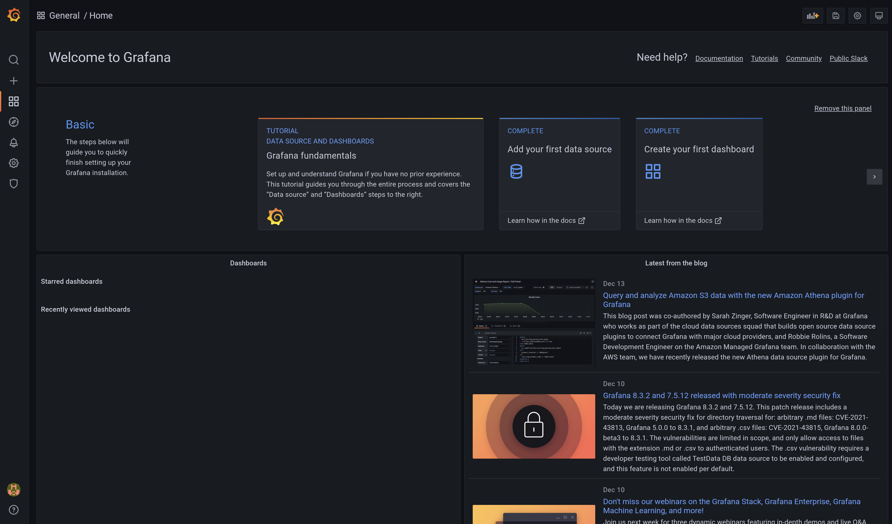
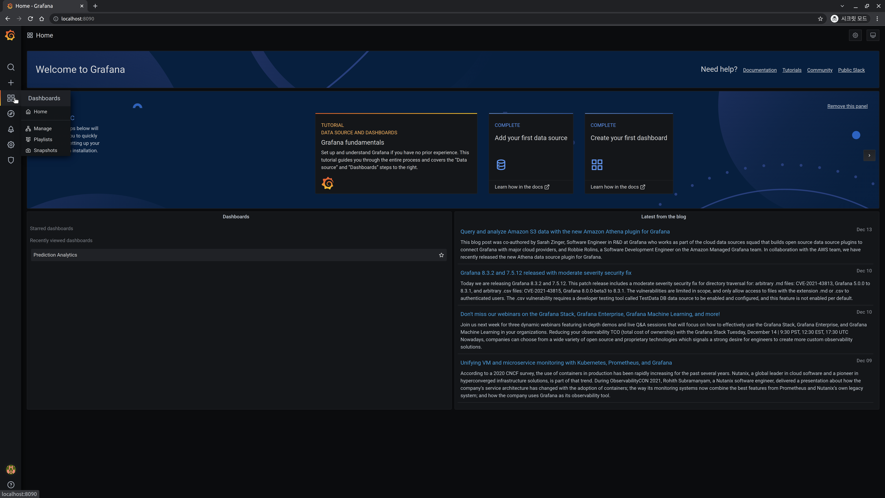
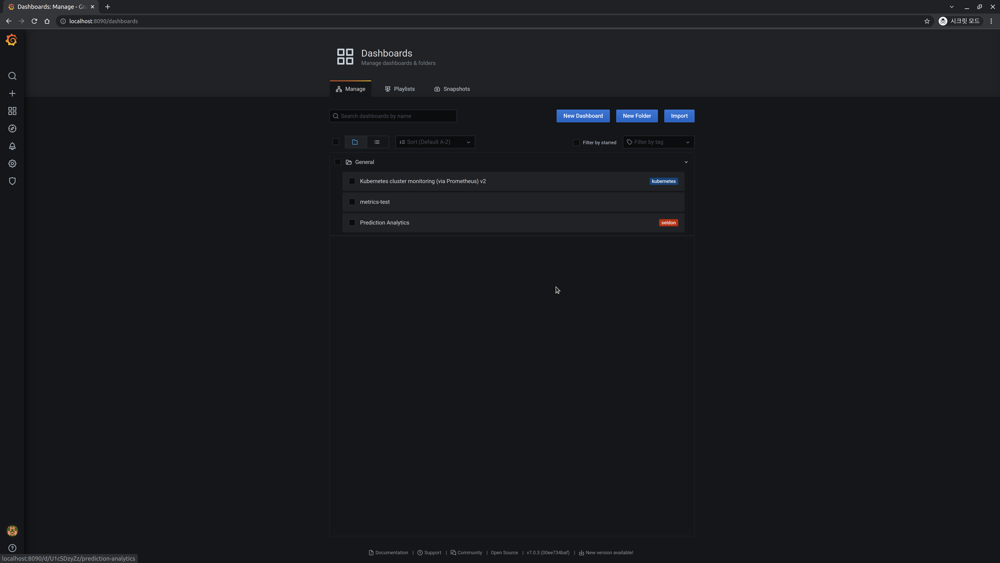
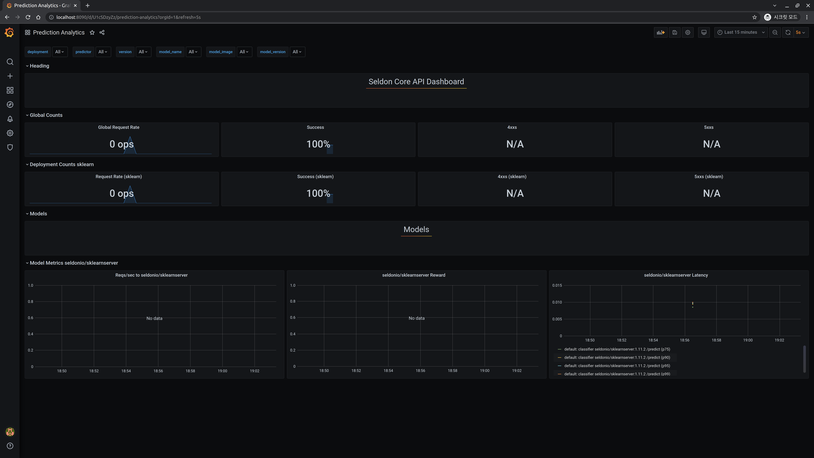

## Prometheus & Grafana

Prometheus and Grafana are tools for monitoring.  
For stable service operation, it is necessary to continuously observe the status of the service and infrastructure where the service is operating, and to respond quickly based on the observed metrics when a problem arises.  
Among the many tools to efficiently perform such monitoring, *Everyone's MLOps* will use open source Prometheus and Grafana.

For more information, please refer to the [Prometheus Official Documentation](https://prometheus.io/docs/introduction/overview/) and [Grafana Official Documentation](https://grafana.com/docs/).

Prometheus is a tool to collect metrics from various targets, and Grafana is a tool to help visualize the gathered data. Although there is no dependency between them, they are often used together complementary to each other.

In this page, we will install Prometheus and Grafana on a Kubernetes cluster, then send API requests to a SeldonDeployment created with Seldon-Core and check if metrics are collected successfully.

We also install a dashboard to efficiently monitor the metrics of the SeldonDeployment created in Seldon-Core using Helm Chart version 1.12.0 from seldonio/seldon-core-analytics Helm Repository.

### Add Helm Repository

```bash
helm repo add seldonio https://storage.googleapis.com/seldon-charts
```

If the following message is output, it means that it has been added successfully.

```bash
"seldonio" has been added to your repositories
```

### Update Helm Repository

```bash
helm repo update
```

If the following message is displayed, it means that the update was successful.

```bash
Hang tight while we grab the latest from your chart repositories...
...Successfully got an update from the "seldonio" chart repository
...Successfully got an update from the "datawire" chart repository
Update Complete. ⎈Happy Helming!⎈
```

### Helm Install

Install version 1.12.0 of the seldon-core-analytics Helm Chart.

```bash
helm install seldon-core-analytics seldonio/seldon-core-analytics \
  --namespace seldon-system \
  --version 1.12.0
```

The following message should be output.

```bash
Skip...
NAME: seldon-core-analytics
LAST DEPLOYED: Tue Dec 14 18:29:38 2021
NAMESPACE: seldon-system
STATUS: deployed
REVISION: 1
```

Check to see if it was installed normally.

```bash
kubectl get pod -n seldon-system | grep seldon-core-analytics
```


Wait until 6 seldon-core-analytics related pods are Running in the seldon-system namespace.
```bash
seldon-core-analytics-grafana-657c956c88-ng8wn                  2/2     Running   0          114s
seldon-core-analytics-kube-state-metrics-94bb6cb9-svs82         1/1     Running   0          114s
seldon-core-analytics-prometheus-alertmanager-64cf7b8f5-nxbl8   2/2     Running   0          114s
seldon-core-analytics-prometheus-node-exporter-5rrj5            1/1     Running   0          114s
seldon-core-analytics-prometheus-pushgateway-8476474cff-sr4n6   1/1     Running   0          114s
seldon-core-analytics-prometheus-seldon-685c664894-7cr45        2/2     Running   0          114s
```

### Check installation

Let's now check if we can connect to Grafana normally. First, we will port forward to connect to the client node.

```bash
kubectl port-forward svc/seldon-core-analytics-grafana -n seldon-system 8090:80
```

Open the web browser and connect to [localhost:8090](http://localhost:8090), then the following screen will be displayed.



Enter the following connection information to connect.

- Email or username: `admin`
- Password: `password`

When you log in, the following screen will be displayed.



Click the dashboard icon on the left and click the `Manage` button.



You can see that the basic Grafana dashboard is included. Click the `Prediction Analytics` dashboard among them.



 The Seldon Core API Dashboard is visible and can be confirmed with the following output.



## References

- [Seldon-Core-Analytics Helm Chart](https://github.com/SeldonIO/seldon-core/tree/master/helm-charts/seldon-core-analytics)
