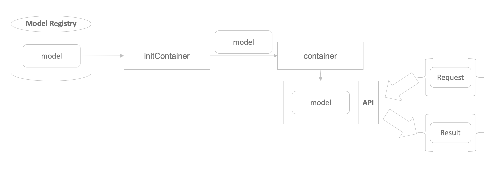

## How Seldon Core works?

Seldon Core가 API 서버를 생성하는 과정을 요약하면 다음과 같습니다.



1. initContainer는 모델 저장소에서 필요한 모델을 다운로드 받습니다.
2. 다운로드받은 모델을 container로 전달합니다.
3. container는 전달받은 모델을 감싼 API 서버를 실행합니다.
4. 생성된 API 서버 주소로 API를 요청하여 모델의 추론 값을 받을 수 있습니다.

## SeldonDeployment Spec

Seldon Core를 사용할 때, 주로 사용하게 되는 커스텀 리소스인 SeldonDeployment를 정의하는 yaml 파일은 다음과 같습니다.

```bash
apiVersion: machinelearning.seldon.io/v1
kind: SeldonDeployment
metadata:
  name: seldon-example
  namespace: kubeflow-user-example-com
spec:
  name: model
  predictors:
  - name: model

    componentSpecs:
    - spec:
        volumes:
        - name: model-provision-location
          emptyDir: {}

        initContainers:
        - name: model-initializer
          image: gcr.io/kfserving/storage-initializer:v0.4.0
          args:
            - "gs://seldon-models/v1.12.0-dev/sklearn/iris"
            - "/mnt/models"
          volumeMounts:
          - mountPath: /mnt/models
            name: model-provision-location

        containers:
        - name: model
          image: seldonio/sklearnserver:1.8.0-dev
          volumeMounts:
          - mountPath: /mnt/models
            name: model-provision-location
            readOnly: true
          securityContext:
            privileged: true
            runAsUser: 0
            runAsGroup: 0

    graph:
      name: model
      type: MODEL
      parameters:
      - name: model_uri
        type: STRING
        value: "/mnt/models"
      children: []

```

SeldonDeployment spec 중 `name` 과 `predictors` 필드는 required 필드입니다.  
`name`은 쿠버네티스 상에서 pod의 구분을 위한 이름으로 크게 영향을 미치지 않습니다.  
`predictors`는 한 개로 구성된 array로 `name`, `componentSpecs` 와 `graph` 가 정의되어야 합니다.  
여기서도 `name`은 pod의 구분을 위한 이름으로 크게 영향을 미치지 않습니다.  

이제 `componentSpecs` 와 `graph`에서 정의해야 할 필드들에 대해서 알아보겠습니다.

## componentSpecs

`componentSpecs` 는 하나로 구성된 array로 `spec` 키값이 정의되어야 합니다.  
`spec` 에는 `volumes`, `initContainers`, `containers` 의 필드가 정의되어야 합니다.

### volumes

```bash
volumes:
- name: model-provision-location
  emptyDir: {}
```

`volumes`은 initContainer에서 다운로드받는 모델을 저장하기 위한 공간을 의미합니다.  
array로 입력을 받으며 array의 구성 요소는 `name`과 `emptyDir` 입니다.  
이 값들은 모델을 다운로드받고 옮길 때 한번 사용되므로 크게 수정하지 않아도 됩니다.

### initContainer

```bash
- name: model-initializer
  image: gcr.io/kfserving/storage-initializer:v0.4.0
  args:
    - "gs://seldon-models/v1.12.0-dev/sklearn/iris"
    - "/mnt/models"
  volumeMounts:
  - mountPath: /mnt/models
    name: model-provision-location
```

initContainer는 API에서 사용할 모델을 다운로드받는 역할을 합니다.  
그래서 사용되는 필드들은 모델 저장소(Model Registry)로부터 데이터를 다운로드받을 때 필요한 정보들을 정해줍니다.

initContainer의 값은 n개의 array로 구성되어 있으며 사용하는 모델마다 각각 지정해주어야 합니다.

#### name

`name`은 쿠버네티스 상의 pod의 이름입니다.  
디버깅을 위해 `{model_name}-initializer` 로 사용하길 권장합니다.

#### image

`image` 는 모델을 다운로드 받기 위해 사용할 이미지 이름입니다.  
seldon core에서 권장하는 이미지는 크게 두 가지입니다.

- gcr.io/kfserving/storage-initializer:v0.4.0
- seldonio/rclone-storage-initializer:1.13.0-dev

각각의 자세한 내용은 다음을 참고 바랍니다.

- [kfserving](https://docs.seldon.io/projects/seldon-core/en/latest/servers/kfserving-storage-initializer.html)
- [rclone](https://github.com/SeldonIO/seldon-core/tree/master/components/rclone-storage-initializer)

*모두의 MLOps* 에서는 kfserving을 사용합니다.

#### args

```bash
args:
  - "gs://seldon-models/v1.12.0-dev/sklearn/iris"
  - "/mnt/models"
```

gcr.io/kfserving/storage-initializer:v0.4.0 도커 이미지가 실행(`run`)될 때 입력받는 argument를 입력합니다.  
array로 구성되며 첫 번째 array의 값은 다운로드받을 모델의 주소를 적습니다.  
두 번째 array의 값은 다운로드받은 모델을 저장할 주소를 적습니다. (seldon core에서는 주로 `/mnt/models`에 저장합니다.)

### volumeMounts

```bash
volumeMounts:
  - mountPath: /mnt/models
    name: model-provision-location
```

`volumneMounts`는 volumes에서 설명한 것과 같이 `/mnt/models`를 쿠버네티스 상에서 공유할 수 있도록 볼륨을 붙여주는 필드입니다.  
자세한 내용은 [쿠버네티스 Volume](https://kubernetes.io/docs/concepts/storage/volumes/)을 참조 바랍니다.

### container

```bash
containers:
- name: model
  image: seldonio/sklearnserver:1.8.0-dev
  volumeMounts:
  - mountPath: /mnt/models
    name: model-provision-location
    readOnly: true
  securityContext:
    privileged: true
    runAsUser: 0
    runAsGroup: 0
```

container는 실제로 모델이 API 형식으로 실행될 때의 설정을 정의하는 필드입니다.  

#### name

`name`은 쿠버네티스 상의 pod의 이름입니다. 사용하는 모델의 이름을 적습니다.

#### image

`image` 는 모델을 API로 만드는 데 사용할 이미지입니다.  
이미지에는 모델이 로드될 때 필요한 패키지들이 모두 설치되어 있어야 합니다.

Seldon Core에서 지원하는 공식 이미지는 다음과 같습니다.

- seldonio/sklearnserver
- seldonio/mlflowserver
- seldonio/xgboostserver
- seldonio/tfserving

#### volumeMounts

```bash
volumeMounts:
- mountPath: /mnt/models
  name: model-provision-location
  readOnly: true
```

initContainer에서 다운로드받은 데이터가 있는 경로를 알려주는 필드입니다.  
이때 모델이 수정되는 것을 방지하기 위해 `readOnly: true`도 같이 주겠습니다.

#### securityContext

```bash
securityContext:
  privileged: true
  runAsUser: 0
  runAsGroup: 0
```

필요한 패키지를 설치할 때 pod이 권한이 없어서 패키지 설치를 수행하지 못할 수 있습니다.  
이를 위해서 root 권한을 부여합니다. (다만 이 작업은 실제 서빙 시 보안 문제가 생길 수 있습니다.)

## graph

```bash
graph:
  name: model
  type: MODEL
  parameters:
  - name: model_uri
    type: STRING
    value: "/mnt/models"
  children: []
```

모델이 동작하는 순서를 정의한 필드입니다.

### name

모델 그래프의 이름입니다. container에서 정의된 이름을 사용합니다.

### type

type은 크게 4가지가 있습니다.

1. TRANSFORMER
2. MODEL
3. OUTPUT_TRANSFORMER
4. ROUTER

각 type에 대한 자세한 설명은 [Seldon Core Complex Graphs Metadata Example](https://docs.seldon.io/projects/seldon-core/en/latest/examples/graph-metadata.html)을 참조 바랍니다.

### parameters

class init 에서 사용되는 값들입니다.  
sklearnserver에서 필요한 값은 [다음 파일](https://github.com/SeldonIO/seldon-core/blob/master/servers/sklearnserver/sklearnserver/SKLearnServer.py)에서 확인할 수 있습니다.

```python
class SKLearnServer(SeldonComponent):
    def __init__(self, model_uri: str = None, method: str = "predict_proba"):
```

코드를 보면 `model_uri`와 `method`를 정의할 수 있습니다.

### children

순서도를 작성할 때 사용됩니다. 자세한 내용은 다음 페이지에서 설명합니다.
