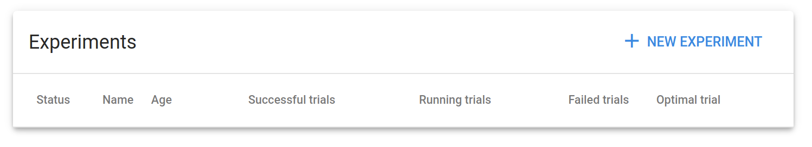

다음으로는 Central Dashboard의 왼쪽 탭의 Experiments(AutoML)을 클릭해보겠습니다.

Experiments(AutoML) 페이지는 Kubeflow에서 Hyperparameter Tuning과 Neural Architecture Search를 통한 AutoML을 담당하는 [Katib](https://www.kubeflow.org/docs/components/katib/overview/)를 관리할 수 있는 페이지입니다.

Katib와 Experiments(AutoML)에 대한 사용법은 *모두의 MLOps* v1.0에서는 다루지 않으며, v2.0에 추가될 예정입니다.
