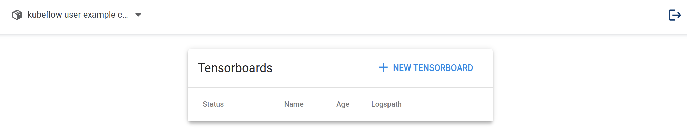

다음으로는 Central Dashboard의 왼쪽 탭의 Tensorboards를 클릭해보겠습니다.

다음과 같은 화면을 볼 수 있습니다.

Tensorboards 탭은 Tensorflow, PyTorch 등의 프레임워크에서 제공하는 Tensorboard 유틸이 생성한 ML 학습 관련 데이터를 시각화하는 텐서보드 서버(Tensorboard Server)를 쿠버네티스 클러스터에 생성하는 기능을 제공합니다.

이렇게 생성한 텐서보드 서버는, 일반적인 원격 텐서보드 서버의 사용법과 같이 사용할 수도 있으며, [Kubeflow 파이프라인 런에서 바로 텐서보드 서버에 데이터를 저장하는 용도](https://www.kubeflow.org/docs/components/pipelines/sdk/output-viewer/#tensorboard)로 활용할 수 있습니다.

Kubeflow 파이프라인 런의 결과를 시각화하는 방법에는 [다양한 방식](https://www.kubeflow.org/docs/components/pipelines/sdk/output-viewer/)이 있으며, *모두의 MLOps*에서는 더 일반적으로 활용할 수 있도록 Kubeflow 컴포넌트의 Visualization 기능과 MLflow의 시각화 기능을 활용할 예정이므로, Tensorboards 페이지에 대한 자세한 설명은 생략하겠습니다.
