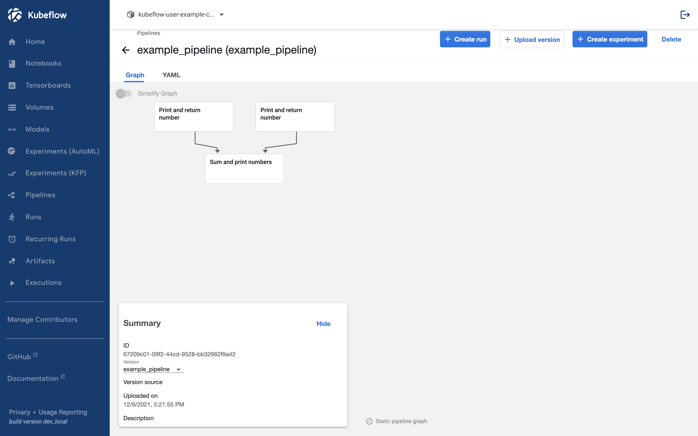
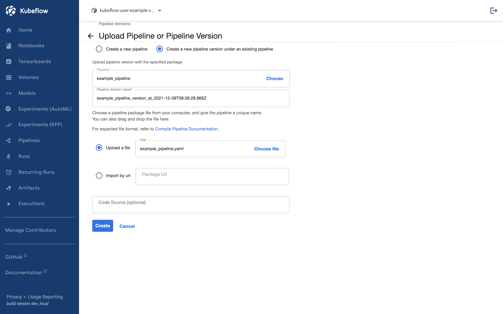

## Upload Pipeline

이제 우리가 만든 파이프라인을 직접 kubeflow에서 업로드 해 보겠습니다.  
파이프라인 업로드는 kubeflow 대시보드 UI를 통해 진행할 수 있습니다.
[Install Kubeflow](../setup-components/install-components-kf.md#정상-설치-확인) 에서 사용한 방법을 이용해 포트포워딩합니다.

```bash
kubectl port-forward svc/istio-ingressgateway -n istio-system 8080:80
```

[http://localhost:8080](http://localhost:8080)에 접속해 대시보드를 열어줍니다.

### 1. Pipelines 탭 선택


### 2. Upload Pipeline 선택


### 3. Choose file 선택


### 4. 생성된 yaml파일 업로드


### 5. Create



## Upload Pipeline Version

업로드된 파이프라인은 업로드를 통해서 버전을 관리할 수 있습니다. 다만 깃헙과 같은 코드 차원의 버전 관리가 아닌 같은 이름의 파이프라인을 모아서 보여주는 역할을 합니다.
위의 예시에서 파이프라인을 업로드한 경우 다음과 같이 example_pipeline이 생성된 것을 확인할 수 있습니다.


클릭하면 다음과 같은 화면이 나옵니다.


Upload Version을 클릭하면 다음과 같이 파이프라인을 업로드할 수 있는 화면이 생성됩니다.


파이프라인을 업로드 합니다.



업로드된 경우 다음과 같이 파이프라인 버전을 확인할 수 있습니다.


